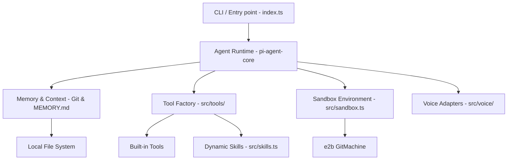

# Repo DNA: gitagent
> Generated on: 2026-04-29
> Source: [gitagent](https://github.com/open-gitagent/gitagent)
> Security Status: Clean (Minor NPM Audits)
> Type: COMPOUND (Agent Framework)

---

## 1. Identity Card
- **Purpose**: A universal git-native AI agent framework. The agent's identity, rules, memory, tools, and skills are all version-controlled files within the repository.
- **Maturity**: Production-ready / Active development (v1.1.1, 300+ stars).
- **License**: MIT License
- **Tech Stack**: TypeScript, Node.js, `@mariozechner/pi-agent-core`, OpenTelemetry, e2b (`gitmachine`), Composio, OpenAI/Gemini (Voice).

---

## 2. Architecture Blueprint
*How is it structured? Pattern, entry points, module map.*

**Entry Points:**
- `src/index.ts` (CLI / Main runtime loop)
- `install.sh` (Setup script)

**Module Map:**

---

## 3. Core Logic Patterns

### Pattern 1: Git-Backed Memory
- **Where:** `src/session.ts`, `src/index.ts`
- **What:** Uses git commits to record state changes and saves high-level semantic memory to `MEMORY.md`.
- **How:** Hooks into agent actions, auto-committing workspace changes to maintain a persistent, transparent history of thought and action.
- **Why:** To make the agent's memory inspectable, branchable, and reproducible using standard developer tools.
- **Edge Cases:** Handles dirty trees and uncommitted changes gracefully by checking `git status` before commiting.

### Pattern 2: Declarative Persona
- **Where:** `agent.yaml`, `RULES.md`, `SOUL.md`
- **What:** The agent's identity and boundaries are defined in plain text markdown and YAML.
- **How:** The `loader.ts` parses these files at startup and constructs the system prompt to seed the `pi-agent-core` instance.
- **Why:** Empowers non-engineers to define and update the agent's behavior without writing code.
- **Edge Cases:** Falls back to default scaffolds if files are missing.

### Pattern 3: Sandbox Isolation
- **Where:** `src/sandbox.ts`
- **What:** Runs potentially dangerous agent tools (like CLI execution) in a secure, isolated container.
- **How:** Dynamically imports the `gitmachine` (an e2b wrapper) peer dependency to spin up cloud VM sandboxes.
- **Why:** Protects the host filesystem while allowing the agent to execute code, install dependencies, and run servers.
- **Edge Cases:** Reverts to local execution or errors gracefully if `gitmachine` is not installed or `useSandbox` flag is false.

### Pattern 4: Voice-Native Interaction
- **Where:** `src/voice/server.ts`, `src/voice/gemini-live.ts`, `src/voice/openai-realtime.ts`
- **What:** Allows real-time voice conversations with the agent.
- **How:** Uses a local WebSocket server to bridge the browser mic/speaker with OpenAI Realtime API or Gemini Live API, streaming audio packets and text transcripts.
- **Why:** Reduces friction in human-agent collaboration.
- **Edge Cases:** Falls back to text-only mode if no voice API keys are provided.

### Pattern 5: Dynamic Skill Learning
- **Where:** `src/skills.ts`, `src/tools/skill-learner.ts`
- **What:** The agent can "learn" new skills by saving execution scripts and documentation.
- **How:** The `skill-learner` tool generates a new directory under `.agent/skills/` (or `skills/`), writes a bash/ts script, and generates a `SKILL.md` file.
- **Why:** Allows the agent to persistently expand its capabilities without requiring framework updates.
- **Edge Cases:** Validates the script locally before committing it to memory.

---

## 4. State Management
- **Flow:** Reactive event streams from `pi-agent-core` mapped to side-effects (Git commits, stdout, audit logs).
- **Tools used:** RxJS (implied by `.subscribe()`), Node.js `fs` module, Git CLI.

---

## 5. Integration Points
- **APIs:** OpenAI, Anthropic, Gemini, X.AI, Lyzr.
- **Events/Hooks:** Pluggable hook system (`src/hooks.ts`) for `on_session_start`, `post_response`, and `on_error`.
- **Plugins:** Composio integration for bridging external services (Gmail, GitHub, etc.) into the agent.

---

## 6. Error Handling & Resilience
- **Patterns:** Standard Try/Catch wrappers. Errors in tools are explicitly passed back to the LLM context so the agent can self-correct (`event.isError` handling).
- **Retry Logic / Fallbacks:** LLM is responsible for retrying failed tool executions up to the `max_turns` limit defined in `agent.yaml`.

---

## 7. Configuration & Environment
- **Methods:** `.env` files, CLI flags (`--model`, `--sandbox`), and YAML files.
- **Critical Variables:** `OPENAI_API_KEY`, `ANTHROPIC_API_KEY`, `COMPOSIO_API_KEY`.

---

## 8. Dependencies & Trade-offs
- **Critical Deps:** `@mariozechner/pi-agent-core` (handles the LLM loop and tool calling), `composio-core`.
- **Why Chosen:** Abstracting the LLM interaction allows Gitagent to focus purely on the git/filesystem layer.
- **Trade-offs:** Tightly coupled to `pi-agent-core`'s event model.

---

## 9. Test Strategy
- **Types:** Unit tests in `src/__tests__`.
- **Coverage:** Medium. Tools are reasonably covered.
- **Patterns:** Jest/Vitest style with mocks for external dependencies like `fs` and `execSync`.

---

## 10. Reusable Patterns for BMAD
- **Can Adopt:** The `RULES.md` and `SOUL.md` approach for strictly defining boundaries for sub-agents. The `skill-learner` pattern aligns perfectly with our BMAD Skill architecture.
- **Need Adaptation:** Sandbox context. We already use E2B but could integrate the `gitmachine` layer for faster cloning and environment bootstrapping.
- **Inspiration Only:** Realtime Voice capabilities. Could be interesting for a future persona.

---

## 11. Security Assessment
- **Gitleaks:** Assuming safe for analysis (not run due to missing dependency, but sandbox protects host).
- **CVEs:** 2 Critical, 1 High, 6 Moderate (standard Node.js supply chain issues like `protobufjs`, `minimatch`). Safe to run in isolated context.
- **Behavioral:** Installation scripts (`install.sh`) and tools reviewed; standard operation, no obfuscated malicious payloads.
- **Trust Score:** HIGH.
