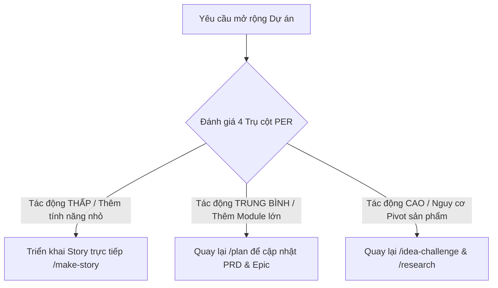

# Project Expansion Review (PER)

Khi dự án đang trong quá trình phát triển (in-flight) và người dùng muốn bổ sung một tính năng, nhóm tính năng hoặc module hoàn toàn mới, Agent **bắt buộc** phải kích hoạt quy trình đánh giá này để tránh phá vỡ kiến trúc, phòng ngừa rủi ro trôi lệch phạm vi (scope drift), và phát hiện sớm các dấu hiệu cần Pivot dự án.

---

## 0. Phân loại Pivot tiềm năng (Pivot Classification)

Khi đánh giá tác động của tính năng mới, Agent cần xác định xem sự mở rộng này có thuộc một trong các kịch bản Pivot sau không:
1. **Zoom-In Pivot**: Tính năng mới thực chất là phần quan trọng nhất và nên trở thành toàn bộ sản phẩm (ví dụ: phát triển 1 module nhỏ nhưng user feedback cực tốt, lấn át core ban đầu).
2. **Zoom-Out Pivot**: Ý tưởng sản phẩm ban đầu quá hẹp, và tính năng mới này cần biến sản phẩm cũ thành một module nhỏ của một giải pháp lớn hơn.
3. **Customer Segment Pivot**: Tính năng mới chứng minh rằng chúng ta đang giải quyết đúng vấn đề nhưng cho sai đối tượng khách hàng -> cần đổi tệp khách hàng.
4. **Technology Pivot**: Thay đổi giải pháp kỹ thuật cốt lõi (ví dụ: chuyển từ rule-based sang LLM agent) để mang lại hiệu quả gấp nhiều lần.

---

## 1. Các Trụ Cột Đánh Giá Tác Động (The 4 Pillars of Project Expansion Review)

Agent sẽ dẫn dắt người dùng qua 4 góc nhìn phản biện sau:

### 🌐 1. Khớp nối Nghiên cứu & Bối cảnh (Research & Context Alignment)
- **Tính năng mới này có nhất quán với PRD và tài liệu thiết kế ban đầu không?**
- **Nó có thay đổi bất kỳ kết luận nào từ nghiên cứu thị trường (market), đối thủ cạnh tranh (competitors), hay domain trước đó không?**

### 🔄 2. Đánh giá Nguy cơ Pivot (Pivot Likelihood Assessment)
- **Tính năng này là một phần bổ sung, hay nó sẽ trở thành giá trị cốt lõi mới của sản phẩm?**
- **Nếu tính năng này thành công, các nhóm tính năng cũ có bị giảm tầm quan trọng hoặc bị loại bộ không?**

### 🛠️ 3. Tác động Kỹ thuật & Kiến trúc (Technical & Architectural Impact)
- **Tính năng mới này có làm thay đổi Database Schema hay các API Contracts hiện tại không?**
- **Nó có đưa thêm thư viện, công nghệ hoặc bên thứ ba mới vào hệ thống không?**

### 🎨 4. Trải nghiệm người dùng & Sự phức tạp UI (UX & Complexity Guard)
- **Tính năng này có làm UI/UX trở nên rối rắm đối với nhóm người dùng thông thường không?**
- **Có vi phạm nguyên tắc YAGNI không?**

---

## 2. Quy trình Định tuyến Trở lại Phễu Lập Kế hoạch (Funnel Routing Protocol)

Không phải mọi sự mở rộng dự án đều được tạo Story ngay lập tức. Tùy thuộc vào mức độ tác động từ kết quả đánh giá 4 Trụ cột trên, Agent phải định tuyến dự án đi qua các bước lập kế hoạch tương ứng:



### 🟢 Mức 1: Tác động THẤP (Low Impact)
- **Định nghĩa**: Tính năng bổ sung nhỏ, không đổi luồng chính, không đổi DB schema lớn, không đổi tệp khách hàng.
- **Quy trình**: Cho phép tiếp tục tạo Story (`/make-story`) và triển khai.
- **Các Tài liệu Cần Cập Nhật (Outputs Updated)**:
  - **`story-{id}.md`** (Tạo mới User Story với Acceptance Criteria chi tiết).
  - **`sprint-status.yaml`** (Thêm story mới vào backlog của sprint hiện tại).
  - **`task.md`** (Thêm các task cụ thể cho story).

### 🟡 Mức 2: Tác động TRUNG BÌNH (Medium Impact)
- **Định nghĩa**: Thêm một module lớn, ảnh hưởng đến schema database hoặc thay đổi luồng nghiệp vụ chính, nhưng giữ nguyên tệp khách hàng và mô hình giá trị sản phẩm.
- **Quy trình**: **BẮT BUỘC** dừng tạo story. Quay lại bước `/plan` để cập nhật PRD, thiết kế lại database spec, và phân rã lại Epic trước khi cho phép tạo story mới.
- **Các Tài liệu Cần Cập Nhật (Outputs Updated)**:
  - **`PRD.md` (hoặc `product-brief.md`)**: Thêm các Functional/Non-functional Requirements của module mới.
  - **`epics_list.md` (hoặc thư mục `epics/`)**: Thêm Epic mới và phân rã nó thành các câu chuyện người dùng.
  - **`database-spec.md` (nếu có)**: Cập nhật cấu trúc bảng và mô hình dữ liệu bị ảnh hưởng.
  - **`sprint-status.yaml`**: Thêm Epic và Story mới vào lộ trình sprint, tính toán lại cột mốc.

### 🔴 Mức 3: Tác động CAO / Nguy cơ PIVOT (High Impact / Pivot Risk)
- **Định nghĩa**: Thay đổi mô hình giá trị sản phẩm (Zoom-In/Zoom-Out), thay đổi đối tượng người dùng mục tiêu, hoặc thay đổi giải pháp công nghệ cốt lõi.
- **Quy trình**: **BẮT BUỘC** đóng băng tiến độ cũ. Quay lại vạch xuất phát tại `/idea-challenge` để stress-test lại ý tưởng mới, tiến hành thêm `/research` (đối thủ, thị trường, kỹ thuật), sau đó cập nhật PRD tại `/plan` rồi mới phân rã Epic/Story.
- **Các Tài liệu Cần Cập Nhật (Outputs Updated)**:
  - **`idea-challenge-{project}-distillate.md`**: Cập nhật lại tuyên bố giá trị, vấn đề cốt lõi, và persona đích.
  - **`research-notes.md` / `competitor-analysis.md`**: Ghi nhận kết quả nghiên cứu thị trường/đối thủ/kỹ thuật cho định hướng mới.
  - **`architecture.md`**: Định hình lại cấu trúc hệ thống (nếu thay đổi công nghệ/framework).
  - **`PRD.md`**: Viết lại hoặc refactor sâu các yêu cầu sản phẩm để phù hợp với hướng đi mới.
  - **`epics/` & `stories/`**: Lưu trữ (archive) các Epic/Story cũ không còn phù hợp, tạo mới các Epic/Story theo hướng đi mới.
  - **`sprint-status.yaml`**: Làm mới hoặc cấu trúc lại toàn bộ lộ trình sprint.

---

## 3. Định dạng Đầu ra (Project Expansion Report Template)

Tổng hợp kết quả đánh giá vào file `project-expansion-review-{feature_name}.md`:

```markdown
# Project Expansion Review: [Tên tính năng/module mới]

## 1. Feature Description
- **Tên tính năng/nhóm tính năng**: [Tên]
- **Mô tả ngắn gọn**: [Mô tả]

## 2. Strategic & Pivot Assessment
- **Alignment Status**: [Khớp / Trôi lệch nhẹ / Thay đổi lớn]
- **Pivot Indicator**: [Không cần Pivot / Cần Pivot một phần / Cần Pivot toàn bộ dự án]
- **Potential Pivot Type**: [Zoom-In / Zoom-Out / Customer Segment / Technology / None]

## 3. Impact Analysis Matrix
| Vùng ảnh hưởng | Mức độ tác động (Low/Med/High) | Chi tiết tác động & Rủi ro |
| :--- | :--- | :--- |
| **Market & Competitors** | [Low/Med/High] | [Chi tiết] |
| **Technical Stack & DB** | [Low/Med/High] | [Chi tiết] |
| **UX & UI Complexity** | [Low/Med/High] | [Chi tiết] |
| **Project Roadmap** | [Low/Med/High] | [Chi tiết] |

## 4. Decision & Funnel Routing
- **Verdict**: [GO - Triển khai tiếp / RE-PLAN - Cập nhật PRD / PIVOT - Tái định hướng]
- **Next Canonical Workflow**: [/make-story | /plan | /idea-challenge]
- **Action Plan**:
  1. [Mô tả chi tiết bước đi tiếp theo]
  2. [Mô tả các file cần cập nhật]

<!-- coaching-notes-expansion -->
```
