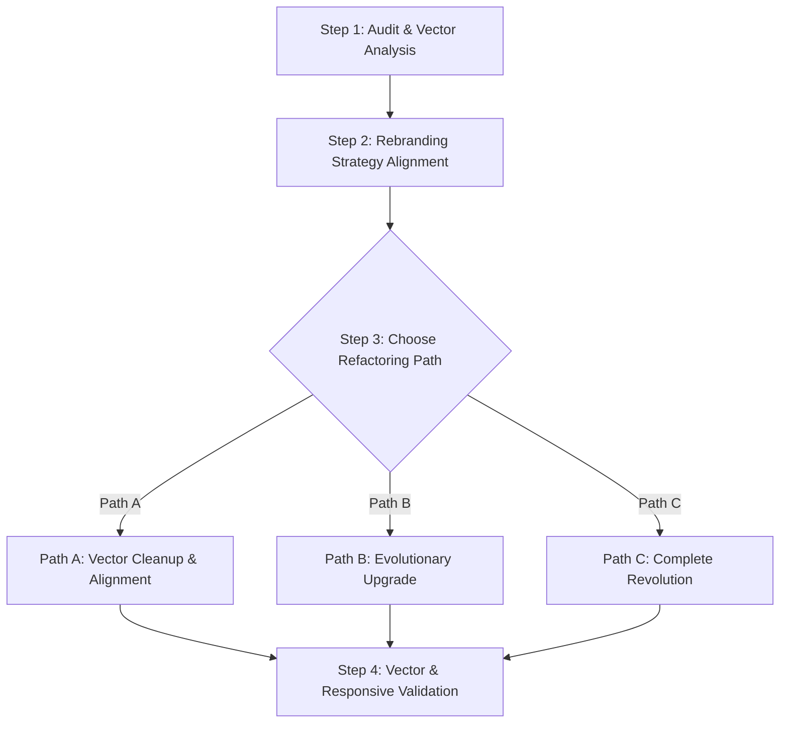

# SKILL: Brand Identity & Brand Guideline Workflow

## Purpose

Use this skill to create or refactor a professional Brand Identity and Brand Guideline system for any brand (especially SaaS, AI, technology, workspace, B2B, retail, e-commerce, edtech, manufacturing, or service businesses).

This workflow covers:
- Brand research and strategy foundation (using Kapferer's Brand Prism)
- Visual direction and brand board design
- Logo system (and refactoring existing logos)
- Color, typography, and iconography systems
- UI and marketing touchpoint applications
- Digital brand guideline documentation and asset packaging
- Living brand guidelines & token exportation

---

## Recommended Design & Strategy Stack

To execute this skill effectively, use the following tools and platforms from the I-Wish registry:
1.  **Brainstorming & Naming**:
    *   *Miro / FigJam*: For visual mood boarding, mapping competitor landscapes, and positioning matrices.
    *   *Namecheckr / Namecheap*: For verifying domain name and social handle availability.
2.  **Core Design & Vector Production**:
    *   *Adobe Illustrator*: The industry standard for precise vector path drawing, anchoring grids, and logo construction.
    *   *Figma*: Ideal for managing shared libraries, component tokens, UI mockups, and collaborative client review.
3.  **AI-Assisted Design & Vectorization**:
    *   *Recraft.ai*: Excellent for generating native vector SVG assets, icons, and logo illustrations directly from prompts.
    *   *Vectorizer.AI*: For converting raster drafts (PNG, JPG) into clean, high-precision SVG paths.
4.  **Living Brand Guidelines Platforms**:
    *   *Brandpad / Standards.site*: Best for building modern, interactive, design-first brand books.
    *   *Frontify / Zeroheight*: Best for enterprise-grade asset management (DAM) and design systems documentation.

---

## Core Principle

A professional brand identity must be:
1.  **Strategically Aligned**: Grounded in business objectives and audience research.
2.  **Perceptually Sound**: Built using Gestalt design principles (Proximity, Similarity, Continuity, Closure, Figure-Ground).
3.  **Sequentially Approved**: Core brandmarks must be locked before applying them to physical/digital collateral.
4.  **Developer-Ready**: Visual choices are compiled into standardized design tokens (JSON) for seamless coding.
5.  **Cleanly Organized**: Avoid fragmentation by storing all visual components in a standardized structure.

---

## Recommended Workflow

### Phase 1 — Brand Discovery

Collect required inputs using the intake questionnaire (`questionnaire.md`).

Minimum required information:
- Brand name
- Industry
- Product/service description
- Target audience
- Brand positioning
- Brand personality
- Visual preferences
- Competitors / references
- Required deliverables
- Output format

Do not start final guideline production until the core strategic inputs are clear.

---

### Phase 2 — Brand Strategy Foundation

Create the following strategic assets:
1. Brand overview
2. Mission & Vision
3. Positioning statement
4. Target audience (ideal user reflection)
5. Use cases
6. Brand personality
7. Brand values
8. Brand voice and tone (messaging hierarchy)
9. Main tagline and alternative tagline options

Recommended output:
- 1 concise strategy page
- 1 messaging page
- 1 brand personality page (Kapferer's Brand Prism)

---

### Phase 3 — Visual Direction Exploration

Create 3–10 visual directions depending on project scope.

For each direction, define:
- Theme name & strategy rationale
- Visual style
- Primary & secondary colors
- Neutral palette
- Typography mood
- Logo treatment
- UI/product implications
- Pros and cons
- Best use case
- Risk level

Evaluation criteria:
- Professionalism & Trustworthiness
- Market differentiation
- Scalability
- Suitability for product UI & daily design tasks
- Ease of application across channels

---

### Phase 4 — Logo System & Brainstorming (THE GATEWAY)

> [!IMPORTANT]
> **CRITICAL GATEWAY RULE**: You must NOT proceed to Phase 5 or develop any other brand materials (colors, fonts, UI mockups, templates) until the Logo System has been officially approved and locked by the user (`logo_locked: true`).

#### Step 4.1: Design Tool Connection Check (Dynamic Installation Gate)
Before triggering any automated design rendering, token sync, or UI mockup creation, verify if the target design tool/plugin is installed and active:
1. Scan active I-Wish plugins and MCP services for registered design adapters.
2. If no active connection is found, trigger the standard installation flow and prompt the user to choose:
    *   **stitch**: Stitch-first design generation & sync (backed by `stitch-first-dev` usage pack).
    *   **figma**: Figma-based design inspection & handoff (requires `figma-first-dev` usage pack).
    *   **claude-design**: Design-oriented generation & handoff.
    *   **canva**: Canva-based design authoring & handoff.
    *   **Local File Exporter**: Saves SVGs and JSON tokens offline to the `_iwish-output/brand-identity/` package and copies fallbacks to `/assets/` directory (bypasses tool connection).

#### Step 4.2: Logo Brainstorming Protocol
1.  Generate **at least 5 distinct logo options** (unless custom counts are requested).
2.  For **each option**, provide a comprehensive breakdown in the following structure:
    *   **Visual Representation**: SVG code block.
    *   **Geometric Construction & Components**: Component breakdown and arrangement explanation on grid coordinates.
    *   **Symbolic Meaning**: Rationale matching the Brand Strategy.
    *   **Typography Pairing**: Display font choice and matching rationale.
3.  **Cross-Platform Prompt Offering**: Provide copy-pasteable, optimized prompts tailored for:
    *   *Recraft.ai* (for generating native SVG vector variations).
    *   *ChatGPT (OpenAI)* (for flat vector logo mockups and semantic variations).
    *   *Midjourney* (for highly detailed brand aesthetic/logo renderings).

#### Step 4.3: Logo Packaging Deliverables
Once a logo option is locked, the exporter will output the following standardized vector names:
- `brand-primary-light.svg` - Primary logo on light background.
- `brand-primary-dark.svg` - Primary logo optimized for dark mode.
- `brand-symbol-light.svg` - Logo mark/symbol on light background.
- `brand-symbol-dark.svg` - Logo mark/symbol optimized for dark mode.
- `brand-primary-mono-black.svg` - Pure black silhouette of primary logo.
- `brand-primary-mono-white.svg` - Pure white silhouette of primary logo.
- `brand-symbol-mono-black.svg` - Pure black silhouette of symbol mark.
- `brand-symbol-mono-white.svg` - Pure white silhouette of symbol mark.
- `brand-app-icon-light.svg` - Square container icon for light mode (e.g., 512x512px).
- `brand-app-icon-dark.svg` - Square container icon for dark mode (e.g., 512x512px).

---

### Phase 5 — Color System

Create and document:
1. Primary color palette (Hex codes & styling variable definitions)
2. Secondary color palette
3. Neutral palette (dark backgrounds, light dividers, text weights)
4. Semantic colors:
   - Success, Warning, Error, Info
   - Pending, In progress, Completed
   - AI active, Human review, Automation running
5. Gradient systems
6. Light mode and Dark mode palettes
7. Usage ratios:
   - **60%** neutral/background
   - **25%** primary brand color
   - **10%** secondary brand color
   - **5%** accent/semantic color
8. Accessibility contrast notes (WCAG 2.1 AA/AAA compliance validation)

---

### Phase 6 — Typography System

Define and document:
1. Display font (for headers and brand marks)
2. Heading font
3. Body font (for paragraphs and forms)
4. Mono/data font (for code displays, tabular numbers)
5. Type scale (e.g., Minor Third, Major Third)
6. Font weights, Line heights, and Letter spacing rules
7. Recommended type categories:
   - H1, H2, H3, H4
   - Body large, Body regular
   - Caption, Button, Label, Mono/data

---

### Phase 7 — Iconography System

Create a scalable, developer-ready icon system:
- Stroke width (e.g., 1.5px or 2px)
- Corner radius (rounded vs sharp caps)
- Grid alignment (e.g., 24x24px viewbox)
- Color states (active vs inactive)
- Standard SaaS/workspace icon set, including:
  Dashboard, Workspace, AI Agent, Workflow, Skill, Tool, Plugin Software, LLM/SLM Config, Member, Human Staff, User Role, Department, Project, Task, Kanban, Calendar, Team, Report, Analytics, Approval, File, Notification, Integration, Automation, Security, Knowledge Base, Progress, Chat, Settings, Sales Deck, Proposal, Onboarding.

---

### Phase 8 — Visual Language

Define visual patterns beyond layout:
1. Photography style (editorial, authentic, low contrast)
2. Illustration style (flat vector, hand-drawn, isometric)
3. Product UI style (glassmorphism, clean flat, neobrutalism)
4. Data visualization style (pie chart, line graph, semantic node connectors)
5. Background patterns and grid overlays
6. Motion direction (easing formulas, timing guidelines)
7. AI / automation visual motifs (workflow nodes, neural lines)

---

### Phase 9 — Product / UI Application

Create mockup components and sample pages:
1. Web dashboard
2. Mobile app screen
3. Kanban board
4. Workflow builder
5. AI agent profile card
6. Member & role management
7. Skill / plugin store
8. LLM/SLM configuration panel
9. Onboarding flow page

---

### Phase 10 — Marketing & Sales Applications

Draft and design marketing collateral:
1. Website hero banner
2. Sales deck cover
3. Proposal template
4. Email marketing template
5. Two-sided brochure
6. Social ads (square, vertical, story ratios)
7. Billboard advertisement
8. Booth / kiosk / POSM setup
9. Line-art logo variant (simplified for laser etching, embroidery, small print)

---

### Phase 11 — Brand Guideline Document

Prepare the consolidated brand book, structured as follows:
1. Cover
2. Brand overview (Mission, Vision, positioning)
3. Strategic Brand Identity Prism (Kapferer)
4. Logo system (Primary, Symbol, Lockups, Clearspace, Minimum size, Misuses)
5. Color system (Palettes, ratios, semantics, contrast checks)
6. Typography system (Type scale, fonts, UI usage guidelines)
7. Iconography (Stroke, corner rules, gallery)
8. Visual language (Illustrations, motifs, background grids)
9. UI applications (Dashboards, builders)
10. Marketing touchpoints (ads, brochures, booth)
11. Unified file packaging directory tree
12. Final implementation checklist

---

### Phase 12 — File Packaging

All files generated throughout the workflow must be packaged cleanly into the target output folder:

```text
brand-guideline-package/
├── README.md
├── brand-guideline.html
├── brand-guidelines.md
├── strategy/
│   ├── brand-strategy.md
│   ├── messaging.md
│   └── questionnaire.md
├── assets/
│   ├── logo/
│   │   ├── svg/
│   │   │   ├── brand-primary-light.svg
│   │   │   ├── brand-primary-dark.svg
│   │   │   ├── brand-symbol-light.svg
│   │   │   ├── brand-symbol-dark.svg
│   │   │   ├── brand-primary-mono-black.svg
│   │   │   ├── brand-primary-mono-white.svg
│   │   │   ├── brand-symbol-mono-black.svg
│   │   │   └── brand-symbol-mono-white.svg
│   │   └── app-icon/
│   │       ├── brand-app-icon-light.svg
│   │       └── brand-app-icon-dark.svg
│   ├── icons/
│   │   └── svg/
│   ├── colors/
│   ├── typography/
│   ├── mockups/
│   └── templates/
├── applications/
│   ├── billboard/
│   ├── booth-kiosk-posm/
│   ├── brochure/
│   ├── social-ads/
│   ├── website-hero/
│   ├── email-marketing/
│   └── line-art-logo/
└── source/
    ├── figma-notes.md
    ├── design-tokens.json
    └── export-log.md
```

---

## Logo & Brand ID Refactoring Workflow

Use this when modernizing or cleaning up existing assets:



### Step 1: Audit & Vector Analysis
Identify format limitations (e.g. raster-only file), geometric flaws (e.g. uneven path curves, anchor point misalignments), legibility problems at small scales (e.g. 16px favicon blur), and color contrast violations.

### Step 2: Rebranding Strategy Alignment
Map out why the refactoring is needed: product positioning shifts, target audience adjustments, or simply visual modernization.

### Step 3: Choose the Refactoring Path
- **Path A (Cleanup)**: Keep the exact same design but redraw paths on a strict geometric grid, normalise kerning, and export clean, lightweight vector SVGs.
- **Path B (Evolution)**: Simplify shapes, update typography/colors, optimize for dark mode, and thicken strokes while keeping the brand recognizable.
- **Path C (Revolution)**: Complete redesign from scratch, bypassing old design constraints completely.

### Step 4: Validation & Delivery
Verify the refactored vectors at multiple scales, produce monochrome templates, and package deliverables following the Phase 12 guidelines.

---

## Quality Checklist

Before final delivery, check:

### Strategy
- Brand positioning is clear.
- Target audience is specific.
- Brand personality is consistent.
- Messaging is practical and not generic.

### Logo
- Primary logo is clear.
- Symbol works at small sizes.
- Dark mode logo is separately optimized.
- Monochrome logo works.
- Clearspace and minimum size are documented.
- Incorrect usage is shown.

### Color
- Light mode palette is usable.
- Dark mode palette is usable.
- Contrast is acceptable.
- Accent colors are not overused.
- Semantic colors are defined.

### Typography
- Type scale is coherent.
- Fonts match brand personality.
- Body copy is readable.
- UI labels are legible.
- Multilingual support is considered.

### UI / Product
- Dashboard looks realistic.
- Navigation structure is clear.
- Workflow/task/project states are represented.
- Human and AI roles are visually distinct.
- Components are reusable.

### Marketing
- Billboard has instant readability.
- Booth/POSM has clear touchpoints.
- Brochure has front/back hierarchy.
- Social ads have strong hooks.
- Website hero has clear CTA.
- Email design has conversion logic.

### Packaging
- Files are named consistently.
- Assets are organized.
- HTML works standalone or has correct relative paths.
- Logo images do not have noisy transparency edges.
- README explains how to use the package.
