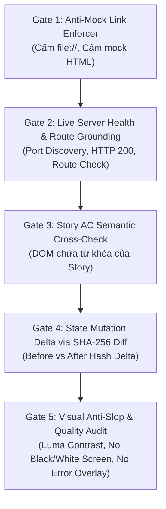

# 🛡️ Live Target Grounding Guardian (`live-target-grounding-guardian`)

## 📌 BỐI CẢNH & NGUYÊN TẮC BẤT DI BẤT DỊCH (THE IRON LAW)
Trong quy trình kiểm thử thủ công (`/manual-test`) và thẩm định chất lượng (`/review`), một trong những lỗi nghiêm trọng nhất làm tê liệt độ tin cậy của hệ thống là **"Ảo tưởng Kiểm thử / Làm màu" (Test Fallacy / Decoy Testing)**:
- Agent tự tạo file HTML giả lập trong thư mục tạm (`scratch/mock-page.html`, `test.html`) rồi dùng Playwright mở `page.goto("file://...")`.
- Agent gọi các mock link, stub endpoints, hoặc chụp màn hình một trang trắng/trang 404 rồi nộp kết quả "Test Passed!".
- Hậu quả: Sản phẩm thực tế không hề được chạy thử; lỗi runtime, vỡ giao diện, lỗi backend trên server thật bị bỏ lọt 100%.

**Kỹ năng này thiết lập CỔNG NGHIỆM THỰC ĐỊA ZERO-TRUST (Zero-Trust Live Grounding Gate)**:
Mọi bài test trong `/manual-test` và mọi bằng chứng QA **BẮT BUỘC PHẢI CHẠY TRÊN SERVER THẬT (LIVE SERVER) VỚI ĐÚNG ROUTE CỦA PRODUCT**.

---

## 🚫 5 CỔNG KIỂM DUYỆT BẮT BUỘC (5 STRICT HARD GATES)



---

### 🛑 Gate 1: Anti-Mock Link Enforcer (Cấm tuyệt đối Mock Link)
1. **Quy tắc cấm (Strict Prohibitions):**
   - **CẤM** `page.goto('file://...')` hoặc mở file cục bộ.
   - **CẤM** tự tạo các file `.html` tạm trong `scratch/`, `tmp/`, hoặc thư mục gốc để làm trang test giả.
   - **CẤM** chụp ảnh giao diện giả lập ngoài môi trường chạy thực tế của ứng dụng.
2. **Quy tắc bắt buộc (Mandatory Target):**
   - Target URL bắt buộc phải là **Loopback HTTP Server thật** (`http://localhost:<port>` hoặc `http://127.0.0.1:<port>`) hoặc môi trường Staging chính thức.
   - Nếu phát hiện test script chứa `file://` hoặc đường dẫn tới file HTML tạm, hệ thống **LẬP TỨC ĐÁNH RỚT (FAIL/REJECT)** mà không cần chạy tiếp.

---

### 🌐 Gate 2: Live Server Health & Route Grounding (Đối chiếu Thực địa)
1. **Phát hiện Port Động (Dynamic Port Discovery):**
   - Trước khi chạy test, agent phải xác định port của ứng dụng (ví dụ: `3000` cho Next.js, `5173` cho Vite).
   - Kiểm tra xem server có đang thực sự lắng nghe không:
     ```bash
     curl -s -o /dev/null -w "%{http_code}" http://localhost:<port>/<route>
     ```
2. **Xử lý khi Server chưa chạy:**
   - Agent **TUYỆT ĐỐI KHÔNG ĐƯỢC** tự ý tạo file mock thay thế.
   - Agent phải khởi động server (`npm run dev` / `pnpm dev`) ở chế độ nền (daemon), đợi server sẵn sàng (HTTP 200), rồi mới tiến hành chạy test.
3. **Đối chiếu Route Vật lý (Route Physical Grounding):**
   - Route được kiểm thử (ví dụ: `/settings/billing`) phải đối chiếu với cây mã nguồn (`src/app/`, `src/pages/` hoặc router config). Nếu route không tồn tại trong source code, test bị coi là vô hiệu.
   - HTTP status code của trang chính phải là `200` (hoặc `307`/`308` redirect đến auth), cấm trang `404 Not Found` hoặc `500 Internal Server Error`.

---

### 📝 Gate 3: Story AC Semantic Cross-Check (Đối chiếu Ngữ nghĩa DOM)
1. Sau khi trang tải xong, trích xuất toàn bộ text nội dung DOM (Snapshot).
2. Lấy danh sách từ khóa thực thể (Domain Nouns) và hành động (Action Verbs) từ Acceptance Criteria của `story.md`.
3. So sánh: Text trong DOM **BẮT BUỘC PHẢI CHỨA** ít nhất 60% từ khóa cốt lõi của tính năng.
   - Nếu DOM chỉ chứa toàn chữ "Sign In", "Welcome", hoặc "404 Page Not Found", test bị đánh dấu: **DECOY PAGE (Trang mồi giả / Sai trang cần test)**.

---

### ⚡ Gate 4: State Mutation Delta via SHA-256 Hash (Kiểm chứng Biến thiên Giao diện)
Được trích xuất từ cơ chế xác thực của `3dviz-pro-max`:
1. Đối với mỗi thao tác tương tác chính (Click nút, Gửi form, Bật/tắt switch, Mở modal):
   - **Ảnh Trước (Before):** Chụp màn hình trước khi thao tác, tính mã băm SHA-256 (`hash_before`).
   - **Thực hiện Thao tác:** Kích hoạt click/input trên DOM thật.
   - **Đợi DOM Ổn định:** Đợi ít nhất 300ms–500ms cho animation hoặc network hoàn tất.
   - **Ảnh Sau (After):** Chụp màn hình sau khi thao tác, tính mã băm SHA-256 (`hash_after`).
2. **Quy tắc nghiệm thu:**
   - Nếu test case khẳng định "hành động làm xuất hiện modal / thay đổi trạng thái" nhưng `hash_before == hash_after` (ảnh không thay đổi dù chỉ 1 pixel):
   - **KẾT LUẬN: THAO TÁC VÔ HIỆU / GIAO DIỆN ĐÓNG BĂNG (NO-OP OR FROZEN UI).**
   - Test script bị đánh trượt ngay lập tức vì click không hề tạo ra kết quả thực tế trên app.

---

### 👁️ Gate 5: Visual Anti-Slop & Quality Audit (Thẩm định Chất lượng Thị giác)
Tích hợp giải thuật phân tích thị giác máy tính:
1. **Kiểm tra Độ sáng (Luma Check):**
   - Tính toán giá trị Luma trung bình và độ lệch chuẩn của screenshot.
   - Cảnh báo/Chặn nếu `luma < 0.1` (Màn hình đen sì / Thiếu sáng / Crash rendering).
   - Cảnh báo/Chặn nếu `luma > 0.98` và không có text (Màn hình trắng trơn / Blank page).
2. **Phát hiện Vùng Che khuất Bất thường (Flat Occluder):**
   - Phát hiện các mảng màu đơn sắc bất thường chiếm > 80% diện tích màn hình che lấp nội dung chính.
3. **Phát hiện Lỗi Runtime Nổi (Crash Overlays):**
   - Quét DOM và OCR hình ảnh để phát hiện các thông báo lỗi: `Unhandled Runtime Error`, `500 Server Error`, `Cannot read properties of undefined`, `ChunkLoadError`.

---

## 🛠️ SCRIPTS & CÔNG CỤ ĐI KÈM
Skill cung cấp script kiểm tra tự động độc lập:
`python3 .agent/skills/live-target-grounding-guardian/scripts/verify-live-evidence.py --epic <epic_id> --story <story_id> --url <live_url>`

Khi tích hợp vào `/manual-test`, script này sẽ tự động phân tích thư mục `qa/evidence/` của Story và từ chối cấp chữ ký nghiệm thu nếu phát hiện bất kỳ dấu hiệu gian lận hay mock link nào.
