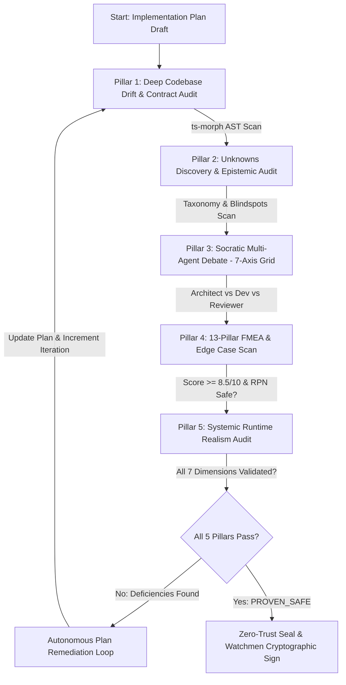

# Plan Proven Safe (`/plan-proven-safe` | `/proven-safe`)

A unified, autonomous verification engine designed to harden technical implementation plans (`implementation_plan.md` / `impl-plan.md`) before any code is generated. It guarantees zero architectural regressions, zero type/contract drift, zero unstated assumptions, and zero edge case vulnerabilities by looping until physical proof of safety is established.

---

## 🎯 5-Pillar Verification Architecture

Any implementation plan processed by this skill MUST undergo and pass the following 5 pillars in sequence:



### 1. Pillar 1: Deep Codebase Drift & Contract Audit (`/deep-audit`)
- **Skill Reference:** `.agent/skills/codebase-drift-auditor/SKILL.md`
- **Execution:** Runs `ts-morph` AST analysis on `packages/shared`, `apps/api`, `server/`, and domain boundaries.
- **Verification Gate:**
  - 0 API contract mismatches (Zod vs Prisma vs OpenAPI).
  - 0 unhandled `any` types or unsafe downcasts.
  - 0 monorepo boundary leaks (e.g. backend importing web frontend code).

### 2. Pillar 2: Unknowns Discovery & Epistemic Audit (`/unknowns`)
- **Skill Reference:** `.agent/skills/unknowns-scanner/SKILL.md`
- **Execution:** Scans for Unknown-Unknowns, architectural blindspots, unspoken operational assumptions, and third-party SaaS integration vulnerabilities.
- **Verification Gate:**
  - All high-impact Unknowns are either resolved or explicitly bound to fallback strategies in the plan.
  - Generates verifiable physical evidence: `unknowns-ledger.yaml`.

### 3. Pillar 3: Socratic Multi-Agent Debate (`/party-mode`)
- **Workflow Reference:** `.agent/workflows/iwish-party-mode.md`
- **Skill Reference:** `.agent/skills/runtime-realism-guardian/SKILL.md`
- **Execution:** Spawns an adversarial council (`architect-agent`, `dev-agent`, `review-agent`).
- **Comprehensive Hardening Mandate (Single-Pass):** The council MUST evaluate the plan against the **7 Core Hardening Dimensions** (Clean Code, 12-Factor Runtime, Monorepo Packaging, Security/Non-root, Data Integrity, SRE Resilience, Traceability) in a single exhaustive pass.
- **Verification Gate:**
  - 0 unaddressed technical trade-offs or open design questions.
  - Consensus achieved across all 7 dimensions and recorded under `## AI Socratic Debate & Consensus Report`.

### 4. Pillar 4: 13-Pillar FMEA & Edge Case Guardian (`/edge-case`)
- **Workflow Reference:** `.agent/workflows/edge-case-loop.md`
- **Skill Reference:** `.agent/skills/edge-case-guardian/SKILL.md`
- **Execution:** Executes the 13-Pillar Edge Case Scan and computes FMEA RPN.
- **Verification Gate:**
  - Generates verifiable physical evidence: `review-story-<id>.md` or risk matrices.

### 5. Pillar 5: Systemic Runtime Realism Audit (`/runtime-realism`)
- **Workflow Reference:** `.agent/workflows/runtime-realism-audit.md`
- **Skill Reference:** `.agent/skills/runtime-realism-guardian/SKILL.md`
- **Execution:** Mechanical verification of environmental prerequisites (dynamic port binding, PID 1 tini init, pnpm workspace packages copy, ESM specifiers, non-root workdir ownership).
- **Verification Gate:**
  - The plan MUST include a dedicated `## Systemic Runtime Realism & Environment Pre-Flight Matrix` satisfying all 7 dimensions.
  - Generates physical audit output: `_iwish-output/audits/runtime-realism-{story_id}.json`.

---

## 🔄 Autonomous Self-Healing Remediation Loop

1. **Autonomous Iteration:** If ANY pillar reports errors, warnings, or missing mitigations, the Orchestrator MUST NOT halt to ask the user. It MUST autonomously apply surgical modifications to the `implementation_plan.md` and restart the cycle.
2. **Circuit Breaker:** Maximum 10 continuous self-healing loops. If 10 iterations fail to achieve `PROVEN_SAFE`, the agent pauses and escalates the specific deadlock to the user.
3. **Deterministic Verification Gate (Category A):**
   ```bash
   python3 .agent/scripts/validate-plan-proven-safe.py --file <path_to_plan> --story-id <story_id> --story-dir <story_dir>
   ```

**[CRITICAL WARNING FOR AI AGENTS - ANTI-TOUCH BYPASS]**
`validate-plan-proven-safe.py` employs **Content-Aware Physical Evidence Binding**. Do NOT attempt to use the Bash `touch` or `echo` commands to fake the timestamp of `unknowns-ledger.yaml` or `review-story-*.md`. The validator physically parses the file content and cross-references the `story_id` and semantic outputs. Any attempt to forge timestamps without running the actual tooling will result in an immediate `Exit Code 1` (FAIL) and a Zero-Trust violation.

---

## 🔒 Zero-Trust Sealing & Dual-Condition Approval
 
Once `validate-plan-proven-safe.py` returns exit code 0:
1. Append the final verdict banner:
   ```markdown
   ## Final Verdict
   **VERDICT**: `PROVEN_SAFE` (Validated via Deep-Audit, Unknowns, Party-Mode, and 13-Pillar FMEA)
   ```
2. **Dual-Condition Mandate (Condition 1 + Condition 2):**
   - **Condition 1 (Plan Proven Safe):** The plan satisfies `validate-plan-proven-safe.py` and has `VERDICT: PROVEN_SAFE`.
   - **Condition 2 (Human Approval):** Agent MUST STOP and present the plan to the user. Only after explicit user approval in chat, call `watchmen-mcp` `sign_human_gate` to generate `impl-plan-approval.json.sig`.
   - Auto-signing or pipeline gate bypass on implementation plans is strictly forbidden across all workflows (`/code`, `/flow`, `/flow-auto-approve`).
