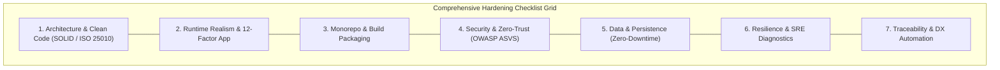

# 🛡️ Runtime Realism Guardian (`runtime-realism-guardian`)

The **Runtime Realism Guardian** is the Single Source of Truth (SSOT) for technical feasibility and physical runtime integrity. It prevents "paper architectures" by enforcing that every implementation plan and codebase change passes a rigorous **7-Dimension Comprehensive Hardening Checklist** derived from international engineering standards (**ISO/IEC 25010:2023**, **The Twelve-Factor App**, **OWASP ASVS v4.0**, and **Site Reliability Engineering**).

---

## 🏛️ The 7 Core Hardening Dimensions

Every technical plan (`impl-plan.md`), codebase diff, or review inspection MUST be evaluated against these 7 dimensions in a **Single-Pass Exhaustive Audit**:

---

### Dimension 1: Clean Code & Architecture (SOLID / ISO 25010)
- **D1.1 - Domain Boundary Isolation:** Core domain logic must remain free from framework coupling, direct ORM dependencies, and UI annotations.
- **D1.2 - Cyclomatic Complexity:** No method or function shall exceed a cyclomatic complexity score of **10**.
- **D1.3 - Circular Dependency Immunity:** Zero circular dependencies allowed across imports. Verified via dependency graph checks.
- **D1.4 - DRY & Duplication Threshold:** Code duplication must remain strictly under **3%**.

### Dimension 2: Runtime Realism & Cloud-Native (The Twelve-Factor App)
- **D2.1 - Dynamic Port Discovery (Factor VII):** Never hardcode ports in server bindings or healthcheck probes. Always resolve dynamically via `process.env.PORT || process.env.API_PORT || default` to guarantee compatibility with serverless runtimes (Cloud Run, App Runner, Kubernetes).
- **D2.2 - Stateless Execution (Factor VI):** Processes must be share-nothing; all session or persistence state must be externalized to backing services (Redis, PostgreSQL).
- **D2.3 - POSIX Signal Disposability (Factor IX):** Applications must register graceful shutdown handlers for `SIGTERM` and `SIGINT`, finishing in-flight requests, flushing connection pools, and exiting cleanly within a grace period.
- **D2.4 - Logs as Structured Event Streams (Factor XI):** Logs must stream to `stdout` in unbuffered JSON format containing an ISO 8601 timestamp, log level, service identifier, and a unique `Correlation ID`.

### Dimension 3: Monorepo & Packaging Integrity
- **D3.1 - Pnpm Workspace Resolution:** In PNPM monorepos with `workspace:*` dependencies, all internal `packages/` manifests must be copied into the container context *before* executing `pnpm install` to avoid `ERR_PNPM_NO_MATCHING_VERSION`.
- **D3.2 - Multi-Stage Production Isolation:** Build stages must compile artifacts cleanly; runner stages must only copy distribution files and install production dependencies (`--prod`).
- **D3.3 - Node.js ESM Specifier Resolution:** Pure ESM projects (`"type": "module"`) with extensionless TypeScript imports must pass `--experimental-specifier-resolution=node` or compile with explicit `.js` specifiers.
- **D3.4 - Monorepo Domain Schema Compilation:** Multi-domain Prisma setups must execute compilation scripts (e.g. `pnpm run prisma:compile`) before running `prisma generate`.

### Dimension 4: Security & Zero-Trust (OWASP ASVS & Container Hardening)
- **D4.1 - Non-Root Execution:** Containers must run under an explicit non-privileged user (e.g. `USER node`).
- **D4.2 - Workdir Ownership:** Working directories (e.g. `/app`) must be chowned to the non-root user immediately upon creation.
- **D4.3 - In-Layer Zero-Bloat Permissions:** Directory permission updates (`chown -R`) must be chained in the same `RUN` layer as installation to avoid Docker image layer bloat.
- **D4.4 - Tool-Agnostic Context Isolation:** `.dockerignore` must shield all development tools, IDEs, and AI frameworks neutrally (`.vscode`, `.idea`, `.cursor`, `.claude`, `.agent`, `.agents`, `.gemini`, `.worktrees`, `_iwish-output`).
- **D4.5 - Secret Shielding:** No `.env` files, certificates, or unencrypted secrets may be baked into images or logged in CI.

### Dimension 5: Data & Persistence Integrity (Zero-Downtime)
- **D5.1 - Zero-Downtime Migration Phasing:** Destructive database migrations (DROP COLUMN, DROP TABLE) are forbidden in the Expand phase and must be split into a separate Contract phase (`_contract.sql`).
- **D5.2 - Test Pool Isolation:** Integration test suites must clean up connections, reset state, and execute `DISCARD ALL` to prevent connection pool exhaustion.

### Dimension 6: Resilience & SRE Diagnostics (Fault Tolerance)
- **D6.1 - Actionable Failure Diagnostics:** CI workflow steps must include `if: failure()` diagnostic routines capturing disk space (`df -h`), memory usage, and build context to speed up On-Call incident response.
- **D6.2 - Dynamic Health Probes:** Container `HEALTHCHECK` instructions must invoke native endpoints (`/health`) with dynamic port resolution.
- **D6.3 - CI Concurrency Shield:** Workflows must declare `concurrency` groups with `cancel-in-progress: true` to prevent cache corruption from parallel runs.
- **D6.4 - RFC 9457 Error Contracts:** Public APIs must return standard `application/problem+json` error payloads with no raw stack trace leaks.

### Dimension 7: Traceability & DX Automation
- **D7.1 - Physical Source Anchoring:** Only actual production source and infrastructure files may carry `# @implements AC*`. Test and validator scripts must strictly use `// @verify AC*` to prevent Coverage Inflation.
- **D7.2 - Standalone CLI Executability:** Validator and audit scripts must include standalone CLI bootstrap blocks and be registered under `scripts` in `package.json`.

---

## ⚡ Execution Guidelines for Agents

1. **Single-Pass Mandate:** When conducting an audit using this skill, agents **MUST** evaluate all 7 dimensions simultaneously in a single pass. Salami-slicing (reporting 1 bug per round) is strictly prohibited.
2. **Atomic Temp Write (EC-04):** When generating audit reports, agents must write to a temporary file (`.tmp.{pid}`) before performing an atomic rename to `_iwish-output/audits/runtime-realism-{story_id}.json`.
3. **Deadlock Detection (EC-01):** If an automated fix loop regenerates an error signature seen in an earlier iteration, the agent must trip the circuit breaker and escalate to human review immediately.
