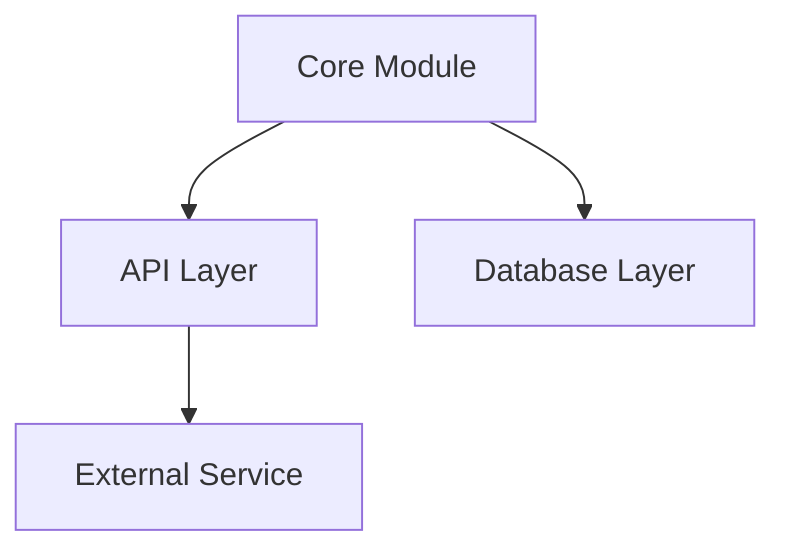

# Repo DNA: {repo-name}
> Generated on: {date}
> Source: [{repo-name}]({repo-url})
> Security Status: {security-status}
> Type: {repo-type}

---

## 1. Identity Card
- **Purpose**: [What problem does this repository solve?]
- **Maturity**: [Is it experimental, production-ready, abandoned?]
- **License**: [MIT, Apache 2.0, GPL, etc.]
- **Tech Stack**: [Languages, Frameworks, Core Libraries]

---

## 2. Architecture Blueprint
*How is it structured? Pattern, entry points, module map.*

**Entry Points:**
- `path/to/main.ts` (Example)

**Module Map:**

*(Replace this Mermaid diagram with the actual architecture extracted from Phase 2)*

---

## 3. Core Logic Patterns
*The "brain" — repeatable patterns with where/what/how/why.*

*(Provide at least 5 core patterns. Use the format below for each)*

### Pattern 1: [Pattern Name]
- **Where:** `file/path.ts`
- **What:** [Description of what it does]
- **How:** [Execution flow]
- **Why:** [Design decision/reasoning]
- **Edge Cases:** [How errors/edge cases are handled]

---

## 4. State Management
- **Flow:** [How data/state flows through the system (e.g., Redux, Context, local state, DB transactions)]
- **Tools used:** [Specific libraries or patterns used]

---

## 5. Integration Points
- **APIs:** [Exposed endpoints or consumed external APIs]
- **Events/Hooks:** [Webhooks, pub/sub, lifecycle events]
- **Plugins:** [Extensibility mechanisms]

---

## 6. Error Handling & Resilience
- **Patterns:** [Try/catch, Result objects, Monads, custom error classes]
- **Retry Logic / Fallbacks:** [Circuit breakers, auto-retries]

---

## 7. Configuration & Environment
- **Methods:** [Dotenv, config files, feature flags]
- **Critical Variables:** [e.g., `DATABASE_URL`, `API_KEY`]

---

## 8. Dependencies & Trade-offs
- **Critical Deps:** [List of heavy/core dependencies]
- **Why Chosen:** [Reasoning extracted from docs/code]
- **Trade-offs:** [Known limitations or bloat]

---

## 9. Test Strategy
- **Types:** [Unit, Integration, E2E]
- **Coverage:** [High/Medium/Low/None]
- **Patterns:** [Mocks used, test fixtures]
*(If no tests exist, write: "N/A — No tests found in repository")*

---

## 10. Reusable Patterns for BMAD
- **Can Adopt:** [Code/ideas that can be copy-pasted into BMAD]
- **Need Adaptation:** [Code that needs refactoring to fit our architecture]
- **Inspiration Only:** [Ideas that are good but implementation is incompatible]

---

## 11. Security Assessment
- **Gitleaks:** [Secrets found or clean]
- **CVEs:** [Vulnerabilities in dependencies]
- **Behavioral:** [Suspicious patterns or safe]
- **Trust Score:** [From L1 assessment]
*(Must reflect the output of the Security Guardian Skill)*
