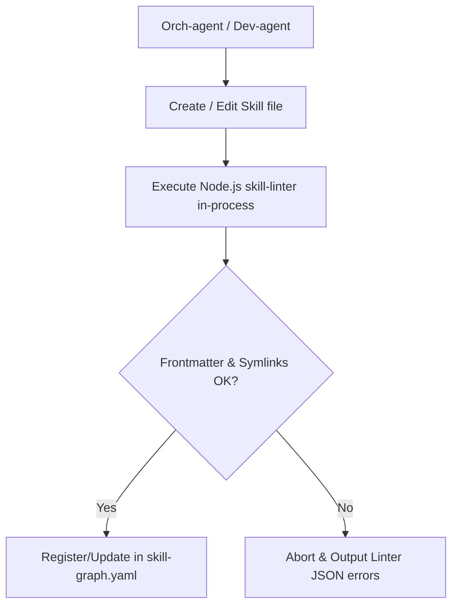

# Architecture Document: Awesome Skills & Claude Code Integration

This document defines the architectural specification and design patterns for upgrading the I-Wish skills and plugin management system.

---

## 1. Design Principles

- **Separation of Concerns:** Split the massive reference catalog from active project files. Keep the user's workspace lean and clean.
- **Dynamic Context Loading:** Never load all registered skills into the agent context simultaneously. Query and inject files dynamically via RAG or command lookups.
- **Secure Sandbox Boundaries:** Strictly validate all target paths using resolved realpaths to prevent path traversal via malicious symlinks.
- **Workspace Portability:** Ensure external skill dependencies are tracked in version-controlled config files to allow automatic synchronization across team members.

---

## 2. Directory Mappings & Cache Management

- **Global Reference Cache:** `~/.iwish/skills-reference/`
  - Stores a shallow clone of the `antigravity-awesome-skills` repository.
  - Used as a read-only catalog for the RAG lookup.
- **Project Configuration:** `{project-root}/.agent/settings.json`
  - JSON file tracking active skill dependencies for the local workspace.
  - Example shape:
    ```json
    {
      "plugins": {
        "antigravity-awesome-skills": {
          "enabled": true,
          "active_skills": ["andrej-karpathy-skills", "security-auditor"]
        }
      }
    }
    ```

---

## 3. Component Interactions & Logic Flows

### 3.1. Skill Linter Flow (Pure Node.js Native)
When `/create-skill` or a skill file edit is detected, the `Orch-agent` triggers validation in-process:
1. Scaffold or parse the skill files under `{project-root}/.agent/skills/<skill-name>/`.
2. Execute the JavaScript-based `skill-linter` directly inside Node.js:
   - Parse `SKILL.md` frontmatter using the native `yaml` npm module.
   - Assert all required fields exist: `name`, `description`, `inputs`, `outputs`, `mcp_tools_required`, `subagent_triggers`.
   - Resolve realpaths for all files and verify they reside within the repository bounds using `symlink-safety.js`.
3. If validation succeeds -> register or update in `skill-graph.yaml`.
4. If validation fails -> abort execution/registration and display structured error feedback.



### 3.2. Dynamic RAG Reference Flow
When an agent is executing a task and needs reference material:
1. Parse the task requirements and perform a search query against `~/.iwish/skills-reference/skills_index.json`.
2. Retrieve the matching skill file path from the index.
3. Load and read the `SKILL.md` content from the global cache on-demand.
4. Inject the parsed instruction sheet as a temporary context fragment.
5. Execute task -> unload the instruction fragment to free the context window.

### 3.3. Orchestrator-Driven Dependency Sync Flow
At I-Wish startup, the `Orch-agent` automatically reads workspace settings:
1. Read `.agent/settings.json` and extract the dependencies array.
2. Verify if the required reference skills exist in `~/.iwish/skills-reference/`.
3. If missing, clone/pull from the awesome-skills repository to update the global user cache.
4. Dynamically link the references into the active I-Wish runtime environment.

---

## 4. Security & Isolation Controls

- **Traversal Guard:** All file-system operations accessing `~/.iwish/skills-reference/` must use the `resolveSafeRealPath` logic from `tools/lib/symlink-safety.js` to ensure links do not resolve outside the global reference cache root.
- **Strict Input Validation:** Command parameters (such as `<skill-id>`) must be regex-checked against alphanumeric formats to prevent arbitrary shell expansions.

