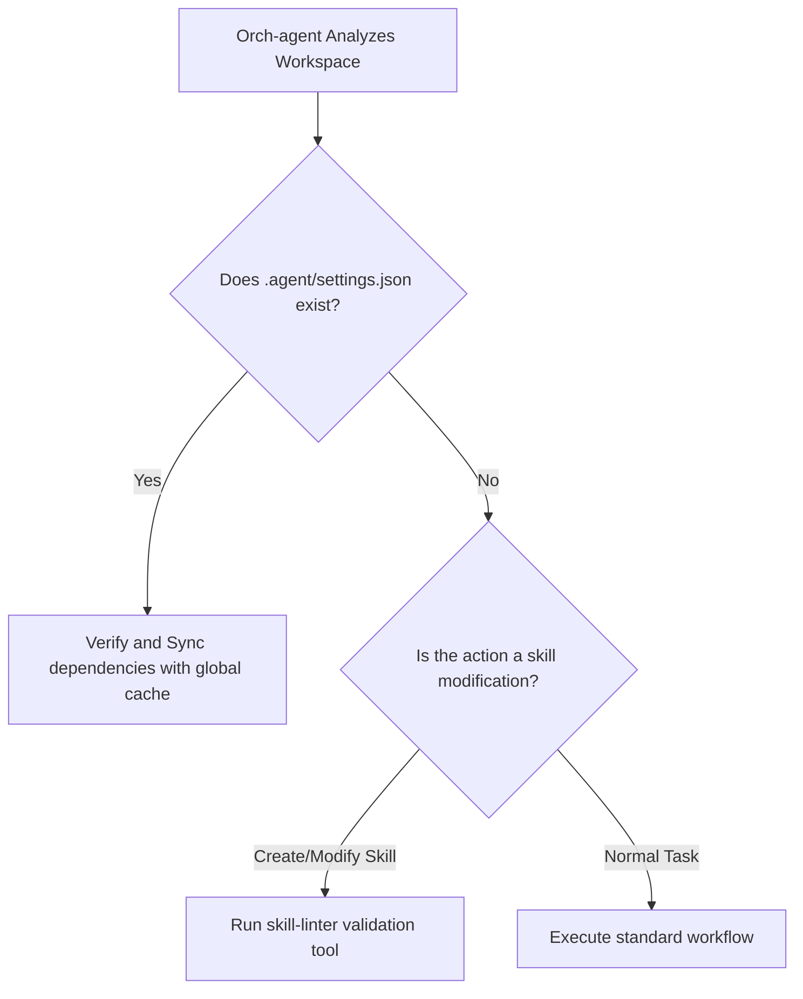

# Design Decision Council: Skill Linter Runtime & Orchestrator Integration

This document records the deliberations of the I-Wish Design Decision Council (comprising the Architect, QA, Data Strategist, and PM/Orch agents) regarding the technical implementation of the new skill linter and the integration pattern for the Orchestrator.

---

## 1. Council Deliberations (Anti-Sycophancy Protocol)

### Topic 1: Linter Runtime Language (Node.js vs. Python)

- **Architect (Technical Lead):**
  "We are evaluating whether to keep the linter in Python or rewrite it in Node.js. If we implement this in Node.js, we eliminate external dependencies. The strongest argument against keeping Python is the high probability of runtime failures. If Python is missing, or if packages like `PyYAML` or `jsonschema` are not installed on the host machine, the linter will crash. Writing a pure Node.js linter allows us to share code with [symlink-safety.js](file:///Users/hatrang20061988/Desktop/AI%20Project/iwish/tools/lib/symlink-safety.js) natively and run inline within the main Node process without the overhead of spawning a subprocess."

- **QA Agent (Skeptical Tester):**
  "What assumption are we not questioning here? We are assuming that translating the linter rules from Python to Node.js will maintain perfect parity. The upstream `antigravity-awesome-skills` repository maintains its linter in Python. If they update their linter scripts or modify their parsing heuristics, I-Wish's Node.js version will suffer from a translation tax and run the risk of false-positives/negatives. Who would this not work for? It would fail for developers who want to contribute custom skills upstream but encounter different linting results locally compared to the remote repo. We must establish a clear mapping to ensure 100% alignment."

- **Data Strategist (Data Integrity & Caching):**
  "What would a competitor like Claude Code do differently? They package all validators in pure JavaScript/TypeScript to guarantee zero-config installations across all environments (macOS, Linux, Windows). Running a Python subprocess is a sandbox escape vector: parsing raw strings and filenames in a shell environment invites command injection if not sanitized perfectly. A Node.js validator operates fully in-memory, parses YAML using native packages, and catches all exceptions inside a clean JavaScript try-catch block. The security benefits of a Node.js implementation outweigh the drift risk."

- **PM / Orchestrator Agent (User Experience & AI Coordination):**
  "To validate the hypothesis with the simplest version: we will write a streamlined TypeScript validation class `SkillLinter` that checks frontmatter fields using standard JSON Schema and checks paths using Node's native `fs.realpathSync`. What will we say NO to? We will say NO to translating complex upstream heuristic formatting rules. We will only enforce core fields and path safety. This simplifies maintenance and makes it extremely easy for AI agents to parse and debug the linter code."

---

## 2. Topic 2: Orchestrator Context Integration (Q1)

To support **Option B** (automatic linting and startup synchronization), the Orchestrator Agent (`Orch-agent`) must be equipped with prompt-level context and tool schemas to automatically recognize when it needs to run validation or resolve dependencies.

### 2.1. Context Recognition Schema

When the Orchestrator parses a user query or analyzes the workspace, it evaluates the context using the following state map:

### 2.2. Command Mapping & Tool Routing

Instead of relying on users executing CLI commands manually, the system registers two high-leverage tools for the Orchestrator:

1. **`validate_skill_format` (Tool):**
   - **Trigger:** Invoked automatically during `/create-skill` or whenever `SKILL.md` is modified.
   - **Behavior:** Runs the Node.js linter inline, checking for:
     - YAML frontmatter completeness.
     - Safe realpaths (no out-of-sandbox symlinks).
   - **Output:** Structured JSON error log or a success confirmation.

2. **`sync_workspace_dependencies` (Tool):**
   - **Trigger:** Invoked automatically upon workspace initialization.
   - **Behavior:** Compares active skill references declared in `.agent/settings.json` against the user's global cache at `~/.iwish/skills-reference/`.
   - **Output:** Automatically clones or pulls missing dependencies into the global cache and links references.

---

## 3. Final Council Decision Matrix

| Dimension | Option A: Python Subprocess | Option B: Node.js (TS) Native | Council Verdict |
|---|---|---|---|
| **Synchronization** | Direct parity with upstream script, but prone to local environment failures. | Integrated into the main package. Synced at runtime. | **Winner: Node.js** |
| **Quality** | High parsing depth for upstream, but subprocesses leak resources. | Consistent error handling and memory limits. | **Winner: Node.js** |
| **Compatibility** | Fails if `python3` or `pip` is unconfigured/broken. | Zero external dependencies. Works on all node platforms. | **Winner: Node.js** |
| **AI-Friendliness** | Needs shell command tools to invoke. High token parser output. | Standard MCP tool interface. Structured JSON returns. | **Winner: Node.js** |
| **Maintainability** | Requires managing two language environments in one project. | Shares TypeScript compiler, lint settings, and file libraries. | **Winner: Node.js** |
| **Scalability** | Spawning subprocesses adds 100-300ms latency per run. | Instant run in-process (< 10ms execution time). | **Winner: Node.js** |

### Decision Summary

1. **The linter and synchronization engine will be written in pure JavaScript/TypeScript (Node.js).** This guarantees 100% environment compatibility, removes Python runtime errors, and allows the linter to be executed in-memory as a secure, low-latency utility.
2. **Context and Command automation will be managed via Orchestrator tool integrations.** The `Orch-agent` will automatically trigger `validate_skill_format` and `sync_workspace_dependencies` dynamically based on file modifications and startup states, maintaining a completely transparent user experience.
