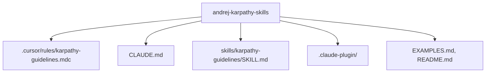

# Repo DNA: andrej-karpathy-skills

## 1. Identity Card
- **Name:** andrej-karpathy-skills
- **URL:** https://github.com/forrestchang/andrej-karpathy-skills
- **Type:** agent-framework / prompt-guidelines
- **Purpose:** Behavioral guidelines to reduce common LLM coding mistakes, derived from Andrej Karpathy's observations. Integrates directly into Cursor, Claude Code, and agent workflows.
- **License:** MIT
- **Tech Stack:** Markdown, MDC (Cursor rules), JSON (Plugin Config).

## 2. Architecture Blueprint
- **Pattern:** Documentation / Prompt Configuration
- **Entry points:** `.cursor/rules/karpathy-guidelines.mdc`, `CLAUDE.md`, `skills/karpathy-guidelines/SKILL.md`

## 3. Core Logic Patterns

### Pattern 1: Think Before Coding
- **Where:** `CLAUDE.md`, `SKILL.md`, `karpathy-guidelines.mdc`
- **What:** Don't assume, don't hide confusion, surface tradeoffs.
- **How:** Before implementing, state assumptions explicitly. If multiple interpretations exist, present them. If something is unclear, stop and ask.
- **Why:** Reduces mistakes stemming from incorrect assumptions.
- **Edge Cases:** For trivial tasks, judgment should be used to avoid over-clarifying.

### Pattern 2: Simplicity First
- **Where:** `CLAUDE.md`, `SKILL.md`, `karpathy-guidelines.mdc`
- **What:** Minimum code that solves the problem.
- **How:** No speculative features, no unused abstractions, no unrequested flexibility. If you write 200 lines and it could be 50, rewrite it.
- **Why:** Prevents overengineering and technical debt.
- **Edge Cases:** "Flexibility" requests should be pushed back unless explicitly required.

### Pattern 3: Surgical Changes
- **Where:** `CLAUDE.md`, `SKILL.md`, `karpathy-guidelines.mdc`
- **What:** Touch only what you must. Clean up only your own mess.
- **How:** Match existing style. Don't refactor adjacent code or fix unrelated formatting. Remove imports/variables orphaned by *your* changes.
- **Why:** Reduces diff size, merge conflicts, and unrelated bugs.
- **Edge Cases:** Do not remove pre-existing dead code unless explicitly asked.

### Pattern 4: Goal-Driven Execution
- **Where:** `CLAUDE.md`, `SKILL.md`, `karpathy-guidelines.mdc`
- **What:** Define success criteria. Loop until verified.
- **How:** Transform tasks into verifiable goals (e.g., test fails -> test passes). For multi-step tasks, state a brief plan with verification checkpoints.
- **Why:** Allows independent looping without constant clarification.
- **Edge Cases:** Weak criteria like "make it work" should be converted into concrete verifications.

### Pattern 5: Cursor Rule Auto-Enforcement
- **Where:** `.cursor/rules/karpathy-guidelines.mdc`
- **What:** `alwaysApply: true` frontmatter configuration.
- **How:** Cursor applies the MDC automatically when coding without requiring explicit inclusion by the user.
- **Why:** Zero-setup developer experience for consumers of the repository.
- **Edge Cases:** May conflict with project-specific instructions; meant to be merged if necessary.

## 4. State Management
N/A — This is a set of prompt guidelines and static configurations, not a runtime application with state.

## 5. Integration Points
- **Cursor:** Integrates via `.cursor/rules/*.mdc`.
- **Claude Code:** Integrates via `.claude-plugin/plugin.json`.
- **Agents/I-Wish:** Integrates via `skills/karpathy-guidelines/SKILL.md`.

## 6. Error Handling & Resilience
N/A — No runtime execution.

## 7. Configuration & Environment
- **Plugin config:** `.claude-plugin/plugin.json` and `marketplace.json` configure metadata for Claude.
- **MDC config:** The frontmatter `alwaysApply: true` in the `.mdc` file acts as the primary configuration to trigger the prompt rules in Cursor.

## 8. Dependencies & Trade-offs
- **Dependencies:** None.
- **Trade-offs:** Biases toward caution over speed. Might slow down simple/trivial tasks due to forced verification and asking questions, but saves significant time on complex tasks by avoiding rewrites.

## 9. Test Strategy
N/A — No automated tests. Contains `EXAMPLES.md` to demonstrate anti-patterns (failures) vs successful patterns.

## 10. Reusable Patterns for I-Wish
- **Action:** ADOPT
- **Notes:** The 4 core rules are highly relevant for Vegeta (Developer), Songoku (AI Engineer), and Piccolo (Architect). We should merge these guidelines into I-Wish's core developer prompts or maintain it as a dedicated "karpathy-guidelines" skill that developers invoke before coding.

## 11. Security Assessment
- **Date:** 2026-04-29
- **Trust Score:** HIGH (Meets 5 criteria: Stars, Forks, Contributors, Recent Commits, README length)
- **Secret Scan:** CLEAN
- **Dependency Audit:** CLEAN
- **Behavioral Analysis:** CLEAN
- **Final Verdict:** PASS
