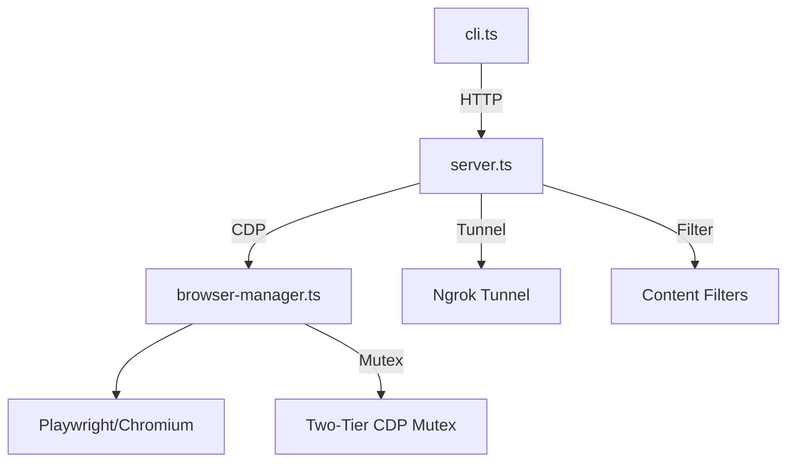

# Repo DNA: gstack

> **Absorption Date:** 2026-04-29
> **Pipeline:** RAP 9-Phase (Dual-Layer)
> **Security Verdict:** WARNING_OVERRIDDEN (test fixture secrets only)
> **Source:** https://github.com/garrytan/gstack

---

## 1. Identity Card

| Field | Value |
|-------|-------|
| **Name** | gstack |
| **Author** | Garry Tan (YC President) |
| **Type** | Compound AI Agent Toolkit |
| **Purpose** | Full-spectrum AI development environment: browser automation daemon + 40+ AI workflow skills + engineering philosophy system |
| **License** | MIT |
| **Tech Stack** | TypeScript, Bun, Playwright, Puppeteer-core, Ngrok |
| **Classification** | Compound (Code + Behavioral) |

---

## 2. Architecture Blueprint

### 2.1 Code Layer — Browser Daemon



- **Pattern:** Daemon / Client-Server Orchestration
- **Entry points:** `browse/src/cli.ts`, `browse/src/server.ts`, `browse/src/browser-manager.ts`
- **Key Innovation:** Persistent Chromium daemon eliminates 3-5s cold start per command

### 2.2 Behavioral Layer — Skill System

```mermaid
graph TD
  ETHOS[ETHOS.md] -->|Injected| PREAMBLE[{{PREAMBLE}} Block]
  PREAMBLE -->|Every Skill| SKILLS[40+ SKILL.md.tmpl Files]
  SKILLS -->|Build-time| GEN[gen-skill-docs.ts]
  GEN -->|Placeholder Fill| COMPILED[Compiled SKILL.md]
  COMPILED -->|Runtime| CLAUDE[Claude Code Agent]

  subgraph Persona Modes
    STARTUP[YC Office Hours Partner]
    CSO[Chief Security Officer]
    REVIEWER[Adversarial Code Reviewer]
    DESIGNER[Design Thinking Partner]
    BUILDER[Builder Mode Collaborator]
  end
```

- **Pattern:** Template-Driven Skill Generation with Shared Placeholders
- **Source of Truth:** `*.md.tmpl` files (templates, NOT compiled `.md`)
- **Key Innovation:** Behavioral instructions are **code-generated** from templates + source code, ensuring docs and code can never drift

---

## 3. Core Logic Patterns

### Pattern 1: Daemon/CLI Architecture
- **Where:** `cli.ts`, `server.ts`
- **What:** CLI dispatches commands to a long-lived background server
- **How:** CLI pings `http://127.0.0.1:4000/health`; if unresponsive, starts server as detached process via lock mechanism (`ensureServer`)
- **Why:** Sub-second response times for AI agents vs. 3-5s Playwright cold start
- **Edge Cases:** Orphaned processes via `BROWSE_PARENT_PID` watchdog

### Pattern 2: Multi-Agent Tab Isolation
- **Where:** `browser-manager.ts`
- **What:** Tab ownership tracking prevents cross-agent interference
- **How:** Maps agent tokens → tab IDs (`tabOwnership`), validates ownership before execution
- **Why:** Essential for concurrent "Pair-Agent" workflows
- **Edge Cases:** Shared "global" tabs if explicitly allowed

### Pattern 3: Dual-Listener Remote Tunneling
- **Where:** `server.ts`
- **What:** Strict isolation between local CLI traffic and remote Pair-Agent traffic
- **How:** Ngrok tunnel with `TUNNEL_COMMANDS` allowlist filtering
- **Why:** Remote agents cannot execute raw JS or access local files
- **Edge Cases:** Ngrok rate limits handled gracefully

### Pattern 4: Content Filtering & Prompt Injection Defense
- **Where:** DOM extraction modules
- **What:** Prevents untrusted web content from hijacking LLM context
- **How:** `runContentFilters` + hidden-element detection (`markHiddenElements`) before DOM snapshots
- **Why:** Modern websites contain SEO spam, adversarial text designed to poison LLM windows

### Pattern 5: Two-Tier Mutex for CDP
- **Where:** `browser-manager.ts`
- **What:** Race-condition prevention for Chrome DevTools Protocol
- **How:** Separate locks for browser-scoped vs tab-scoped operations
- **Why:** Prevents deadlocks when simultaneous commands collide over WebSocket

---

## 4. Behavioral Intelligence (Phase 1.5 Extraction)

This section captures the **non-code AI behavioral patterns** — the "soul" of gstack that makes it a compound repository.

### 4.1 Engineering Ethos (`ETHOS.md`)

Three foundational principles injected into every skill via `{{PREAMBLE}}`:

| Principle | Rule | Anti-Pattern |
|-----------|------|-------------|
| **Boil the Lake** | When completeness costs minutes more than the shortcut, do the complete thing. Always. | "Choose B — it covers 90% with less code" |
| **Search Before Building** | Three layers: Tried-and-true (L1) → New-and-popular (L2) → First-principles (L3). Prize the "Eureka Moment" when L3 reveals conventional wisdom is wrong. | Rolling custom when runtime has a built-in |
| **User Sovereignty** | AI models recommend. Users decide. Two models agreeing is signal, not proof. Never skip the verification step. | "Both models agree, so I'll just make the change" |

**I-Wish Relevance:** HIGH — These principles directly map to our `Grand-Priest` orchestrator's decision-making philosophy.

### 4.2 Skill Template System

**Architecture:** `SKILL.md.tmpl` → `gen-skill-docs.ts` (build-time) → `SKILL.md` (committed)

| Placeholder | Source | Function |
|-------------|--------|----------|
| `{{PREAMBLE}}` | `gen-skill-docs.ts` | Startup: update check, session tracking, operational self-improvement, AskUserQuestion format, Search Before Building |
| `{{COMMAND_REFERENCE}}` | `commands.ts` | Auto-generated command table from source code |
| `{{GBRAIN_CONTEXT_LOAD}}` | `resolvers/gbrain.ts` | Brain-first context search with keyword extraction |
| `{{GBRAIN_SAVE_RESULTS}}` | `resolvers/gbrain.ts` | Post-skill brain persistence with entity enrichment |
| `{{LEARNINGS_SEARCH}}` | Generated | Search operational learnings from previous sessions |
| `{{LEARNINGS_LOG}}` | Generated | Log new operational learnings for future sessions |
| `{{CONFIDENCE_CALIBRATION}}` | Generated | Force confidence scoring on all findings |
| `{{BASE_BRANCH_DETECT}}` | `gen-skill-docs.ts` | Dynamic base branch detection for PR-targeting skills |

**Key Insight:** The template system ensures behavioral instructions are **structurally sound** — if a command exists in code, it appears in docs. If it doesn't exist, it can't appear.

### 4.3 Persona Catalog (40+ Skills)

#### Tier 1 — High-Value Behavioral Patterns

| Skill | Persona | Key Innovation | I-Wish Equivalent |
|-------|---------|----------------|-----------------|
| `/review` | Adversarial Code Reviewer | Fix-First flow (AUTO-FIX vs ASK), Greptile integration, specialist army dispatch, PR Quality Score | `/code-review` |
| `/cso` | Chief Security Officer | 14-phase security audit, STRIDE + OWASP Top 10, Daily (8/10 gate) vs Comprehensive (2/10 gate), variant analysis | `/Hit` edge case analysis |
| `/office-hours` | YC Office Hours Partner | 6 Forcing Questions, Startup vs Builder mode, Signal Synthesis, Builder Profile tracking across sessions, YC referral | `/brainstorming` + `/create-product-brief` |
| `/ship` | Release Engineer | Pre-flight review dashboard, version queue management, landing-order risk assessment | No equivalent |
| `/qa` | QA Engineer | Test bootstrap framework detection, coverage enforcement, CI/CD pipeline setup | `/Tien-Shinhan` |
| `/plan-ceo-review` | CEO Strategic Reviewer | Cross-model plan review (Codex or Claude subagent fallback), second opinion architecture | No equivalent |

#### Tier 2 — Specialized Patterns

| Skill | Function | Key Pattern |
|-------|----------|------------|
| `/design-html` | HTML design from screenshots | UX Principles (scanning, satisficing, goodwill reservoir, trunk test) |
| `/design-shotgun` | Comparison board feedback loop | Shotgun loop for iterative design refinement |
| `/design-consultation` | Design thinking partner | Market research + competitive analysis |
| `/investigate` | Bug investigation | Systematic root cause analysis |
| `/learn` | Learning mode | Pedagogical approach to code education |
| `/skillify` | Skill creator | Meta-skill: create new skills from patterns |
| `/careful` | High-stakes mode | Extra validation for destructive operations |
| `/guard` | Safety guardrails | Prevent common AI agent mistakes |
| `/context-save/restore` | Session persistence | Cross-session context preservation |

### 4.4 Anti-Sycophancy Framework

The `/office-hours` skill contains a rigorous **anti-sycophancy system** — rules that prevent the AI from being agreeable instead of honest:

**Never say during diagnostic:**
- "That's an interesting approach" → Take a position instead
- "There are many ways to think about this" → Pick one, state what evidence would change your mind
- "You might want to consider..." → Say "This is wrong because..."
- "That could work" → Say whether it WILL work based on evidence

**I-Wish Relevance:** CRITICAL — Should be extracted and applied to our `King-Kai` (Council) and `Master-Roshi` (Advisor) personas.

### 4.5 Operational Self-Improvement Loop

Every skill session ends with a reflection phase:
1. Agent reflects on failures (CLI errors, wrong approaches, project quirks)
2. Logs operational learnings to project's JSONL file
3. Future sessions search these learnings via `{{LEARNINGS_SEARCH}}`

**Pattern:** `{{LEARNINGS_LOG}}` → JSONL append → `{{LEARNINGS_SEARCH}}` query

**I-Wish Relevance:** HIGH — Our agents lack this cross-session learning mechanism.

### 4.6 Test Strategy (Three Tiers)

| Tier | What | Cost | Speed |
|------|------|------|-------|
| 1 — Static validation | Parse `$B` commands, validate against registry | Free | <2s |
| 2 — E2E via `claude -p` | Spawn real Claude session, run each skill | ~$3.85 | ~20min |
| 3 — LLM-as-judge | Sonnet scores docs on clarity/completeness/actionability | ~$0.15 | ~30s |

**Key Insight:** "Catch 95% of issues for free, use LLMs only for judgment calls."

---

## 5. State Management

- **Persistent Memory:** `BROWSE_STATE_FILE` for browser state
- **In-Memory Buffers:** Circular buffers for network requests, dialogs, console logs (OOM prevention)
- **Builder Profile:** `~/.gstack/builder-profile.jsonl` — tracks user across sessions (signal count, design docs, resources shown)
- **Operational Learnings:** Per-project JSONL files for cross-session improvement
- **Security Reports:** `.gstack/security-reports/` with trend tracking and fingerprint matching

---

## 6. Error Handling & Resilience

- **Error Philosophy:** "Errors are for AI agents, not humans." Every error message includes actionable next steps.
- **Crash Recovery:** No self-healing. Server exits on Chromium crash; CLI auto-restarts on next command.
- **wrapError():** Rewrites Playwright's internal stack traces into agent-friendly guidance.

---

## 7. Configuration & Environment

| Variable | Purpose |
|----------|---------|
| `BROWSE_STATE_FILE` | Configuration path |
| `BROWSE_PARENT_PID` | Watchdog tracking |
| `BROWSE_HEADED` | Visual browser toggle |
| `GSTACK_CHROMIUM_PATH` | Custom Chromium injection |
| `GSTACK_HOME` | Base directory for state (~/.gstack) |

---

## 8. Dependencies & Trade-offs

| Decision | Trade-off |
|----------|-----------|
| Persistent Chromium daemon | 200-500MB RAM baseline → sub-second command execution |
| No MCP protocol | Token-lighter plain HTTP → no standard protocol interop |
| No WebSocket streaming | Simpler HTTP → no real-time streaming |
| Committed (not generated) SKILL.md | Git blame works, CI validates → requires rebuild on changes |
| macOS-only cookie decryption | Full Keychain support → no Linux/Windows |

---

## 9. Reusable Patterns for I-Wish

### ADOPT Candidates

| Pattern | Source | Target in I-Wish | Priority |
|---------|--------|---------------|----------|
| Anti-Sycophancy Rules | `/office-hours` | `King-Kai`, `Master-Roshi` | P0 |
| Operational Self-Improvement Loop | `{{LEARNINGS_LOG/SEARCH}}` | All agents | P0 |
| Fix-First Review Flow | `/review` | `/code-review` | P1 |
| CSO 14-Phase Security Audit | `/cso` | `/Hit` edge case | P1 |
| Builder Profile / Signal Tracking | `/office-hours` Phase 4.5 | `/brainstorming` | P2 |
| Three-Tier Test Strategy | Test infrastructure | `/Tien-Shinhan` | P2 |

### MERGE Candidates

| Pattern | Source | Merge Into | Notes |
|---------|--------|-----------|-------|
| 6 Forcing Questions | `/office-hours` Phase 2A | `/create-product-brief` | Complement existing discovery |
| Engineering Ethos (3 Principles) | `ETHOS.md` | `CLAUDE.md` / Agent preambles | "Boil the Lake" + "Search Before Building" |
| Confidence Calibration | `{{CONFIDENCE_CALIBRATION}}` | `/code-review`, `/Hit` | Require confidence scores on findings |
| Cross-Model Second Opinion | Phase 3.5 Codex/Subagent | `/King-Kai` council | Independent cold reads |

### OBSERVE (Not Ready to Adopt)

| Pattern | Reason |
|---------|--------|
| Daemon Architecture | Requires browser binary management; `Cell` agent doesn't need persistent state yet |
| Ngrok Tunnel Pairing | No remote-agent use case in I-Wish currently |
| Builder Journey narrative | Requires multi-session tracking infrastructure we don't have |

---

## 10. Security Assessment

| Check | Result |
|-------|--------|
| **Date** | 2026-04-29 |
| **Trust Score** | HIGH |
| **Gitleaks Scan** | WARNING_OVERRIDDEN (test fixture secrets only) |
| **Dependency Audit** | CLEAN |
| **Behavioral Analysis** | CLEAN |
| **Skill Supply Chain** | CLEAN (all skills are first-party) |
| **Final Verdict** | PASS |

---

## 11. Behavioral Asset Inventory

Total behavioral assets identified: **72**

| Category | Count | Examples |
|----------|-------|---------|
| Skill Templates (`.md.tmpl`) | 40+ | review, cso, office-hours, ship, qa, design-*, plan-* |
| Shared Placeholders | 18 | PREAMBLE, GBRAIN_*, LEARNINGS_*, CONFIDENCE_*, etc. |
| Engineering Docs | 5 | ETHOS.md, ARCHITECTURE.md, DESIGN.md, CONTRIBUTING.md, AGENTS.md |
| Agent Configurations | 3 | agents/, model-overlays/, conductor.json |
| Build Scripts | 6+ | gen-skill-docs.ts, resolvers/*.ts |

**Token Overflow Guard Result:** 50/72 assets processed (triaged by P0.5/P1.5 priority)
