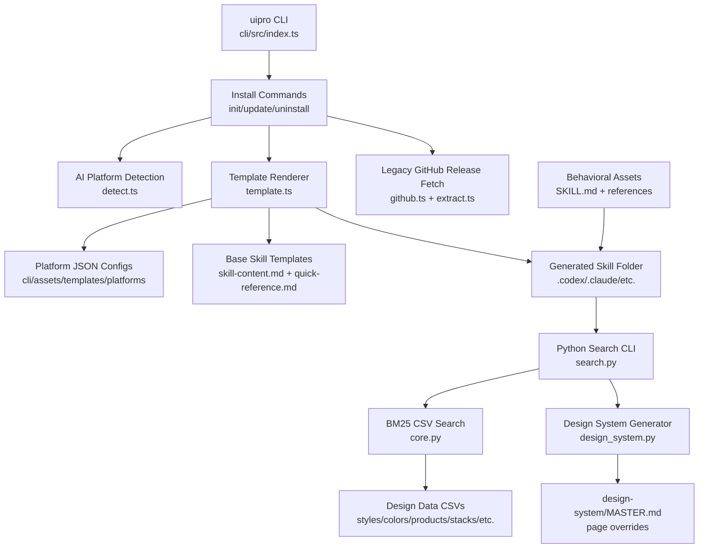

# Repo DNA: ui-ux-pro-max-skill
> Generated on: 2026-05-09
> Source: [ui-ux-pro-max-skill](https://github.com/nextlevelbuilder/ui-ux-pro-max-skill)
> Security Status: PASS
> Type: hybrid-agent

---

## 1. Identity Card
- **Purpose**: Provides UI/UX design intelligence as installable AI-assistant skills plus local searchable design data. It helps agents choose styles, color palettes, typography, UX rules, stack-specific guidelines, and full design-system recommendations.
- **Maturity**: Production-oriented public project with npm CLI packaging, GitHub releases, large README, and bundled multi-platform assets. Test coverage is partial.
- **License**: MIT.
- **Tech Stack**: TypeScript CLI on Node/Bun (`commander`, `chalk`, `ora`, `prompts`), Python 3 search/generation scripts, CSV knowledge bases, Markdown skill/reference assets, GitHub releases for optional legacy install.

---

## 2. Architecture Blueprint

**Entry Points:**
- `cli/src/index.ts` — `uipro` CLI command router.
- `cli/src/commands/init.ts` — install flow for local/global skill generation.
- `src/ui-ux-pro-max/scripts/search.py` — installed skill search and design-system CLI.
- `src/ui-ux-pro-max/scripts/design_system.py` — multi-domain design-system generator.
- `.claude/skills/ui-ux-pro-max/SKILL.md` — primary behavioral skill asset.

**Module Map:**

**Classification:** `hybrid-agent`: a CLI installer, data-backed AI skill, prompt/reference library, and local reasoning scripts packaged together.

---

## 3. Core Logic Patterns

### Pattern 1: Platform-Aware Skill Installation
- **Where:** `cli/src/utils/detect.ts`, `cli/src/commands/init.ts`
- **What:** Detects existing AI assistant folders and selects an install target such as Claude, Codex, Cursor, Windsurf, Copilot, Gemini, or all platforms.
- **How:** Checks marker directories like `.claude`, `.codex`, `.github`, `.agents`; if no `--ai` is supplied, prompts the user with supported targets.
- **Why:** Lets one package distribute the same design intelligence across many coding-agent ecosystems.
- **Edge Cases:** Multiple detected targets suggest `all`; no prompt response cancels; invalid `--ai` exits before install.

### Pattern 2: Template-Generated Skill Files
- **Where:** `cli/src/utils/template.ts`, `cli/assets/templates/platforms/*.json`, `cli/assets/templates/base/*.md`
- **What:** Generates platform-specific skill/workflow files from shared Markdown templates and per-platform JSON config.
- **How:** Loads platform config, renders frontmatter and placeholders, writes `SKILL.md` or equivalent into the target folder, then copies `data/` and `scripts/` into the skill directory.
- **Why:** Avoids maintaining separate hand-written skill copies for each AI platform.
- **Edge Cases:** Missing platform configs are skipped in `all`; global installs rewrite script paths to `~/...`; frontmatter values containing special characters are quoted.

### Pattern 3: Searchable CSV Knowledge Base
- **Where:** `src/ui-ux-pro-max/scripts/core.py`
- **What:** Provides local design lookup across styles, colors, products, UX, typography, icons, charts, React/web performance, Google Fonts, and stack-specific guidance.
- **How:** Maps domains to CSV files and searchable columns, tokenizes rows, builds a BM25 index per query, and returns top-scoring rows.
- **Why:** Keeps the AI skill lightweight and deterministic while still supporting a broad design corpus.
- **Edge Cases:** Missing CSV files return structured errors; unknown stack returns available options; zero-score results are filtered out.

### Pattern 4: Multi-Domain Design-System Generation
- **Where:** `src/ui-ux-pro-max/scripts/design_system.py`, `src/ui-ux-pro-max/data/ui-reasoning.csv`
- **What:** Converts a product/query into a recommended pattern, style, color palette, typography, effects, anti-patterns, and checklist.
- **How:** Searches product first, finds a matching reasoning rule, then runs style/color/landing/typography searches with priority keywords and formats output as ASCII or Markdown.
- **Why:** Gives agents a concrete design direction before building UI, reducing arbitrary palettes and style drift.
- **Edge Cases:** Missing reasoning rule falls back to generic minimal/flat defaults; malformed decision-rule JSON is ignored; persistence is optional.

### Pattern 5: Master + Page Override Design-System Persistence
- **Where:** `src/ui-ux-pro-max/scripts/search.py`, `src/ui-ux-pro-max/scripts/design_system.py`
- **What:** Persists generated design rules into a global project master plus optional page-specific override files.
- **How:** `--persist` writes `design-system/{project}/MASTER.md`; `--page` writes `design-system/{project}/pages/{page}.md`.
- **Why:** Gives agents a durable source of truth across sessions and page-specific deviations.
- **Edge Cases:** Page overrides are only written when a page is supplied; project names are slugified; output directory can be overridden.

### Pattern 6: Legacy Download With Local Fallback
- **Where:** `cli/src/commands/init.ts`, `cli/src/utils/github.ts`, `cli/src/utils/extract.ts`
- **What:** Optional legacy mode downloads the latest GitHub release ZIP, but falls back to bundled/template generation on failure.
- **How:** Fetches release metadata, resolves a ZIP asset or tag archive, downloads/extracts, copies target folders, and cleans temp directories.
- **Why:** Keeps old distribution behavior while making template generation the default.
- **Edge Cases:** Rate limits, missing ZIPs, network failures, and download errors warn and return `null` so the installer can continue with bundled generation.

---

## 4. State Management
- **Flow:** Mostly stateless command execution. CLI state is held in command options and generated files. Python search builds an in-memory BM25 index per invocation. Design-system persistence writes Markdown files as durable state.
- **Tools used:** File-system checks and writes, CSV readers, JSON platform configs, GitHub API calls, process working directory, optional home directory for global install.

---

## 5. Integration Points
- **APIs:** GitHub REST API for releases/latest release in legacy install and update checks.
- **Events/Hooks:** CLI subcommands (`init`, `versions`, `update`, `uninstall`) and Python CLI flags (`--domain`, `--stack`, `--design-system`, `--persist`, `--page`).
- **Plugins:** Outputs skill folders for multiple AI assistants: Claude, Codex, Cursor, Windsurf, Antigravity, Copilot, Kiro, OpenCode, RooCode, Gemini, Trae, Continue, CodeBuddy, Droid, KiloCode, Warp, Augment.

---

## 6. Error Handling & Resilience
- **Patterns:** Custom `GitHubRateLimitError` and `GitHubDownloadError`, guarded file existence checks, try/catch around install flows, structured Python error dictionaries for missing data.
- **Retry Logic / Fallbacks:** No automatic retries. Key resilience comes from fallback from GitHub release download to template/bundled install, and from default design-system recommendations when specific reasoning rules are absent.

---

## 7. Configuration & Environment
- **Methods:** `cli/assets/templates/platforms/*.json` controls install targets; CSV files control the design corpus; CLI options control install mode, global/local path, offline behavior, and search behavior.
- **Critical Variables:** No required environment variables. Network is only needed for update checks and legacy release downloads.

---

## 8. Dependencies & Trade-offs
- **Critical Deps:** `commander` for CLI routing, `prompts` for interactive selection, `ora`/`chalk` for terminal UX, Python standard library for search/generation.
- **Why Chosen:** The package optimizes for local, offline-friendly use after install. CSV + BM25 keeps search understandable and portable.
- **Trade-offs:** Large duplicated data assets under `src/` and `cli/assets/`; many Markdown references and CSVs increase package size; no semantic embeddings or learned ranking; generated skill templates can drift if platform configs are incomplete.

---

## 9. Test Strategy
- **Types:** Limited tests found only under `.claude/skills/ui-styling/scripts/tests/` for unrelated bundled UI-styling helpers.
- **Coverage:** Low for the main `uipro` CLI and Python design-system generator.
- **Patterns:** Python test files and coverage fixture exist for the ui-styling sub-skill. No direct TypeScript unit tests or integration tests found for install/update/uninstall flows.

---

## 10. Reusable Patterns for I-Wish
- **Can Adopt:** Platform-config-driven generation of skills/workflows; local CSV-backed design intelligence; `MASTER.md` + page override persistence; design-system-first workflow; explicit UI quality checklists.
- **Need Adaptation:** I-Wish should merge the design-system generator into existing UX/design guardian assets rather than importing all 98 behavioral files. The BM25 search and reasoning CSV could become a small attached tool or dataset.
- **Inspiration Only:** Multi-platform installer is useful conceptually but may be unnecessary if I-Wish targets its own `.agent`/`.codex` structure. Large Google Fonts CSV and font license bundles are heavy and not high-value for I-Wish core.

**Behavioral Patterns Extracted:**
- **Role/Persona:** UI/UX design intelligence assistant for web/mobile design decisions, UI reviews, and quality control.
- **System Prompt:** Use design-system generation first, then supplement with domain and stack searches; prioritize accessibility, touch interaction, performance, style selection, layout, typography, animation, forms, navigation, and charts.
- **Tool Usage Pattern:** Calls `python3 skills/ui-ux-pro-max/scripts/search.py` with `--design-system`, `--domain`, `--stack`, `--persist`, and optional `--page`.
- **Workflow Steps:** Analyze request → generate design system → optionally persist → search detailed domain/stack rules → implement/review UI against checklist.
- **Decision Logic:** Product/category selection steers style, color, typography, landing pattern, and anti-patterns; page override rules supersede master design rules.
- **Guard Rails:** Avoid UI work without accessibility checks; use SVG icons instead of emoji; maintain contrast, touch target size, responsive behavior, reduced-motion support, and consistent style tokens.

---

## 11. Security Assessment
- **Gitleaks:** Clean. `gitleaks detect` scanned one shallow commit and found no leaks.
- **CVEs:** Clean. `npm audit --json` in `cli/` reported 0 vulnerabilities.
- **Behavioral:** Clean. Broad scan found `process.env` examples in CSV guidance only; tightened scan found no exfiltration or dynamic execution hits.
- **Trust Score:** HIGH. Public MIT repo with high stars/forks, README, recent release, and visible activity.
