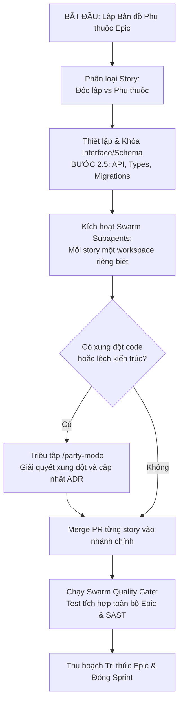

Chào bạn, đây là tài liệu **"MASTER PROTOCOL: AI-FACTORY SDLC"** được thiết kế dưới dạng chỉ thị hệ thống (System Instruction). Tài liệu này đóng vai trò là "Hiến pháp kỹ thuật" mà bạn có thể nạp trực tiếp cho AI (Claude, Gemini, hoặc Antigravity Agent) để nó tự đối chiếu, audit và đề xuất cải tiến quy trình hiện tại của tổ chức bạn.

--------------------------------------------------------------------------------

MASTER PROTOCOL: AI-FACTORY SDLC & SECURITY STANDARD (V3.0 - SWARM & PARALLEL-READY)  
**To:** AI Agents, System Architects, & Product Owners  
**From:** Office of the CTO & Chief AI Officer  
**Context:** Tối ưu hóa hiệu suất và giảm độ trễ thông qua việc tận dụng kiến trúc Multi-Agent song song (Swarm/Parallel) từ Antigravity 2.0 và Claude Code (Opus 4.8).

> **Phạm vi áp dụng:** Quy trình song song hóa (Phần 3, 4, 5 của tài liệu này) chỉ được kích hoạt khi nền tảng vận hành có hỗ trợ thực thi sub-agent song song (ví dụ: Antigravity 2.0 với `invoke_subagent`, Claude Code với multi-agent mode). Khi chạy trên nền tảng đơn luồng (single-agent), các bước vẫn tuân thủ đúng quy trình nhưng thực hiện tuần tự.

---

## PHẦN 1: TRIẾT LÝ VẬN HÀNH (FACTORY MINDSET)  

Hệ thống không được vận hành dựa trên trí nhớ con người mà dựa trên **Mô hình KWSR** (Knowledge - Workflow - Skill - Rule) được lưu trữ bền vững.  
1. **Code là phụ, Tri thức là chính:** Mục tiêu của một Sprint không chỉ là ship tính năng, mà là "thu hoạch" (Harvesting) tri thức để làm giàu "Bộ não doanh nghiệp" (Corporate Brain).  
2. **Đại lý tự chủ (Autonomous Swarm):** Con người đóng vai trò Kiến trúc sư và Người gác cổng (Gatekeeper). AI đóng vai trò Thực thi (Worker) thông qua một mạng lưới subagent song song chuyên biệt.  
3. **Bảo mật từ thiết kế (Security by Design):** Bảo mật không phải là bước cuối cùng, mà là ràng buộc đầu tiên trong `Smart_PRD` và `THREAT_MODEL`.  
4. **Phân tách giữa Khám phá song song và Tích hợp tuần tự (Exploration vs Integration):** Chạy song song không giới hạn các subagent để thử nghiệm, tìm giải pháp hoặc quét dữ liệu (Parallel Exploration), nhưng việc merge mã nguồn vào nhánh chính và giải phóng tài nguyên phải được kiểm soát tuần tự, chặt chẽ (Sequential Integration).

--------------------------------------------------------------------------------

## PHẦN 2: QUY TRÌNH 5 BƯỚC CẢI TIẾN (THE PARALLEL ASSEMBLY LINE)  

Mọi tính năng (Feature) phải đi qua dây chuyền sản xuất gồm 5 trạm kiểm soát sau. Bất kỳ bước nào thiếu Output chuẩn sẽ bị từ chối chuyển tiếp.

### BƯỚC 1: CONTEXT LOADING & PARALLEL SCAN (NẠP BỐI CẢNH SONG SONG)  
*Mục tiêu: Kế thừa tri thức cũ với tốc độ cao bằng cách chia nhỏ không gian quét tài liệu.*  
* **Tác nhân:** Product Architect (Human) + Research Agent Swarm (Các subagent chạy song song).  
* **Hành động:**  
    1. Một Agent điều phối chính kích hoạt nhiều subagent song song để quét đồng thời: bài học cũ (Post-mortems), codebase hiện tại, rủi ro bảo mật lịch sử và tài liệu liên quan.  
    2. Tổng hợp tri thức từ các subagent thành một bối cảnh hợp nhất.  
* **Output bắt buộc:**  
    * 📄 `docs/PRD.md`: Theo chuẩn **Smart_PRD** (Rõ ràng về Tech Stack, Success Metrics).  
    * 📄 `docs/SECURITY_REQUIREMENTS.md`: Xác định rõ dữ liệu nhạy cảm (PII) và quyền truy cập.  

### BƯỚC 2: DEBATE-DRIVEN BLUEPRINTING (KIẾN TRÚC TRANH BIỆN)  
*Mục tiêu: Đưa ra bản vẽ kỹ thuật tối ưu thông qua sự phản biện tự động giữa các Agent.*  
* **Tác nhân:** System Architect (Human) + Planning Agent Swarm (Council of Agents).  
* **Hành động:**  
    1. Kích hoạt song song các subagent đề xuất các giải pháp kỹ thuật khác nhau (Option A, B, C).  
    2. Chạy cơ chế **Party Mode** tự động để các agent tự tranh biện, chỉ ra lỗ hổng của nhau dưới góc nhìn hiệu năng, bảo mật và khả năng mở rộng.  
* **Output bắt buộc:**  
    * 📄 `docs/ADR.md`: Ghi nhận quyết định kiến trúc (Tại sao chọn A thay vì B?).  
    * 📄 `docs/THREAT_MODEL.md`: Danh sách các vector tấn công và cách phòng chống.  
    * 📄 `PLAN.md`: Kế hoạch thực thi tổng thể.  

### BƯỚC 2.5: SCHEMA & INTERFACE LOCK (KHÓA GIAO DIỆN - Bắt buộc)  
*Mục tiêu: Ngăn chặn trôi dạt kiến trúc (Architectural Drift) trước khi phân rã tác vụ.*  
* **Tác nhân:** System Architect (Human + AI Master).  
* **Hành động:**  
    1. Định nghĩa và đóng băng (freeze) toàn bộ các Interface, Schema dữ liệu (TypeScript Types, Zod/Pydantic Schemas), API Contracts và Database Schema Migrations.  
    2. Lưu trữ các định nghĩa này làm "Hợp đồng giao tiếp" dùng chung. Các subagent thực thi ở Bước 3 bắt buộc phải dùng mock từ hợp đồng này, cấm tự ý sửa đổi interface chung mà không được phê duyệt tuần tự.  
* **Output bắt buộc:**  
    * 📄 `docs/API_CONTRACTS.md` hoặc các file định nghĩa Types/Schemas cứng.

### BƯỚC 3: PARALLEL IMPLEMENTATION (THỰC THI SONG SONG)  
*Mục tiêu: Code cực nhanh, độc lập và an toàn.*  
* **Tác nhân:** Coding Agent Swarm (Claude Code/Antigravity Subagents chạy song song).  
* **Hành động:**  
    1. Phân rã `PLAN.md` thành các sub-task độc lập, phân bổ mỗi sub-task cho một subagent.  
    2. Mỗi subagent chạy trên một workspace cô lập phù hợp (Local hoặc Docker Sandbox - xem tiêu chí ở Phần 3).  
    3. Áp dụng quy tắc **Write-Locking**: Chỉ ghi đè lên các file thuộc phân vùng quản lý riêng của subagent đó. Cấm ghi song song vào file cấu hình chung (`package.json`, Router chung).  
* **Output bắt buộc:**  
    * Source Code riêng biệt theo nhánh.  
    * Unit Tests (Coverage > 80%).  

### BƯỚC 3.5: CONFLICT PARTY-MODE (GIẢI QUYẾT XUNG ĐỘT KIẾN TRÚC & CODE - Bắt buộc khi có xung đột)  
*Mục tiêu: Đánh giá và định hướng kiến trúc trước khi thực thi kiểm thử.*  
* **Tác nhân:** Swarm Orchestrator + Council of Agents (dev-agent, architect-agent, review-agent).  
* **Hành động:**  
    1. **Tạm ngưng kiểm thử (Halt Testing):** Khi có xung đột merge hoặc lệch pha kiến trúc giữa các subagent, hệ thống bắt buộc dừng việc chạy test suite.  
    2. **Triệu tập Hội đồng:** Kích hoạt `/party-mode` tranh biện giữa các Agent.  
    3. **Thống nhất giải pháp:** Ghi nhận quyết định vào ADR logs.  
    4. **Tiến hành Test:** Sau khi tháo gỡ xung đột hoàn toàn, mới chuyển sang Bước 4 (Quality Gate).

### BƯỚC 4: SWARM QUALITY GATE (CỔNG KIỂM SOÁT PHÂN TÁN)  
*Mục tiêu: Kiểm thử và quét bảo mật phân tán trước khi merge.*  
* **Tác nhân:** QA Agent Swarm + Human Gatekeeper.  
* **Hành động:**  
    1. Chạy song song các bộ quét bảo mật SAST, rò rỉ secret (Secrets scan), và chạy các unit/integration test suite.  
    2. Sau khi tất cả subagent vượt qua kiểm thử cục bộ, merge PR tuần tự và chạy bộ test tích hợp hệ thống cuối cùng (Final System Integration Test).  
    3. Human Review: Tập trung vào logic nghiệp vụ và ranh giới hệ thống.  
* **Tiêu chuẩn:** Không có lỗi High/Critical Security. Mọi thay đổi đều được document.  

### BƯỚC 5: KNOWLEDGE HARVESTING (THU HOẠCH TRI THỨC)  
*Mục tiêu: Lưu trữ tri thức song song mà không làm chậm quy trình phân phối.*  
* **Tác nhân:** Memory Agent.  
* **Hành động:**  
    1. Tổng hợp lỗi đã gặp từ logs của tất cả subagent và cách sửa.  
    2. Cập nhật file luật chung nếu phát hiện quy tắc mới.  
    3. Lưu trữ tri thức vào Vector DB (Memora/Cognee).  
* **Output bắt buộc:**  
    * 📄 `docs/KNOWLEDGE_DELTA.md`: Báo cáo thu hoạch tri thức.  
    * Cập nhật `CLAUDE.md` / `.cursorrules` với Rule mới.

--------------------------------------------------------------------------------

## PHẦN 3: TIÊU CHUẨN BẢO MẬT & QUẢN TRỊ SUBAGENT SONG SONG  

### 1. Tiêu Chí Lựa Chọn Môi Trường Cô Lập (Sandbox Decision Matrix)

| Tiêu chí | Sandbox trên Local (Git Branch / Temporary Workspace) | Sandbox trên Docker (Container cô lập hoàn toàn) |
|---|---|---|
| **Điều kiện áp dụng** | Phát triển/chỉnh sửa codebase nội bộ đáng tin cậy. Viết test, refactor, định dạng code. | Nạp/hấp thụ mã nguồn từ bên ngoài (RAP). Chạy lệnh cài đặt thư viện mới. Dynamic Testing. |
| **Ưu điểm** | Tốc độ cực nhanh, ít tài nguyên. | Bảo mật tuyệt đối. |
| **Nhược điểm** | Không có cô lập cấp OS. | Tốn tài nguyên, độ trễ khởi động. |

### 2. Định Hướng Tối Ưu Hóa (Chất Lượng & Tốc Độ)
* **Tốc độ (Speed):** Song song hóa tối đa ở khâu Context Scanning và Code các module độc lập. Áp dụng Context Compression.
* **Chất lượng (Quality):** Áp dụng cơ chế **Incremental Validation (Kiểm định gia tăng)** ngay tại Turn-level của từng agent.

### 3. Điều Phối Tương Tác Người Dùng — Chế Độ Tuần Tự Hóa (Prompt Serialization Queue)

Khi chạy song song nhiều subagent trên nền tảng hỗ trợ (Antigravity 2.0, Claude Code), để tránh việc người dùng bị ngập câu hỏi từ các nhánh chạy đồng thời, hệ thống bắt buộc áp dụng cơ chế **Tuần tự hóa câu hỏi (Prompt Serialization)** gồm 2 lớp:

**Lớp 1 — Tự Quyết Cục Bộ (Local Auto-Resolution):**
Trước khi đưa bất kỳ câu hỏi nào lên người dùng, subagent phải thực hiện:
1. Tranh biện nội bộ 1 vòng (Socratic Pre-debate) với các agent persona liên quan.
2. Đối chiếu câu trả lời với tài liệu sẵn có (`project-context.md`, `PRD.md`, `epics.md`).
3. Nếu đạt đồng thuận có căn cứ tài liệu → tự động chọn phương án tối ưu mà KHÔNG hỏi người dùng.
4. Ghi nhận quyết định đã tự giải quyết vào Decisions Log để người dùng kiểm tra sau (theo quy tắc Rule 7 của Socratic Review).

**Lớp 2 — Hàng Đợi Tuần Tự (Serial Prompt Queue):**
Với các câu hỏi bắt buộc phải leo thang lên người dùng:
1. Subagent gửi câu hỏi về hàng đợi tập trung của `orch-agent`.
2. `orch-agent` hiển thị cho người dùng **từng câu hỏi một**, chờ trả lời xong mới chuyển sang câu kế tiếp.
3. Trong thời gian chờ người dùng trả lời, các subagent khác không liên quan tiếp tục chạy song song bình thường; chỉ subagent đang chờ câu trả lời mới bị tạm dừng (Partial Halt).
4. Sau khi người dùng trả lời, subagent bị tạm dừng tiếp tục chạy và thả các story phụ thuộc nếu có.

### 4. Đảm Bảo Tuân Thủ Workflow (Sub-Agent Compliance Protocol)

Khi `orch-agent` sinh ra các subagent song song, chúng có nguy cơ thực thi tác vụ theo cách tự do (freestyle) thay vì tuân thủ đúng workflow đã được quy định trong hệ thống I-Wish. Để ngăn chặn điều này, quy trình bắt buộc áp dụng cơ chế **Workflow Binding** gồm 4 lớp:

**Lớp 1 — Routing Profile Lookup (Tra cứu Hồ sơ Định tuyến):**
Trước khi sinh subagent, `orch-agent` bắt buộc phải tra cứu file `*.routing-profile.yaml` tương ứng trong `.agent/agents/` để xác định:
- `primary_workflows`: Danh sách workflow chính thức của agent đó (ví dụ: `delivery-manager-agent` → `make-story`).
- `primary_agents`: Agent persona cần load (ví dụ: `dev-agent`).
- `source_path`: Đường dẫn đến file persona gốc.

**Lớp 2 — Mandatory System Prompt Injection (Tiêm Chỉ Thị Cứng vào System Prompt):**
Khi gọi `define_subagent()` hoặc `invoke_subagent()`, system prompt của subagent PHẢI chứa:
1. Nội dung đầy đủ của file persona gốc (ví dụ: `.agent/agents/dev-agent.md`).
2. Chỉ thị bắt buộc đọc và tuân thủ file workflow tương ứng trước khi thực thi (ví dụ: `"Bạn PHẢI đọc và tuân thủ hoàn toàn file .agent/workflows/iwish-feature-create-story.md trước khi tạo story. NGHIÊM CẤM tạo story bằng bất kỳ phương pháp nào khác."`).
3. Danh sách file cấm sửa đổi (Write-Lock list).

**Lớp 3 — Output Schema Validation (Kiểm Định Cấu Trúc Đầu Ra):**
Sau khi subagent hoàn thành tác vụ, `orch-agent` phải kiểm tra kết quả đầu ra có khớp với cấu trúc kỳ vọng của workflow hay không:
- Ví dụ: Workflow `/make-story` tạo story phải chứa: Acceptance Criteria, Task list, AC-Task Traceability Matrix, QA Scorecard.
- Nếu thiếu bất kỳ trường bắt buộc nào, subagent bị đánh dấu `FAIL` và bắt buộc chạy lại.

**Lớp 4 — Post-Execution Audit Log (Nhật Ký Kiểm Toán Sau Thực Thi):**
`orch-agent` ghi nhận vào nhật ký kiểm toán (Audit Trail) cho mỗi subagent:
- Workflow nào đã được sử dụng (tên file `.md`).
- Các quyết định đã tự giải quyết (Decisions Log) vs. các câu hỏi đã leo thang cho người dùng.
- Thời gian thực thi và trạng thái (`PASS` / `FAIL`).

### 5. Quy Tắc Vận Hành Khác
* **Workspace Isolation:** Mọi subagent chạy nền bắt buộc chạy trên workspace cô lập. Không được ghi trực tiếp lên nhánh phát triển chính.  
* **Interface-Driven Parallelism:** Nghiêm cấm phát triển mã nguồn song song khi chưa có Schema và Interface Lock (Bước 2.5).  
* **Budget & Context Compression:** Giới hạn Token Budget trần cho mỗi subagent.  
* **Security Swarm Gatekeeper:** Mỗi subagent code phải đi kèm một subagent audit bảo mật.  
* **No Naked Secrets & Sanitized Logs:** Tuyệt đối không hardcode API Key, Password, Token.

--------------------------------------------------------------------------------

## PHẦN 4: QUY TRÌNH PHÁT TRIỂN TOÀN BỘ EPIC SONG SONG (EPIC-LEVEL SWARM WORKFLOW)  

Khi người dùng yêu cầu phát triển **toàn bộ một Epic** (bao gồm nhiều User Stories), hệ thống sẽ vận hành theo luồng song song có kiểm soát (Swarm Workflow) như sau:

### Bước 1: Dependency Mapping (Lập bản đồ phụ thuộc của Epic)
*   **Thực thi:** Gọi workflow `/data-dependency-map` quét toàn bộ danh sách story trong Epic. Phân chia thành:
    *   *Independent Stories (Luồng song song chính):* Phát triển tách biệt.
    *   *Dependent Stories (Luồng tuần tự/đợi mock):* Phụ thuộc API/data của story khác.

### Bước 2: Blueprinting & Interface Mocking (Khóa Hợp đồng Giao tiếp Epic)
*   **Thực thi:** Định nghĩa cứng toàn bộ API, DB migrations, và Mock Objects dùng chung cho cả Epic tại Bước 2.5.
*   **Ý nghĩa:** Nhờ có Mock, subagent đảm nhận story phụ thuộc có thể code ngay bằng cách gọi Mock, không cần đợi story khác xong.

### Bước 3: Swarm Coding (Thực thi code song song)
*   **Thực thi:** Orchestrator khởi chạy song song các subagent ứng với mỗi Story. Mỗi subagent được inject đúng persona và workflow binding theo Phần 3.4 (Sub-Agent Compliance Protocol).
*   **Tương tác người dùng:** Áp dụng Chế độ Tuần tự hóa (Phần 3.3). Các câu hỏi từ các story song song được xếp hàng đợi tuần tự để người dùng trả lời từng câu một.

### Bước 4: Conflict Resolution & Sequential Merge
*   **Thực thi:** Nếu phát hiện xung đột, tạm dừng khâu Test, triệu tập `/party-mode`, merge tuần tự PR.

### Bước 5: Swarm Quality Gate (Kiểm định tích hợp toàn Epic)
*   **Thực thi:** QA Agent chạy song song các bài test tích hợp và quét bảo mật trên nhánh chính đã merge đầy đủ.

### Bước 6: Knowledge Harvesting (Thu hoạch Tri thức)
*   **Thực thi:** Memory Agent thu hoạch tri thức, ghi nhận vào `KNOWLEDGE_DELTA.md` và đóng Epic.

--------------------------------------------------------------------------------

## PHẦN 5: HƯỚNG DẪN DÀNH CHO AI (AUDIT INSTRUCTION)  

*(Dành cho AI Agent đang đọc tài liệu này)*  
**Nhiệm vụ của bạn:** Đóng vai trò là **Lead Process Architect**. Dựa trên "Master Protocol V3.0" ở trên, hãy thực hiện các bước sau đối với dự án:  
1. **Gap Analysis:** Kiểm tra cấu hình dự án hiện tại có hỗ trợ cơ chế chạy subagent song song hay chưa.  
2. **Parallel Security Audit:** Quét xem các subagent có đang ghi đè chéo tệp tin hoặc có cơ chế khóa ghi cho các file chung hay không.  
3. **Compliance Check:** Xác minh các sub-agent khi sinh ra có được inject đúng workflow binding theo Phần 3.4 hay không.  
4. **Proposal:** Đề xuất cập nhật cấu hình định tuyến (`*.routing-profile.yaml`) và quy tắc cách ly workspace.
