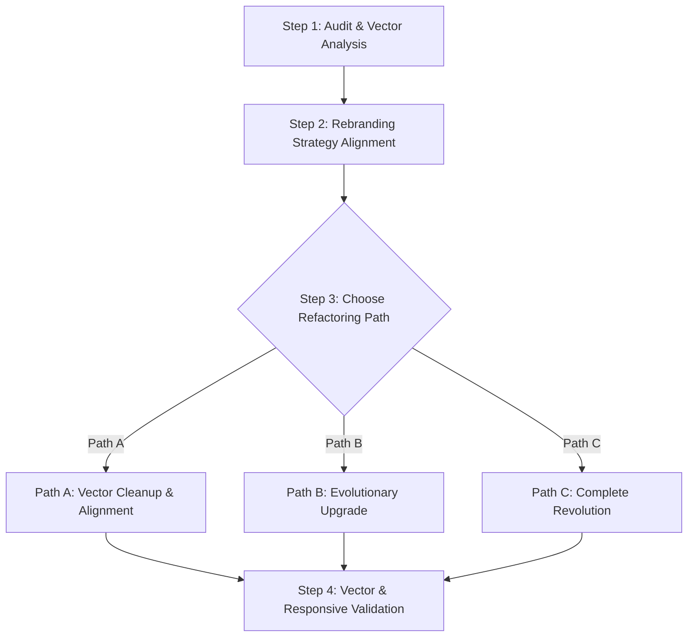

# SKILL: Brand Identity & Brand Guideline Workflow

## Purpose

Use this skill to create or refactor a professional Brand Identity and Brand Guideline system for any brand (especially SaaS, AI, technology, workspace, B2B, retail, e-commerce, edtech, manufacturing, or service businesses).

This workflow covers:
- Brand research and strategy foundation
- Visual direction and brand board design
- Logo system (and refactoring existing logos)
- Color, typography, and iconography systems
- UI and marketing touchpoint applications
- Digital brand guideline documentation and asset packaging

---

## Recommended Design & Strategy Stack

To execute this skill effectively, use the following tools and platforms from the I-Wish registry:
1.  **Brainstorming & Naming**:
    *   *Miro / FigJam*: For visual mood boarding, mapping competitor landscapes, and positioning matrices.
    *   *Namecheckr / Namecheap*: For verifying domain name and social handle availability.
2.  **Core Design & Vector Production**:
    *   *Adobe Illustrator*: The industry standard for precise vector path drawing, anchoring grids, and logo construction.
    *   *Figma*: Ideal for managing shared libraries, component tokens, UI mockups, and collaborative client review.
3.  **AI-Assisted Design & Vectorization**:
    *   *Recraft.ai*: Excellent for generating native vector SVG assets, icons, and logo illustrations directly from prompts.
    *   *Vectorizer.AI*: For converting raster drafts (PNG, JPG) into clean, high-precision SVG paths.
4.  **Living Brand Guidelines Platforms**:
    *   *Brandpad / Standards.site*: Best for building modern, interactive, design-first brand books.
    *   *Frontify / Zeroheight*: Best for enterprise-grade asset management (DAM) and design systems documentation.

---

## Core Principle

A professional brand identity must be:
1.  **Strategically Aligned**: Grounded in business objectives and audience research.
2.  **Perceptually Sound**: Built using Gestalt design principles (Proximity, Similarity, Continuity, Closure, Figure-Ground).
3.  **Sequentially Approved**: Core brandmarks must be locked before applying them to physical/digital collateral.
4.  **Developer-Ready**: Visual choices are compiled into standardized design tokens (JSON) for seamless coding.

---

## The 5-Phase Development Workflow
(Based on Alina Wheeler's *Designing Brand Identity* methodology)

### Phase 1 — Research & Discovery
Collect required inputs using the intake questionnaire ([questionnaire.md](file:///Users/hatrang20061988/Desktop/AI%20Project/iwish/scratch/brand_id_guideline_skill_workflow/brand_id_guideline_skill_workflow/questionnaire.md)).
1.  Conduct a market audit of immediate competitors to identify design conventions (colors to avoid, typographic trends).
2.  Identify stakeholder preferences, target demographics, and required output formats.
3.  *Deliverable*: **Audit Readout & Project Scope Document**.

### Phase 2 — Strategy Foundation
Establish the strategic "source code" using **Kapferer's Brand Identity Prism**:
1.  **Culture**: Internal values, mission, and origin story.
2.  **Personality**: Tone of voice, character, and communication style.
3.  **Physique**: Tangible visual requirements (initial color moods, symbol expectations).
4.  **Relationship**: How the brand behaves towards users (e.g., helper, expert, partner).
5.  **Reflection**: The outward projection of the ideal customer.
6.  **Self-Image**: How the customer feels about themselves when using the product.
7.  *Deliverable*: **Strategic Brand Brief & Tagline Matrix**.

### Phase 3 — Visual Direction Exploration
Create 3 to 10 visual mood boards defining:
*   Theme name & rationale.
*   Typographic mood and color palette (Primary, Secondary, Neutral).
*   UI/UX implication and risk rating.
*   *Deliverable*: **Visual Direction Mood Boards (approved by client)**.

### Phase 4 — Logo System & Brainstorming (THE GATEWAY)
> [!IMPORTANT]
> **CRITICAL GATEWAY RULE**: You must NOT proceed to Phase 5 or develop any other brand materials (colors, fonts, UI mockups, templates) until the Logo System has been officially approved and locked by the user.

#### Step 4.1: Design Tool Connection Check (Dynamic Installation Gate)
Before triggering any automated design rendering, token sync, or UI mockup creation, the agent must verify if the target design tool/plugin is installed and active in the project workspace:
*   **Action**: Scan active I-Wish plugins and MCP services for registered design adapters.
*   **Installation Workflow Fallback**: If no active tool is configured, trigger the standard I-Wish design tool installation flow:
    1.  Verify the project's active tool state.
    2.  Prompt the user to choose and install one of the pre-setup design adapters from the I-Wish registry:
        *   **stitch**: Stitch-first design generation & sync (backed by `stitch-first-dev` / `stitch-to-code` usage pack).
        *   **figma**: Figma-based design inspection & handoff (requires `figma-first-dev` / `figma-to-code` usage pack).
        *   **claude-design**: Design-oriented generation & handoff (requires `claude-design-first-dev` / `claude-design-to-code` usage pack).
        *   **canva**: Canva-based design authoring & handoff (requires `canva-first-dev` / `canva-to-code` usage pack).
        *   **Local File Exporter**: Local vector & JSON token rendering only (saves to `/assets/` directory, bypasses tool connection).
    3.  Once selected, guide the user to run `npx iwish-db add <pack-name>` or configure the corresponding API key / workspace setup.
*   Only run automation through the user's explicitly approved/installed path.

#### Step 4.2: Logo Brainstorming Protocol
1.  Generate **at least 5 distinct logo options** (unless the user explicitly requests a different number).
2.  For **each option**, provide a comprehensive breakdown in the following structure:
    *   **Visual Representation**: Standard SVG format or a clean layout draft.
    *   **Geometric Construction & Components**: An explanation (words + diagram) showing the shape components (e.g., circle, grid intersection, monogram) and how they are arranged.
    *   **Symbolic Meaning**: What each component represents in relation to the Brand Strategy.
    *   **Typography Pairing**: Display font style choice and rationale.
3.  **Cross-Platform Prompt Offering**: Along with these options, the agent must ask the user if they wish to test or compare these designs on other external design platforms. If requested, provide copy-pasteable, optimized prompts tailored for:
    *   *Recraft.ai* (for generating native SVG vector variations).
    *   *ChatGPT (OpenAI)* (for flat vector logo mockups and semantic variations).
    *   *Midjourney* (for highly detailed brand aesthetic/logo renderings).
    *   *Or any other preferred design tool* specified by the user.
4.  *Deliverable*: **Logo Presentation Board & Final Approved Logo Vector**.

### Phase 5 — System Extension & Asset Management
Once the logo is locked, expand the visual identity into a unified design system:
1.  **Color System**:
    *   Primary, secondary, and neutral palettes.
    *   Semantic states (Success, Warning, Error, Info, Automation Active).
    *   WCAG 2.1 AA/AAA contrast ratios and light/dark mode adaptation.
    *   *Formula*: 60% Neutral Background / 25% Brand Primary / 10% Brand Secondary / 5% Accent.
2.  **Typography**: Font stack pairing (Display, Body, Mono), type scales (e.g., Major Third), weights, and line heights.
3.  **Iconography**: Standardize grid sizes, stroke widths, corner radii, and fill states.
4.  **Touchpoints**: Mockups for Web UI (dashboards, kanbans), Marketing (banners, brochures), Ads, and Event/POSM booths.
5.  **Design Tokens**: Compile all styling parameters into a W3C-compliant JSON format compatible with Style Dictionary.
6.  *Deliverable*: **Asset Package (ZIP) & Living Brand Guideline Document**.

---

## Logo & Brand ID Refactoring Workflow
Use this workflow when the user has an existing logo or brand ID that needs cleanup, modernization, or expansion.

### Step 1: Audit & Vector Analysis
Identify limitations in the current asset:
*   *Format*: Is it raster-only? (Needs vectorization).
*   *Geometry*: Are the curves uneven, or do anchor points look unaligned? (Needs grid adjustment).
*   *Responsive Legibility*: Does the logo blur or become unreadable at 16x16px (favicon scale)?
*   *Accessibility*: Do the colors fail contrast standards?

### Step 2: Rebranding Strategy Alignment
Map the reason for the refactoring:
*   *Product shift*: Moving from services to a digital product platform.
*   *Target shift*: Attracting enterprise clients instead of startups.
*   *Visual refresh*: Modernizing retro gradients and heavy fonts to flat, responsive styles.

### Step 3: Choose the Refactoring Path

#### Path A: Vector Cleanup & Grid Alignment (Low Risk)
*   **Goal**: Keep the exact same design but make it pixel-perfect and technically clean.
*   **Execution**:
    *   Import logo into Figma/Illustrator.
    *   Redraw lines using strict geometric circles, rectangles, and angles.
    *   Fix kerning and letter spacing of the wordmark.
    *   Export clean, lightweight SVGs without redundant paths.

#### Path B: Evolutionary Upgrade (Medium Risk)
*   **Goal**: Retain the brand equity (recognizable shapes/colors) but modernize the composition.
*   **Execution**:
    *   Simplify gradients into solid colors or modern CSS gradients.
    *   Thicken thin strokes that disappear at small sizes.
    *   Update typography to modern humanist/geometric sans-serif fonts.
    *   Create a separate dark-mode optimized symbol.

#### Path C: Complete Revolution (High Risk)
*   **Goal**: Discard the existing visual design and create a brand-new logo system while maintaining only core strategic elements (e.g., name and brand values).
*   **Execution**: Run the standard 5-Phase Development Workflow, using the old brand assets only as a historical reference.

### Step 4: Validation & Delivery
1.  Verify the refactored logo at 16px, 32px, 128px, and 512px.
2.  Generate monochrome black/white versions.
3.  Deliver a clean vector package and update the design tokens configuration.
