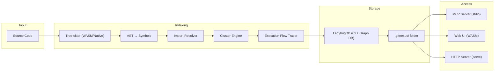
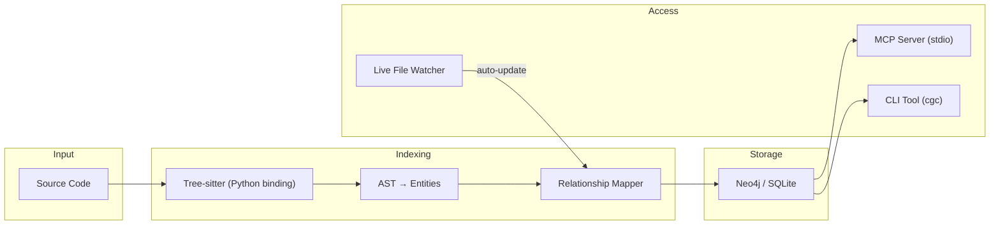

# So Sánh Toàn Diện: GitNexus vs CodeGraphContext

## 1. Tổng Quan Nền Tảng

| Tiêu chí | GitNexus | CodeGraphContext |
|----------|----------|------------------|
| **GitHub** | [abhigyanpatwari/GitNexus](https://github.com/abhigyanpatwari/GitNexus) | [CodeGraphContext/CodeGraphContext](https://github.com/CodeGraphContext/CodeGraphContext) |
| **Stars** | ~17.4k ⭐ | ~2k ⭐ |
| **Forks** | ~2k | ~400 |
| **Contributors** | ~15 | ~75 |
| **License** | MIT | MIT |
| **Ngôn ngữ phát triển** | TypeScript / C++ | Python |
| **Phiên bản** | v1.4.6 (Mar 2026) | v0.9.x (Mar 2026) |
| **Thời điểm ra mắt** | Aug 2025, viral Feb 2026 | Nov 2025 |
| **Chi phí** | 🟢 Miễn phí hoàn toàn | 🟢 Miễn phí hoàn toàn |

---

## 2. Kiến Trúc Kỹ Thuật

### GitNexus

| Component | Detail |
|-----------|--------|
| **Parser** | Tree-sitter (WASM cho Web UI, Native binding cho CLI) |
| **Graph DB** | LadybugDB — C++ embedded graph DB (fork từ KuzuDB) |
| **Storage** | `.gitnexus/` folder trong repo (gitignored) |
| **Query** | Cypher query language |
| **Install** | `npm install -g gitnexus` — **cần compile C++ native module** |

### CodeGraphContext

| Component | Detail |
|-----------|--------|
| **Parser** | Tree-sitter (Python wheels — precompiled) |
| **Graph DB** | Neo4j (full) hoặc SQLite (lightweight) |
| **Storage** | Database file local |
| **Query** | Cypher (Neo4j) hoặc SQL |
| **Install** | `pip install codegraphcontext` — **100% Python, zero native build** |

---

## 3. So Sánh Chi Tiết Tính Năng

### 3.1 Core Intelligence

| Tính năng | GitNexus | CodeGraphContext |
|-----------|----------|------------------|
| **Số ngôn ngữ hỗ trợ** | 40+ languages | 14 languages |
| **TypeScript/TSX** | ✅ | ✅ |
| **Python** | ✅ | ✅ |
| **Java/C/C++/Go/Rust** | ✅ | ✅ |
| **Import resolution** | ✅ Đầy đủ (cross-file) | ✅ Đầy đủ |
| **Call chain analysis** | ✅ Upstream + Downstream | ✅ Callers + Callees |
| **Class hierarchy** | ✅ Inheritance tree | ✅ Inheritance + implements |
| **Execution flow tracing** | ✅ Process-level tracing | ❌ Chưa có |
| **Symbol clustering** | ✅ Auto-cluster related symbols | ❌ Chưa có |
| **Monorepo support** | ✅ Multi-repo registry | ✅ Single repo |

### 3.2 MCP Tools (API cho AI Agent)

| MCP Tool | GitNexus | CodeGraphContext |
|----------|----------|------------------|
| `context()` — 360° symbol view | ✅ | ✅ (tương đương) |
| `impact()` — blast radius | ✅ | ✅ (call chain tracing) |
| `detect_changes()` — pre-commit | ✅ | ❌ |
| `query()` — process-grouped search | ✅ | ✅ (search functions) |
| `cypher()` — raw graph query | ✅ | ✅ (Neo4j mode) |
| `rename()` — multi-file rename | ✅ | ❌ |
| **Real-time update** | ❌ Cần re-index | ✅ Auto-update on save |
| **Visualization** | ✅ Web UI (browser) | ✅ Interactive graph |

### 3.3 Deployment & Operations

| Tiêu chí | GitNexus | CodeGraphContext |
|----------|----------|------------------|
| **Cài đặt** | `npm install -g` (**cần C++ build**) | `pip install` (**zero build**) |
| **macOS Intel (darwin-x64)** | ❌ Build thất bại | ✅ Hoạt động |
| **macOS ARM (Apple Silicon)** | ✅ | ✅ |
| **Linux x64** | ✅ | ✅ |
| **Windows** | ⚠️ Cần WSL | ✅ |
| **Runtime dependency** | Node.js 18+ | Python 3.9+ |
| **Disk usage (index)** | ~50-200MB (graph DB) | ~5-50MB (SQLite) / ~200MB (Neo4j) |
| **RAM usage** | ~200-500MB | ~50-200MB |
| **Index speed (DMS ~500 files)** | ~2-5 phút | ~1-3 phút |
| **Web UI** | ✅ Browser-based (WASM) | ✅ Interactive graph |
| **Multi-repo** | ✅ Global registry | ❌ Per-project |
| **Privacy** | ✅ 100% local | ✅ 100% local |

---

## 4. Chi Phí Vận Hành

| Hạng mục | GitNexus | CodeGraphContext |
|----------|----------|------------------|
| **License** | 🟢 Free (MIT) | 🟢 Free (MIT) |
| **Infrastructure** | 🟢 Local only | 🟢 Local only |
| **LLM cost** | 🟢 Không dùng LLM | 🟢 Không dùng LLM |
| **Cloud service** | 🟢 Không cần | 🟢 Không cần (Neo4j optional) |
| **Maintenance** | 🟡 Cần re-index khi code thay đổi lớn | 🟢 Auto real-time update |
| **Team scaling** | 🟢 Mỗi dev tự index | 🟢 Mỗi dev tự index |
| **Tổng chi phí** | **$0/tháng** | **$0/tháng** |

> [!NOTE]
> Cả 2 đều hoàn toàn miễn phí, không có tier trả phí, không gửi data ra ngoài.

---

## 5. Ưu Nhược Điểm

### GitNexus

| ✅ Ưu điểm | ❌ Nhược điểm |
|------------|--------------|
| 40+ languages — gần như universal | Cần compile C++ native (LadybugDB) |
| 17.4k stars — community lớn, active | **Không hỗ trợ macOS Intel (darwin-x64)** |
| Execution flow tracing — unique feature | Không real-time update (cần re-index) |
| Symbol clustering — nhóm related code | RAM usage cao (~500MB) |
| Multi-repo registry — 1 MCP server cho nhiều repo | Disk usage lớn (~200MB/project) |
| Web UI WASM — explore online không cần cài | Single maintainer (rủi ro bus-factor) |
| Built-in Graph RAG Agent | Web UI limited by browser memory |
| `rename()` và `detect_changes()` MCP tools | Index time chậm hơn |

### CodeGraphContext

| ✅ Ưu điểm | ❌ Nhược điểm |
|------------|--------------|
| **`pip install` — zero native build, mọi platform** | 14 languages — ít hơn GitNexus |
| Real-time update — auto sync khi code thay đổi | Không có execution flow tracing |
| RAM/Disk nhẹ hơn nhiều (~50MB) | Không có symbol clustering |
| 75+ contributors — community phát triển nhanh | Thiếu `detect_changes()` và `rename()` |
| Neo4j backend option — enterprise-grade | Cần Python environment |
| Query speed cực nhanh (near-instant) | Single-repo only (chưa multi-repo) |
| Hoạt động trên **mọi OS** kể cả macOS Intel | Phiên bản mới hơn, chưa battle-tested bằng |
| Minimal token usage — optimized cho AI context | Không có Web UI browser-based |

---

## 6. Ma Trận Quyết Định cho DMS Project

| Tiêu chí | Trọng số | GitNexus | CodeGraphContext | Ghi chú |
|----------|----------|----------|------------------|---------|
| Cài đặt được trên máy dev | 🔴 Critical | ❌ 0/10 | ✅ 10/10 | macOS Intel = blocking |
| TypeScript/NestJS/Next.js support | 🔴 Critical | ✅ 10/10 | ✅ 10/10 | Cả 2 đều OK |
| MCP integration | 🟡 High | ✅ 10/10 | ✅ 9/10 | CGC thiếu 2 tools |
| Real-time update | 🟡 High | ❌ 3/10 | ✅ 10/10 | CGC auto-sync |
| Multi-repo | 🟢 Medium | ✅ 10/10 | ❌ 3/10 | DMS chỉ 1 repo |
| Performance / RAM | 🟢 Medium | 🟡 6/10 | ✅ 9/10 | CGC nhẹ hơn |
| Community / longevity | 🟢 Medium | ✅ 9/10 | 🟡 7/10 | GitNexus lớn hơn |
| **Tổng điểm (weighted)** | — | **~5.5/10** | **~9.0/10** | — |

---

## 7. Đề Xuất Cuối Cùng

> [!IMPORTANT]
> **Dùng CodeGraphContext cho DMS project ngay bây giờ.**

**Lý do:**
1. **Cài được ngay** — `pip install codegraphcontext` trên máy Mac Intel hiện tại
2. **Real-time update** — không cần re-index mỗi lần code thay đổi
3. **90% feature parity** — context, impact, search đều có
4. **TypeScript full support** — đủ cho NestJS + Next.js + Prisma
5. **Chi phí: $0** — giống GitNexus

**Các bước tiếp theo:**
1. `pip install codegraphcontext` → `cgc setup` → `cgc mcp setup`
2. Update workflow `/analyze-codebase` để hỗ trợ CGC backend
3. Update 3 workflow patches (`/code-review`, `/dev-story`, `/fix-bug`) — API concept tương tự
4. Nếu sau này cần 40+ languages hoặc multi-repo → switch về GitNexus khi LadybugDB fix macOS Intel hoặc bạn upgrade máy Apple Silicon
