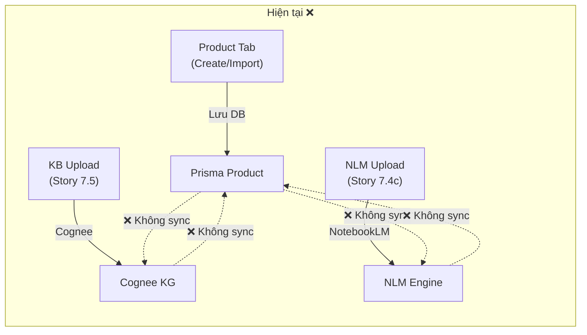

# 🏛️ BMAD Council Assessment: Data Strategy Gap & KB Synchronization Architecture

**Ngày:** 2026-03-19 | **Triệu tập bởi:** User (Product Owner) | **Đánh giá bởi:** Antigravity (Master Executor)

---

## I. Bổ Sung Phân Tích: Product Tab → KB Gap

### Product Data Hiện Có Trong Database (Chưa Đồng Bộ KB)

| Trường | Prisma Model | Ý nghĩa KB |
|---|---|---|
| `name` | `Product` | Tên sản phẩm |
| `description` | `Product` | Mô tả chi tiết |
| `storageConditions` | `Product` | Điều kiện bảo quản |
| `shelfLifeDays` | `Product` | Hạn sử dụng |
| `baseUnit`, `unitL2`, `unitL3` | `Product` | Quy cách đóng gói |
| `vatRate` | `Product` | Thuế VAT |
| `category.name` | `Category` | Danh mục |
| `brand.name` | `Brand` | Thương hiệu |
| `variant.sku`, `variant.barcode` | `ProductVariant` | Mã SKU, barcode |
| `variant.costPrice`, `variant.sellingPrice` | `ProductVariant` | Giá vốn, giá bán |
| `media.url` | `ProductMedia` | Hình ảnh sản phẩm |

> [!CAUTION]
> **Toàn bộ dữ liệu trên CHƯA BAO GIỜ được index vào Cognee hay NotebookLM.** AI trả lời câu hỏi về sản phẩm hoàn toàn dựa vào prompt engineering, không có product knowledge thực sự.

### Vấn Đề Đồng Bộ Hai Chiều



---

## II. Ba Phương Án Kiến Trúc KB

### Option A: Gom Về Cognee (Unified KB)

```
Product Tab → Prisma DB → Cognee Sync Pipeline → Cognee KG ← KB Upload
                                                              ← NLM Output
```

| Pros | Cons |
|---|---|
| Single source of truth cho AI queries | NLM mất tính độc lập |
| Tất cả consumer modules chỉ cần query 1 nơi | Cognee phải xử lý load lớn |
| Dễ maintain long-term | NLM rich content (video slides, infographic) khó map vào KG |

### Option B: Giữ 3 Nguồn (Triple-Source, Status Quo + Sync)

```
Product Tab → Prisma DB ←→ Sync Layer ←→ Cognee KG
                                      ←→ NLM Engine
```

| Pros | Cons |
|---|---|
| Giữ nguyên architecture hiện tại | Phức tạp sync 3-way |
| Mỗi hệ thống làm đúng sở trường | Dữ liệu dễ bị stale |
| NLM giữ nguyên rich content capabilities | Consumer modules phải query nhiều nơi |

### Option C: Hybrid — Cognee làm Unified Query, NLM làm Content Engine ⭐

```
Product Tab → Prisma DB → Product KB Sync → Cognee KG (unified query)
KB Upload → Cognee KG
NLM Upload → NotebookLM → Content Assets → Cognee Index (metadata only)
AI Consumers → Cognee Unified Search → response
```

| Pros | Cons |
|---|---|
| Cognee = unified search interface cho AI | Cần build sync pipeline |
| NLM vẫn giữ rich content generation | NLM content indexed 2 lần (NLM + Cognee metadata) |
| Product data auto-index khi CRUD | Moderate implementation effort |
| Consumer modules chỉ cần 1 integration point | |

> [!IMPORTANT]
> **Khuyến nghị: Option C** — Cognee làm "Unified KB Query Layer", NLM vẫn là content engine. Product data auto-sync vào Cognee. Đây là trade-off tốt nhất giữa complexity và capabilities.

---

## III. Gap Analysis: BMAD SDLC Thiếu Data Strategy Phase

### Quy Trình Hiện Tại (5 Bước)

| Bước | Tên | Tác nhân | Output |
|---|---|---|---|
| 1 | Context Loading | PM + Research Agent | PRD, Security Requirements |
| 2 | Blueprinting | Architect + Planning Agent | ADR, Threat Model, Plan |
| 3 | Implementation | Dev Agent | Code, Tests, SAST |
| 4 | Quality Gate | QA + Human | Test Results |
| 5 | Knowledge Harvesting | Memory Agent | Knowledge Delta |

### ❌ Vấn Đề

| Gap | Không có phase nào trả lời câu hỏi |
|---|---|
| **Data Flow Design** | Dữ liệu chảy từ đâu → đâu? Ai produce, ai consume? |
| **Data Sync Strategy** | Khi entity A thay đổi, entities nào cần cập nhật theo? |
| **KB Architecture** | Product knowledge được nạp từ đâu? AI query ở đâu? |
| **BI/Analytics Pipeline** | Data nào cần aggregate? Dashboard nào cần real-time vs batch? |
| **Data Lineage** | Một thay đổi ở Prisma schema ảnh hưởng downstream nào? |

### Hậu quả thực tế

Chính vì thiếu Data Strategy phase mà:
- Product tab data **không ai thiết kế** việc sync vào KB
- Cognee và NLM **được thiết kế độc lập** trong 2 story khác nhau, không có ai cross-check
- 5 consumer modules **không ai đề ra** requirement phải dùng KB
- `PromptAssemblyService` **chỉ dùng trong roleplay** vì không có design document nào yêu cầu phải dùng globally

---

## IV. Đánh Giá Agent Roster Hiện Tại

### 13 Agents Hiện Có

| Agent | Icon | Vai trò | Phủ Data Strategy? |
|---|---|---|---|
| BMad Master | 🧙 | Orchestrator | ❌ |
| Creative Intelligence | 🎨 | Ideation | ❌ |
| Edge Case Guardian | 🛡️ | Risk analysis | ❌ |
| Analyst | 📊 | Business analysis | ⚠️ Partial (business rules) |
| Architect | 🏗️ | System design | ⚠️ Partial (architecture) |
| **Kira (Data Architect)** | 🗄️ | **Schema/Seed/Migration** | ⚠️ **Structural only** |
| Dev | 💻 | Implementation | ❌ |
| PM | 📋 | Product management | ❌ |
| QA | 🧪 | Testing | ❌ |
| SM | 📅 | Sprint management | ❌ |
| **Songoku** | 🐉 | **AI/LLM Operations** | ⚠️ **Prompt/Model only** |
| UX Designer | 🎨 | UX/UI | ❌ |
| Tech Writer | 📝 | Documentation | ❌ |

### Kira vs Data Strategy Needs

| Capability | Kira hiện tại | Data Strategy cần |
|---|---|---|
| Schema design | ✅ | ✅ |
| Seed data governance | ✅ | ✅ |
| Type alignment (FE↔BE) | ✅ | ✅ |
| **Data flow architecture** | ❌ | ✅ Cần |
| **KB sync strategy** | ❌ | ✅ Cần |
| **Event-driven data pipeline** | ❌ | ✅ Cần |
| **BI/Analytics pipeline** | ❌ | ✅ Cần |
| **Data lineage & impact analysis** | ❌ | ✅ Cần |
| **AI training data strategy** | ❌ | ✅ Cần |

---

## V. Đề Xuất: Bổ Sung Data Strategy Layer

### A. Agent Mới: Data Strategist (Shinji) 📊🔬

```yaml
name: "data-strategist"
title: "Data Strategist & BI Architect"
icon: "📊🔬"
identity: |
  Senior Data Strategist with expertise in:
  - Data Flow Architecture (event-driven, CDC, ETL/ELT)
  - Knowledge Base Strategy (vector DB, graph DB, RAG pipelines)
  - BI & Analytics Pipeline Design (OLAP, data warehouse, real-time dashboards)
  - Data Science Infrastructure (feature stores, experiment tracking, ML pipelines)
  - Data Governance (lineage, quality, cataloging)
```

**Menu items:**
1. `[DF]` **Data Flow Map** — Thiết kế data flow architecture cho một feature/epic
2. `[KS]` **KB Sync Strategy** — Thiết kế Knowledge Base ingestion & sync pipeline
3. `[BP]` **BI Pipeline Design** — Thiết kế analytics pipeline (metrics, dashboards, reports)
4. `[DL]` **Data Lineage Analysis** — Trace impact khi schema/data thay đổi
5. `[DS]` **Data Science Spec** — Thiết kế ML pipeline, feature store, training data strategy

### B. Workflows Mới (3)

| Workflow | Trigger | Output |
|---|---|---|
| `/create-data-flow` | Sau PRD + Architecture, trước Implementation | `data-flow-architecture.md` |
| `/create-kb-strategy` | Khi feature liên quan AI/KB | `kb-sync-strategy.md` |
| `/create-bi-pipeline` | Khi feature cần analytics/dashboard | `bi-pipeline-spec.md` |

### C. Skills Mới (2)

| Skill | Mô tả |
|---|---|
| `data-flow-guardian` | Validates data flow completeness: mọi data producer phải có consumer, mọi entity change phải có sync strategy |
| `kb-sync-validator` | Validates KB sync coverage: % entities indexed, staleness detection, sync gap alerts |

### D. SDLC Process Update

```
TRƯỚC (5 bước):
1. Context Loading → 2. Blueprinting → 3. Implementation → 4. Quality Gate → 5. Knowledge Harvesting

SAU (6 bước):
1. Context Loading → 2. Blueprinting → 2.5 DATA FLOW DESIGN ⭐ → 3. Implementation → 4. Quality Gate → 5. Knowledge Harvesting
```

**Bước 2.5: Data Flow Design (NẾU CẦN)**
- Tác nhân: Data Strategist (Shinji) + Data Architect (Kira)
- Trigger: Feature liên quan đến data CRUD, AI/KB, analytics
- Output: `data-flow-architecture.md`, `kb-sync-strategy.md`

> [!TIP]
> Không phải mọi story đều cần Data Flow Design. Chỉ trigger khi: (1) Tạo model mới, (2) Feature liên quan AI/KB, (3) Cần dashboard/analytics, (4) Cross-module data dependency.

---

## VI. Quyết Định Cần User

1. **KB Architecture**: Chọn Option A (Unified Cognee), B (Triple-Source), hay C (Hybrid)?
2. **Data Strategist Agent**: Nên tạo agent mới hay mở rộng Kira?
3. **SDLC Update**: Đồng ý thêm bước 2.5 Data Flow Design?
4. **Ưu tiên**: Nên xử lý KB sync trước (technical debt) hay tạo agent/workflow trước (process improvement)?
