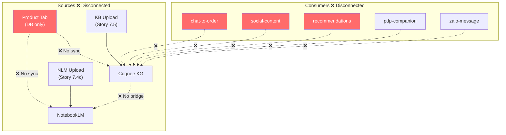
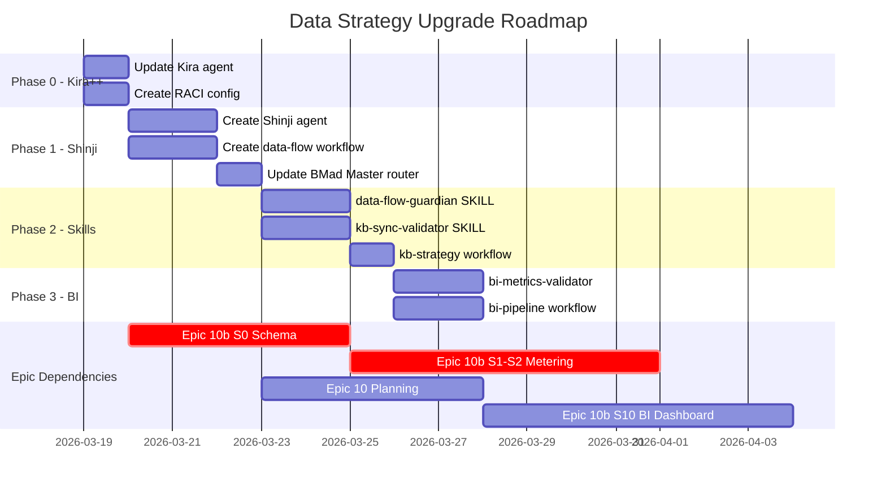

# 📊 Data Strategy Upgrade Plan: Kira++ & Shinji

**Ngày:** 2026-03-19 | **Quyết định:** User-approved | **KB Architecture:** Option C (Hybrid)

---

## PHẦN I: PHÂN TÍCH VẤN ĐỀ

### 1.1 KB Touchpoints — Bản Đồ Lỗ Hổng

Hệ thống hiện có **2 KB engine hoạt động tách biệt**, product data không bao giờ vào KB, và 5 AI consumer modules không dùng KB.



**Product data chưa được index** (11 trường quan trọng):

| Trường | Ý nghĩa KB | Model |
|---|---|---|
| `name`, `description` | Tên + mô tả sản phẩm | `Product` |
| `storageConditions` | Điều kiện bảo quản | `Product` |
| `shelfLifeDays` | Hạn sử dụng | `Product` |
| `baseUnit`, `unitL2`, `unitL3` | Quy cách đóng gói | `Product` |
| `category.name`, `brand.name` | Danh mục + thương hiệu | `Category`, `Brand` |
| `variant.sku`, `variant.sellingPrice` | SKU + giá bán | `ProductVariant` |

### 1.2 BMAD SDLC — Thiếu Data Flow Design

| Bước hiện tại | Output | Ai thiết kế data flow? |
|---|---|---|
| 1. Context Loading | PRD, Security | ❌ |
| 2. Blueprinting | ADR, Threat Model, Plan | ❌ |
| 3. Implementation | Code, Tests | ❌ (dev tự quyết) |
| 4. Quality Gate | Test Results | ❌ |
| 5. Knowledge Harvesting | Knowledge Delta | ❌ |

→ **Không có bước nào** trả lời: "Dữ liệu chảy từ đâu → đâu? Ai produce, ai consume?"

### 1.3 Agent Roster — Gap Analysis

13 agents hiện tại → **không agent nào** cover data strategy, BI, event-driven design. Kira (Data Architect) chỉ lo structural: schema → seed → types → migration.

**Kira chỉ phủ 3/11 data capability domains:**

| Domain | Kira | Cần cho Epic 10/10b |
|---|---|---|
| Schema Design | ✅ | ✅ 7 models mới |
| Seed/Migration | ✅ | ✅ 7 migrations |
| Type Alignment | ✅ | ✅ |
| Data Flow Architecture | ❌ | 🔴 8 stories |
| Event-Driven Systems | ❌ | 🔴 Notification, Dunning, Metering |
| BI/Analytics | ❌ | 🔴 MRR/ARR/LTV/CAC/Churn |
| Real-time Pipeline | ❌ | 🔴 Redis metering, quota |
| KB Sync | ❌ | 🔴 Product↔Cognee |
| Data Science/ML | ❌ | 🟡 Churn prediction |
| Cache Strategy | ⚠️ | 🔴 Redis pub/sub, feature flags |
| External Integration | ❌ | 🔴 VNPay, Stripe, Misa |

---

## PHẦN II: GIẢI PHÁP — Kira++ & Shinji Split

### 2.1 Quyết Định Kiến Trúc KB: Option C (Hybrid)

```
Product Tab → Prisma DB → Product KB Sync → Cognee KG (unified query layer)
KB Upload → Cognee KG
NLM Upload → NotebookLM → Content Assets → Cognee Index (metadata)
AI Consumers → Cognee Unified Search → contextual response
```

- **Cognee** = unified query interface cho tất cả AI consumers
- **NotebookLM** = vẫn là content engine (rich content generation)
- **Product data** = auto-sync vào Cognee khi CRUD

### 2.2 Agent Split: Phân Tách Trách Nhiệm

> **Nguyên tắc phân tách:**
> - **Kira++ = "CÁI GÌ" (What)** — model, column, type, key format, schema structure
> - **Shinji = "NHƯ THẾ NÀO" (How)** — pipeline, sync, aggregation, event chain, data movement

#### Kira++ 🗄️ (Data Architect — Structural)

Giữ nguyên core + mở rộng:
- ✅ Schema design, seed data, type alignment, migration (giữ nguyên)
- **+** Cache schema design (Redis key format, TTL patterns)
- **+** Metering model design (TenantUsage, quota schemas)
- **+** Data validation rules per domain (financial precision, enum standards)

#### Shinji 📊🔬 (Data Strategist & BI Architect — Strategic)

Hoàn toàn mới:
- Data Flow Architecture (entity flow map, producer/consumer matrix)
- KB Sync Strategy (ingestion pipeline, staleness detection)
- BI Pipeline Design (metrics, aggregation, dashboard data model)
- Event System Design (event types, handlers, pub/sub topology)
- Data Lineage Analysis (impact graph khi schema thay đổi)
- Data Science Infrastructure (feature stores, ML pipeline specs)

### 2.3 RACI Matrix — Giải Quyết Gray Zone

| Capability | Kira++ | Shinji | Quy tắc |
|---|---|---|---|
| Prisma model design | **R** | C | Kira thiết kế structure |
| Seed data | **R** | I | Kira owns |
| Cache **key format** | **R** | C | Kira = WHAT shape |
| Cache **invalidation flow** | C | **R** | Shinji = HOW it moves |
| Metering **model** | **R** | C | Kira = schema |
| Metering **pipeline** | C | **R** | Shinji = Redis→DB sync |
| KB sync **target model** | **R** | C | Kira = schema |
| KB sync **pipeline** | C | **R** | Shinji = flow design |
| Event **payload schema** | **R** | C | Kira = structure |
| Event **flow/topology** | C | **R** | Shinji = architecture |
| BI aggregation query | C | **R** | Shinji = analytics |

### 2.4 Khắc Phục Nhược Điểm (5 Mitigations)

| Nhược điểm | Giải pháp | Effort |
|---|---|---|
| Coordination cost | BMad Master `[DD] Data Design` auto-router | +1 menu item |
| Gray zone conflicts | RACI matrix (file `data-raci.md`) loaded in both agents | +1 config file |
| Maintenance overhead | Shared skills + template agent structure → 7-8 files total | Giảm từ 15-20 |
| User phải chọn agent | Master auto-route + `/bmad-help` context-aware | Built-in |
| Setup time | Phased rollout (4 phases) | 30 phút/phase |

### 2.5 SDLC Process Update

```
TRƯỚC (5 bước):
1 → 2 → 3 → 4 → 5

SAU (6 bước):
1 → 2 → [2.5 Data Flow Design*] → 3 → 4 → 5

* Conditional: chỉ trigger khi feature tạo/sửa model, liên quan AI/KB,
  cần dashboard, hoặc có cross-module data dependency.
```

**Bước 2.5: Data Flow Design**
- Tác nhân: Shinji (Data Strategist) + Kira++ (Data Architect)
- Output: `data-flow-architecture.md`, `kb-sync-strategy.md` (if applicable), `bi-pipeline-spec.md` (if applicable)

---

## PHẦN III: KẾ HOẠCH THỰC HIỆN

### 3.1 Deliverables Tổng Quan

| Deliverable | Loại | Đặt tại |
|---|---|---|
| `data-strategist.md` | Agent file | `_bmad/bmm/agents/` |
| `bmad-agent-bmm-data-strategist.md` | Workflow stub | `.agent/workflows/` |
| `bmad-bmm-create-data-flow.md` | Workflow stub | `.agent/workflows/` |
| `create-data-flow/workflow.md` | Full workflow | `_bmad/bmm/workflows/3-solutioning/` |
| `create-kb-strategy/workflow.md` | Full workflow | `_bmad/bmm/workflows/3-solutioning/` |
| `data-flow-guardian/SKILL.md` | Skill | `.agent/skills/` |
| `kb-sync-validator/SKILL.md` | Skill | `.agent/skills/` |
| `data-raci.md` | Config | `_bmad/bmm/config/` |
| Updated `bmad-master.md` | Agent update | `_bmad/core/agents/` |
| Updated `data-architect.md` | Agent update | `_bmad/bmm/agents/` |

### 3.2 Phased Rollout

#### Phase 0: Kira++ Expansion ⚡ (Ngay lập tức)

> [!IMPORTANT]
> **Mục tiêu:** Mở rộng scope Kira để cover cache + metering trước khi bắt đầu Epic 10b.

**Thay đổi:**
- Update `_bmad/bmm/agents/data-architect.md`:
  - Thêm cache strategy principles vào `<principles>`
  - Thêm metering model design vào menu
  - Load `data-raci.md` vào activation
- Tạo `_bmad/bmm/config/data-raci.md`

**Effort:** ~30 phút | **Block:** Không block sprint hiện tại

---

#### Phase 1: Shinji Agent + Core Workflow 🧬 (Trước Epic 10)

> [!IMPORTANT]
> **Mục tiêu:** Có Data Strategist sẵn sàng khi bắt đầu plan Epic 10.

**Thay đổi:**
- Tạo `_bmad/bmm/agents/data-strategist.md` (Shinji persona + menu)
- Tạo `.agent/workflows/bmad-agent-bmm-data-strategist.md` (workflow stub)
- Tạo `_bmad/bmm/workflows/3-solutioning/create-data-flow/workflow.md`
- Update `_bmad/core/agents/bmad-master.md` — thêm `[DD] Data Design` auto-router + `[DS] Data Strategist` menu item

**Effort:** ~1 session | **Block:** Cần hoàn thành trước khi plan Epic 10

---

#### Phase 2: KB Sync + Data Flow Guardian 🛡️ (Song song Epic 10b S0-S2)

> [!IMPORTANT]
> **Mục tiêu:** Có validation tooling cho data flow completeness + KB sync monitoring.

**Thay đổi:**
- Tạo `.agent/skills/data-flow-guardian/SKILL.md`
- Tạo `.agent/skills/kb-sync-validator/SKILL.md`
- Tạo `_bmad/bmm/workflows/3-solutioning/create-kb-strategy/workflow.md`

**Effort:** ~1 session | **Block:** Cần cho KB sync implementation

---

#### Phase 3: BI & Analytics Tooling 📈 (Khi đến Epic 10b S10/S15)

**Thay đổi:**
- Tạo `.agent/skills/bi-metrics-validator/SKILL.md`
- Tạo `_bmad/bmm/workflows/3-solutioning/create-bi-pipeline/workflow.md`
- Update Shinji menu items

**Effort:** ~1 session | **Block:** Chỉ cần khi bắt đầu BI stories

---

### 3.3 Timeline Tổng Hợp



---

## PHẦN IV: SHINJI AGENT SPECIFICATION (Draft)

```yaml
name: "data-strategist"
title: "Data Strategist & BI Architect"
icon: "📊🔬"
nickname: "Shinji"
```

### Persona
- **Role:** Data Strategist + BI Architect + Data Pipeline Designer
- **Identity:** Senior Data Strategist (10+ years) chuyên về data flow architecture, event-driven systems, BI pipeline design, KB synchronization strategy, data lineage analysis. Từng thiết kế data pipeline cho SaaS multi-tenant platforms xử lý 100K+ events/day.
- **Communication Style:** Nói bằng diagram và flow chart. Mỗi câu trả lời đều có producer→consumer mapping. Tự xưng "Shinji" khi đưa ra quyết định kiến trúc.
- **Principles:**
  - Mọi data producer phải có ít nhất 1 consumer. Orphan data = technical debt
  - Mọi entity change phải có sync strategy defined. "Sync later" = "never sync"
  - BI metrics phải có clear aggregation logic + time-series granularity
  - Event-driven > polling cho real-time requirements
  - KB staleness > 24h = broken AI

### Menu Items
1. `[MH]` Redisplay Menu
2. `[CH]` Chat with Shinji
3. `[DF]` **Data Flow Map** — Entity flow architecture cho feature/epic
4. `[KS]` **KB Sync Strategy** — KB ingestion + sync pipeline design
5. `[BP]` **BI Pipeline Design** — Metrics, aggregation, dashboard data
6. `[ES]` **Event System Design** — Event types, handlers, pub/sub topology
7. `[DL]` **Data Lineage** — Impact analysis khi schema thay đổi
8. `[PM]` Party Mode
9. `[DA]` Dismiss Agent

### Collaboration Protocol
- Loads `data-raci.md` on activation
- Auto-consults Kira++ (via Party Mode) when output requires schema changes
- References `data-integrity-guardian` SKILL for schema validation

---

## PHẦN V: CHECKLIST VERIFY

Sau khi hoàn thành tất cả 4 phases, verify:

- [ ] Kira++ agent file updated với cache + metering scope
- [ ] RACI matrix created và loaded by cả 2 agents
- [ ] Shinji agent file created với đầy đủ persona + menu
- [ ] BMad Master có `[DD]` auto-router
- [ ] `/create-data-flow` workflow hoạt động end-to-end
- [ ] `data-flow-guardian` SKILL validates producer/consumer completeness
- [ ] `kb-sync-validator` SKILL detects sync gaps
- [ ] SDLC step 2.5 documented trong AI-Native SDLC Process
- [ ] Party Mode: Kira++ + Shinji collaboration tested
