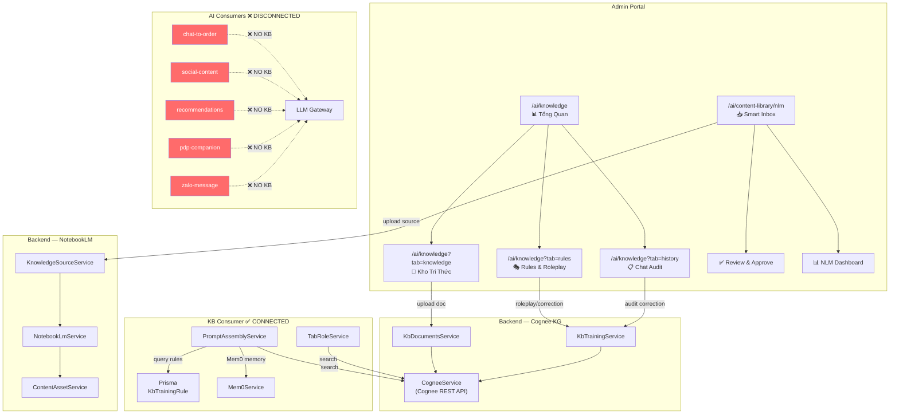

# 🔍 Phân Tích Lỗ Hổng KB Touchpoints — AI-Embedded Light DMS

## Tóm Tắt Vấn Đề

Hệ thống hiện tại có **2 hệ thống KB hoạt động độc lập**, không đồng bộ dữ liệu với nhau, và các module AI tiêu thụ (consumer) **không kết nối** với KB nào cả.

---

## 1. Bản Đồ Các Touchpoints Nạp KB

### Hệ thống 1: Cognee Knowledge Graph (Story 7.5)

| Touchpoint | Module | Cách nạp | Đích |
|---|---|---|---|
| **Upload tài liệu** | `KbDocumentsService` | Admin upload PDF/DOCX/XLSX/TXT/CSV → Cognee `addDocument` | `KnowledgeDocument` (DB) + Cognee KG |
| **Roleplay Sandbox** | `KbTrainingService` | Admin chơi vai customer, sửa lỗi AI → Cognee `codifyRule` | `KbTrainingRule` (DB) + Cognee KG |
| **Chat Audit** | `KbTrainingService.saveCorrection` | Admin review chat audit flagged → tạo correction → Cognee `codifyRule` | `KbTrainingRule` (DB) + Cognee KG |
| **Golden Template** | `KbTrainingService.uploadTemplate` | Admin upload template chat mẫu → Cognee `addDocument` | Cognee KG (chỉ KG, không lưu DB) |
| **Persona Config** | `AiConfigService.updatePersona` | Admin cấu hình persona (tone, vocabulary, pronouns) | `TenantConfig.personaConfig` (DB) |
| **Domain Guardrails** | `AiConfigService.updateGuardrails` | Admin enable/disable guardrails ngành | `TenantConfig.domainGuardrails` (DB) |
| **Industry Mode** | `AiConfigService.updateIndustryMode` | Admin chọn ngành (pharma/fmcg/general) | `TenantConfig.industryMode` (DB) |

### Hệ thống 2: NotebookLM Knowledge Factory (Story 7.4c)

| Touchpoint | Module | Cách nạp | Đích |
|---|---|---|---|
| **Smart Inbox** | `KnowledgeSourceService.uploadSource` | Admin paste URL/text/drag-drop file → NotebookLM | `KnowledgeSource` (DB) + NotebookLM |
| **Content Asset Generation** | `ContentAssetService.generateVisualAsset` | Auto-generate từ source (infographic, flashcard, slides...) | `ContentAsset` (DB) |
| **Review & Approve** | `ContentAssetService.approveAsset` | Admin approve content assets | `ContentAsset.isApproved` (DB) |
| **Caption Derivation** | `ContentAssetService.deriveCaption` | Tạo caption cho social media từ talking points | `ContentAsset` (DB) |

---

## 2. User Flow Hiện Tại

---

## 3. Các Lỗ Hổng Phát Hiện

### 🔴 Lỗ Hổng Nghiêm Trọng

| # | Lỗ hổng | Chi tiết | Ảnh hưởng |
|---|---|---|---|
| **G1** | **2 KB Systems hoàn toàn tách biệt** | `Cognee KG` (Story 7.5) và `NotebookLM` (Story 7.4c) chạy độc lập. Không có bridge/sync. | Admin nạp content vào NLM nhưng AI sidebar/chat không biết. Admin train KB qua Cognee nhưng content factory không dùng. |
| **G2** | **Consumer modules không dùng KB** | `chat-to-order`, `social-content`, `recommendations`, `pdp-companion`, `zalo-message` — 5 module AI chính **không query Cognee** và **không dùng đối tượng ContentAsset** | AI tư vấn sản phẩm mà không có kiến thức sản phẩm. Content generation không dùng KB đã được curate. |
| **G3** | **Product data không vào KB** | Dữ liệu Product (tên, mô tả, thành phần, giá...) từ Prisma Product tables **không bao giờ** được index vào Cognee hay NotebookLM | AI không biết chi tiết sản phẩm. Khi tạo content/trả lời câu hỏi, AI phải dựa hoàn toàn vào prompt engineering |
| **G4** | **PromptAssembly chỉ phục vụ roleplay** | `PromptAssemblyService.assemble()` chỉ được gọi bởi `KbTrainingService.handleRoleplayMessage`. Các consumer modules khác **không gọi** assemble | Persona, guardrails, behavioral rules chỉ áp dụng trong roleplay sandbox, không áp dụng cho production AI |

### 🟡 Lỗ Hổng Trung Bình

| # | Lỗ hổng | Chi tiết |
|---|---|---|
| **G5** | **Golden Template chỉ lưu Cognee, không lưu DB** | `uploadTemplate` gửi file lên Cognee nhưng không tạo record `KnowledgeDocument`. Mất trace và quản lý |
| **G6** | **ContentAsset không liên kết Product** | `ContentAsset.productCategoryIds` chỉ lưu category IDs, không có FK trực tiếp đến Product. Content tạo từ NLM hoàn toàn tách biệt khỏi catalog sản phẩm |
| **G7** | **Không có event-driven sync** | Khi Product được thêm/sửa/xóa, không có event trigger cập nhật KB. KB trở nên stale |
| **G8** | **Webstore KnowledgeResponseCard disconnected** | `/webstore/src/components/ai-chat/KnowledgeResponseCard.tsx` render UI nhưng backend consumer (`chat-to-order`) không query Cognee để cung cấp knowledge data |

---

## 4. Đề Xuất Giải Pháp

### Phase 1: Unified KB Pipeline (Ưu tiên cao)

> [!IMPORTANT]
> Tạo `KnowledgeOrchestrator` service trung tâm để bridge hai hệ thống KB

1. **`KnowledgeOrchestratorService`** — Service trung tâm:
   - Khi `KnowledgeSource` processed bởi NLM → auto-index talking points vào Cognee
   - Khi `KnowledgeDocument` processed bởi Cognee → extract content assets
   - Unified search interface cho cả hai KB

2. **Product-to-KB Sync** — Event-driven pipeline:
   - Prisma middleware hoặc DB trigger khi Product/ProductVariant thay đổi
   - Auto-index product info (tên, mô tả, thành phần, giá, danh mục) vào Cognee
   - Batch sync job cho lần đầu tiên + cron daily sync

### Phase 2: Consumer Module Integration (Ưu tiên cao)

3. **Inject KB vào Consumer Modules**:
   - `chat-to-order`: Query Cognee cho product knowledge khi trả lời khách
   - `social-content`: Dùng approved `ContentAsset` làm content material
   - `zalo-message`: Thêm context từ KB vào message generation
   - `pdp-companion`: Query Cognee cho product knowledge & usage tips
   - `recommendations`: Cross-reference KB khi suggest sản phẩm

4. **PromptAssembly global adoption**: Tất cả consumer modules đều gọi `PromptAssemblyService.assemble()` để thừa kế persona, guardrails, behavioral rules

### Phase 3: Data Consistency & Observability (Ưu tiên trung bình)

5. **KB Health Dashboard**:
   - Hiển thị % products đã được index
   - Last sync time cho mỗi data source
   - Staleness alerts khi product data thay đổi nhưng KB chưa cập nhật

6. **Golden Template DB tracking**: Lưu `KnowledgeDocument` record cho mỗi template upload

7. **Content↔Product Linking**: Thêm FK trực tiếp `ContentAsset → Product` thay vì chỉ category IDs

---

## 5. Bảng Tình Trạng Đồng Bộ Hiện Tại

| Data Source | → Cognee KG | → NotebookLM | → Prisma DB | → AI Consumers |
|---|---|---|---|---|
| Admin docs (PDF/DOCX) | ✅ | ❌ | ✅ `KnowledgeDocument` | ❌ |
| Training rules | ✅ | ❌ | ✅ `KbTrainingRule` | ❌ (chỉ Roleplay) |
| Golden templates | ✅ | ❌ | ❌ | ❌ |
| NLM sources (URL/text/file) | ❌ | ✅ | ✅ `KnowledgeSource` | ❌ |
| Content assets | ❌ | ✅ (partial) | ✅ `ContentAsset` | ❌ (chỉ Sales App UI) |
| Persona/Guardrails | N/A | N/A | ✅ `TenantConfig` | ❌ (chỉ Roleplay) |
| **Product catalog** | **❌** | **❌** | ✅ `Product` tables | **❌** |
| **CTKM/Promotions** | **❌** | **❌** | ✅ `CTKM` tables | **❌** |

> [!CAUTION]
> Tình trạng hiện tại: KB được nạp nhưng **không bao giờ được tiêu thụ** bởi các AI feature chính. Đây là lỗ hổng kiến trúc cốt lõi cần giải quyết trước khi scale AI features.
