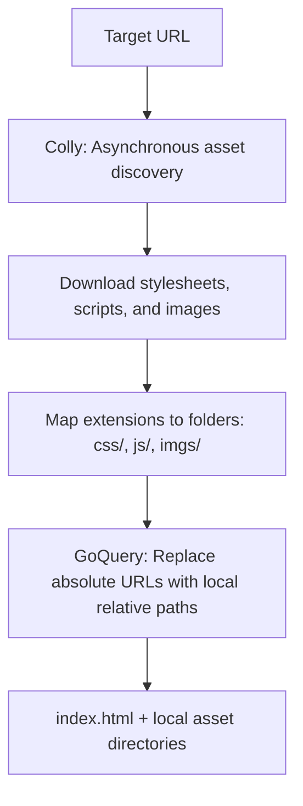

# GoClone Integration Guide (Adoption Review Pack)

---

## 1. What is it
- **Name**: GoClone
- **Source**: [https://github.com/goclone-dev/goclone](https://github.com/goclone-dev/goclone)
- **Current Registration State**: Approved for `SYSTEM_SKILL` integration to support the Hybrid Cloner Upgrade.
- **Shape Classification**: CLI Tool / Scraping Utility
- **Role Classification**: Static asset crawler and relative HTML URL re-linker.

---

## 2. Why it exists
- **What job it solves**: 
  - Standard page cloning usually copies raw HTML but leaves image and style references pointing to absolute remote URLs. When the original site changes or blocks requests, the cloned page breaks.
  - GoClone resolves this by crawling all assets (CSS, JS, images) asynchronously and modifying the HTML source to reference local, relative paths (`css/`, `js/`, `imgs/`), ensuring perfect offline rendering.
- **Why I-Wish wants it**: We want to extract its asset harvesting and local re-linking logic to upgrade I-Wish's visual cloner.
- **What gap it fills**: Fills the asset-preservation gap in Hallmark's Visual DNA model. By combining both, we can harvest brand-specific assets (like logos and custom SVGs) while rebuilding the layout with clean responsive CSS tokens.

---

## 3. Delivery framework placement
- **Which phase(s) it helps**: `design` (discovery / resource asset collection), `implement` (layout assembly).
- **Which stage/task(s) it serves**: Core visual cloner upgrades and asset pipeline management.
- **Classification**: `supportive` visual utility.

---

## 4. Input -> Process -> Output



### Inputs
- **Live URL**: The address of the reference page to copy.
- **Project Directory**: The local path where assets and rewritten HTML should be saved.

### Process
1. **`HTMLExtractor`**: Downloads the raw HTML from the target URL.
2. **`Collector` (Colly Scraper)**: Scans the page asynchronously for `link[rel='stylesheet']`, `script[src]`, and `img[src]` tags, downloading each resource.
3. **`writeFileToPath`**: Classifies and writes files into `css/`, `js/`, or `imgs/` folders.
4. **`arrange` (GoQuery Rewriting)**: Reads the local `index.html` and rewrites all asset source paths to their local, relative counterparts.

### Outputs
- **Rewritten `index.html`**: A fully functional offline HTML page.
- **Local Asset Folders**: Structured subdirectories containing the harvested assets.

---

## 5. Use cases
- **Core Use Cases**:
  - **Offline Landing Page Archiving**: Downloading a reference layout and its associated assets to verify visual elements offline.
  - **Asset Harvesting**: Automatically collecting unique SVGs, background patterns, and logos from a live page to use in a rebuilt component.
- **Adjacent Use Cases**:
  - **Asset Pruning**: Scanning and downloading only critical stylesheets, ignoring large tracking or analytics scripts.
- **Do-Not-Use Cases**:
  - Replicating dynamic, client-side rendered Single Page Applications (SPAs) without SSR support (use screenshot vision fallback instead).
  - Production deployments requiring complex JavaScript code splitting or React/Vue compilation (requires custom bundler steps).

---

## 6. Edge cases / Stress cases / Constraints
- **Dynamic Assets**: JS-injected elements, CSS `@import` files, or background images defined in external CSS are not scraped.
- **Go Runtime dependency**: GoClone is written in Go. To ensure native compatibility within I-Wish, its logic should be ported to TypeScript/JavaScript using `cheerio` and a Node-based fetch crawler.
- **Anti-Bot Walled Pages**: Cloudflare-protected pages will refuse standard crawling requests. In these cases, browser-based DevTools scraping must be invoked.

---

## 7. Agent / Workflow / Skill coordination
- **Agents**:
  - `dev-agent`: Porting the GoQuery/Colly logic to Node.js and implementing local asset folder generation.
  - `ux-agent`: Reviewing the extracted assets for size and relevance.
- **Workflows**: `/clone-website-wrapper` (upgraded to use the new Hybrid Cloner spec).
- **Supportive Skills**: `UX Guardian` (verifies aesthetic tokens), `a11y-debugging` (audits keyboard navigation on the cloned layout).

---

## 8. Orch routing hints
- **Trigger Phrases**: `harvest assets from URL`, `clone landing page offline`, `rewrite remote links to local`, `download images and CSS from website`.
- **Anti-Triggers**: `extract design DNA only`, `audit layout slop`.
- **Preferred Routing Stage**: UI Discovery / Asset Harvesting phase.

---

## 9. Review questions for the user
1. **Node Porting**: Do you prefer we rewrite the asset-harvesting and path-relinking logic in Node.js (TypeScript) for native I-Wish compatibility, or wrap GoClone as a compiled CLI binary?
2. **CDN Assets**: Should standard CDN scripts (like Google Fonts or Tailwind Play CDN) be downloaded locally or left pointing to their remote CDNs to optimize file sizes?
3. **Dynamic SPA Fallback**: If a URL fails to yield static assets due to client-side rendering (SPA), should we automatically switch to Screenshot-based DNA extraction?

---

## 10. Example scenarios

### Scenario 1: Rewriting remote resource paths to local relative folders
*Original source code:*
```html
<link rel="stylesheet" href="https://assets.stripe.com/css/main.css">
<script src="https://assets.stripe.com/js/analytics.js"></script>

```
*Rewritten code generated by Hybrid Cloner:*
```html
<link rel="stylesheet" href="css/main.css">
<script src="js/analytics.js"></script>

```
