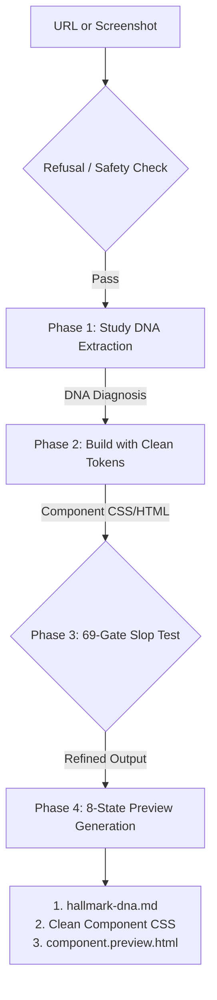

# Hallmark Integration Guide (Adoption Review Pack)

---

## 1. What is it
- **Name**: Hallmark
- **Source**: [https://github.com/nutlope/hallmark](https://github.com/nutlope/hallmark)
- **Current Registration State**: Approved for `SYSTEM_SKILL` and `USER_SPACE` integration.
- **Shape Classification**: Prompt Collection / Design Ruleset / Verification Tooling
- **Role Classification**: Declarative AI Design Engine, Visual DNA Extractor, and Aesthetic QA Auditor.

---

## 2. Why it exists
- **What job it solves**: 
  - Traditional web cloning (e.g., `clone-website`) attempts brute-force code copying (DOM/CSS replication), which is fragile, introduces framework clutter, breaks dynamic layouts, and yields messy inline styles.
  - Standard AI-generated interfaces often look cheap, generic, and carry recognizable "AI Tells" (poor alignment, bad margin ratios, default purple-to-blue gradients, `transition-all` on every element, lack of focus/disabled states).
- **Why I-Wish wants it**: To upgrade `/clone-website` with **Design DNA Extraction** (rebuilding pages using clean structural skeletons instead of copying raw styles) and to enforce premium visual quality via the **69-Gate Slop Test**.
- **What gap it fills**: Introduces structured visual criteria and 8-state interactive previews, transforming AI layouts from generic "templates" into premium, high-craft digital products.

---

## 3. Delivery framework placement
- **Which phase(s) it helps**: `design` (discovery / UI spec), `implement` (component-level styling), `validate` (visual audit & state verification).
- **Which stage/task(s) it serves**: Core cloner upgrades, design system compliance auditing, and interactive component verification.
- **Classification**: `supportive` design validator and layout engine.

---

## 4. Input -> Process -> Output



### Inputs
- **Live URL or Screenshot**: A link to a reference website or an image of the design to replicate.
- **User Content / Brief**: The text copy, features, and brand requirements to apply to the extracted layout skeleton.

### Process
1. **`study` (DNA Extraction)**: Runs a 5-step protocol (Surface → Type → Structure → Motion → Rhythm) to analyze the reference site, outputting a natural language "skeleton diagnosis" instead of raw source code.
2. **`refusal & remote safety checks`**: Automatically rejects template marketplaces (e.g., ThemeForest, Webflow Templates) and screens for prompt injection inside fetched URL content.
3. **`build / redesign`**: Applies the extracted DNA skeleton to the user's content using native responsive HSL tokens.
4. **`slop-test`**: Subjects the output to 69 stringent aesthetic gates (checking for illegal gradients, centering errors, transition bloat, and spacing errors).
5. **`preview`**: Generates a vertically stacked component catalog showing all 8 interactive states.

### Outputs
- **DNA Diagnosis**: An architectural description of the layout, typography, colors, and rhythm.
- **Clean Component Code**: Clean, semantic HTML and tokenized CSS.
- **`.preview.html`**: A single scrollable HTML page rendering the component in all 8 interactive states.

---

## 5. Use cases
- **Core Use Cases**:
  - **Premium UI Cloning**: Replicating the "vibe" and layout structure of a reference site using a screenshot, without copying the underlying messy code.
  - **Aesthetic Self-Auditing**: Automatically checking generated code for "AI tells" (bad typography pairings, default hover scaling, zero-chroma neutrals) before rendering.
  - **Interactive State Validation**: Ensuring all custom buttons, cards, and forms handle disabled, active, and focus states correctly.
- **Adjacent Use Cases**:
  - **A11y / Reduced Motion Audits**: Automatically generating prefers-reduced-motion CSS variants for all micro-animations.
  - **Viewport Stress Testing**: Confirming pages do not scroll horizontally on viewports from 320px to 1920px.
- **Do-Not-Use Cases**:
  - Full-stack database or API generation (Hallmark is strictly a visual layout engine).
  - Production builds requiring complex JS bundle chunking or framework hydration systems (requires hosting wrapper support).

---

## 6. Edge cases / Stress cases / Constraints
- **URL Mode Rhythm Blind Spot**: WebFetch cannot determine the visual density or negative space ("Rhythm") from HTML markup alone. The rhythm is marked as `unknown (URL mode)`. If rhythm is critical, a screenshot must be provided.
- **Client-Rendered SPAs**: URLs targeting React/Vue/Angular apps that only return an empty `<div id="root">` shell will trigger the screenshot fallback, as the fetch pipeline only parses server-rendered payloads.
- **Context Bloat**: Hallmark's rulesets total over 350KB. Dynamically loading them into every prompt will bloat context windows. I-Wish resolves this by integrating the rules into the host agent's memory and targeting specific folders (like `UX Guardian` rules).
- **Self-Critique Hallucination**: AI models auditing their own design work tend to be sycophantic. To prevent this, human-in-the-loop checkpoints or external script-based validation are recommended.

---

## 7. Agent / Workflow / Skill coordination
- **Agents**: 
  - `ux-agent`: Triggers the `study` and `slop-test` protocols to verify design spec alignment.
  - `dev-agent`: Implements the layout using tokenized CSS and generates the 8-state preview.
  - `orch-agent`: Directs cloner tasks, managing transitions between `study` and `build`.
- **Workflows**: `/clone-website-wrapper` (uses Study mode as the primary extraction engine), `/audit-ux-patterns` (injects the slop-test gates).
- **Supportive Skills**: `UX Guardian` (enforces aesthetic alignment), `a11y-debugging` (validates layout-safety and keyboard focus).

---

## 8. Orch routing hints
- **Trigger Phrases**: `study website design`, `extract DNA layout from image`, `check UI for AI tells`, `audit website spacing and alignment`, `generate 8 states preview`.
- **Anti-Triggers**: `setup database tables`, `configure webpack configs`, `optimize node backend endpoints`.
- **Preferred Routing Stage**: UI Discovery & Design Phase (for DNA extraction) and QA & Verification Phase (for Slop-Test and 8-State Previews).

---

## 9. Review questions for the user
1. **Rhythm Extraction**: If your reference site is a dynamic Single Page Application (SPA), are you comfortable using screenshots instead of URLs to allow full Rhythm and spacing analysis?
2. **Interactive States**: Should the 8-state preview `.preview.html` generation be mandatory for all UI story tickets, or only for core custom-themed interactive elements?
3. **Aesthetic Tone**: How strict should we be on the "anti-slop" color rule (e.g., prohibiting pure `#000` or `#fff` base colors unless modern-minimalist is explicitly requested)?

---

## 10. Example scenarios

### Scenario 1: Studying a reference site DNA from a URL
*User prompt: "study https://stripe.com and tell me its design skeleton"*
*System response:*
```
1. Surface: Dark Mode Elevaled, Lightness elevation, Accent Teal (Hue 185) at 4% footprint.
2. Type: Display is "Geist Sans" (geometric grotesque), Body is "Inter" (neutral grotesque).
3. Structure: Bento Grid with asymmetry, hairline rules (1px, L 15% opacity).
4. Motion: GSAP-driven scroll entrance, Lenis smooth scroll active.
5. Rhythm: unknown (URL mode) - Please attach a screenshot if you need visual rhythm and spacing analysis.
```

### Scenario 2: Enforcing the 8-State interactive check in CSS
*Code structure generated by Dev Agent to pass the Slop Test:*
```css
/* Button Component - 8 States Enforced */
.btn-primary { /* 1. Default State */
  background-color: oklch(0.6 0.18 250);
  color: var(--text-light);
  transition: background-color 150ms ease-in-out;
}
.btn-primary:hover { /* 2. Hover State */
  background-color: oklch(0.55 0.18 250);
}
.btn-primary:active { /* 3. Active State */
  background-color: oklch(0.48 0.18 250);
}
.btn-primary:focus-visible { /* 4. Focus State */
  outline: 2px solid oklch(0.6 0.18 250);
  outline-offset: 2px;
}
.btn-primary:disabled { /* 5. Disabled State */
  background-color: var(--neutral-muted);
  cursor: not-allowed;
  opacity: 0.5;
}
/* Additional states (6. Loading, 7. Selected, 8. Error) handled via CSS modifiers */
.btn-primary.is-loading {
  cursor: wait;
}
.btn-primary.is-selected {
  outline: 2px solid var(--text-light);
}
.btn-primary.has-error {
  border-color: var(--color-danger);
}
```
