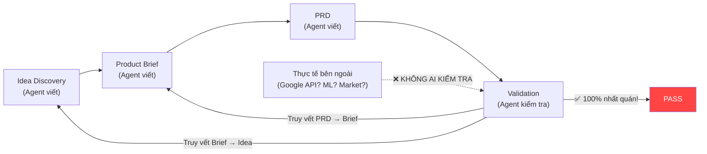
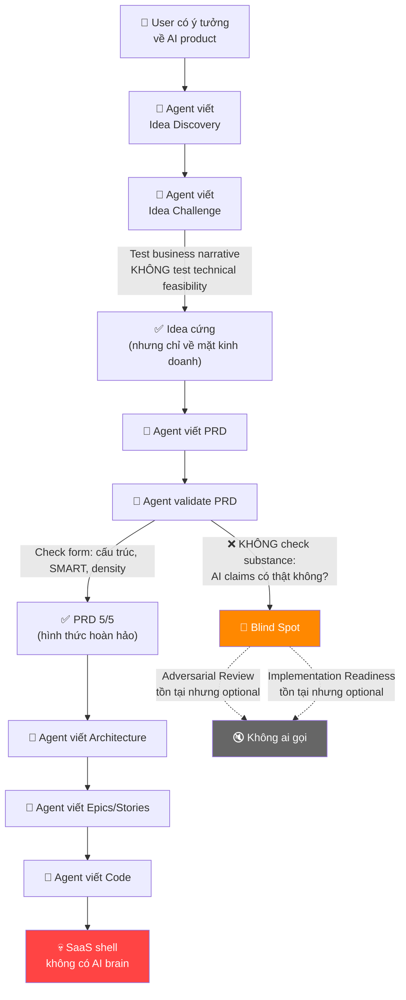

# 📋 PHẦN 1: CHIẾN LƯỢC PIVOT — Agentic SEO Suite
# 🔬 PHẦN 2: PHÂN TÍCH GỐC RỄ — Vì Sao I-Wish Pipeline Thất Bại

> **Ngày:** 2026-06-04  
> **Phạm vi:** Đề xuất pivot dựa trên kết quả Hội đồng Đánh giá + Phân tích lỗ hổng cấu trúc workflow

---

# PHẦN 1: CHIẾN LƯỢC PIVOT

## I. NGHIÊN CỨU THỰC ĐỊA — Thế Giới Thực Vs Giả Định

### 1.1 Google MCP + UCP — Thực trạng (06/2026)

| Giả định trong PRD | Thực tế |
|:---|:---|
| Google sẽ whitelist MCP Gateway thương mại | ❌ Google KHÔNG whitelist individual gateways — hệ sinh thái dùng open protocols |
| Gemini sẽ gọi MCP tools để search/mua sản phẩm | ⚠️ MCP là connectivity layer, nhưng commerce dùng **UCP (Universal Commerce Protocol)** |
| AI Agent sẽ tự động đàm phán giá qua MCP | ❌ Không có nền tảng AI nào hỗ trợ autonomous price negotiation |
| Cần xây Centralized MCP Gateway làm broker | ❌ **Shopify đã có native MCP endpoints**: `https://{shop}.myshopify.com/api/mcp` |

> [!IMPORTANT]
> **PHÁT HIỆN MỚI — Google UCP (Universal Commerce Protocol):**
> - Google ra mắt UCP đầu 2026 — "ngôn ngữ chung" cho toàn bộ hành trình mua sắm: discovery → purchase → post-purchase
> - **Co-developed với Shopify, Etsy, Wayfair, Target, Walmart**
> - UCP hoạt động CÙNG MCP (MCP = connectivity, UCP = commerce-specific standard)
> - Bao gồm **Agent Payments Protocol (AP2)** cho autonomous checkout an toàn
> - Merchants expose `/.well-known/ucp` cho AI agent discovery
> - Google "Universal Cart" (05/2026): persistent cart xuyên suốt Search, Gemini, YouTube, Gmail
>
> **Tác động:** Giả thuyết "Centralized MCP Gateway whitelisted bởi Google" bị **obsolete hoàn toàn**. Hệ sinh thái đã chuyển sang open standards mà bất kỳ merchant nào cũng có thể adopt trực tiếp.

### 1.2 GEO (Generative Engine Optimization) — Trạng thái học thuật

- Nghiên cứu đầu tiên: Princeton/Georgia Tech (2024) — xác định các yếu tố: **Citing Sources (+40%)**, **Adding Statistics (+30%)**, **Quotation Addition (+25%)**, **Fluency Optimization (+15%)**
- **KHÔNG có framework GEO scoring thương mại nào được xác thực** — mỗi vendor tự đặt weights riêng
- `llms.txt` do Jeremy Howard (fast.ai) đề xuất cuối 2024 — adoption cực kỳ hạn chế
- Các player lớn (Surfer SEO, Clearscope, MarketMuse) đang thêm "AI visibility" nhưng chưa ai có validated scoring

> [!NOTE]
> **GEO đang ở trạng thái pre-paradigm** — lĩnh vực quá mới để bất kỳ ai xác thực được trọng số scoring. Đây vừa là rủi ro (không thể chứng minh sản phẩm hoạt động) vừa là cơ hội (chưa ai chiếm được market leadership).

### 1.3 Conversational Commerce — Ai Đang Thắng?

| Platform | Revenue | Có negotiation? | Có GEO? | Mô hình |
|:---|:---|:---:|:---:|:---|
| **Tidio** | ~$50M ARR | ❌ | ❌ | Rule-based flows + Lyro AI (FAQ) |
| **Drift/Salesloft** | Enterprise | ❌ | ❌ | B2B lead qualification |
| **Ada** | Enterprise | ❌ | ❌ | Customer service automation |
| **Rep.ai** | Series A | ❌ | ❌ | Behavioral AI product recs |
| **Shopify Sidekick** | Built-in | ❌ | ❌ | Admin assistant (not customer-facing) |

> **Insight:** Không platform nào kết hợp GEO + conversational commerce. Đây hoặc là **blue ocean** hoặc là dấu hiệu rằng sự kết hợp này bị ép buộc (**forced combination**).

### 1.4 AI Shopping Agents — Thực tế 2026

**Capabilities hiện tại (06/2026):**
- Autonomous discovery đa nền tảng cùng lúc
- Deep evaluation: real-time pricing, specs, reviews, return policies
- End-to-end transaction execution ("zero-click shopping") — qua UCP/AP2
- Post-purchase management: tracking, returns, subscriptions

**Infrastructure hỗ trợ:**
- UCP + MCP + A2A protocols — hệ sinh thái mở
- **Mastercard "Agent Pay"** với cryptographic mandates cho autonomous checkout
- Google "Universal Cart" — persistent cart xuyên Search/Gemini/YouTube/Gmail

> [!NOTE]
> **Chuyển biến quan trọng:** Retailers đang cạnh tranh cho **"algorithmic attention"** thay vì human eyeballs. Product feed optimization > traditional SEO. Structured data clarity là thứ AI agents cần.
>
> **Tác động:** Price negotiation VẪN không tồn tại. Nhưng AI agents ĐÃ CÓ khả năng transact — thông qua UCP/AP2 standards, KHÔNG qua custom MCP gateways.

---

## II. FRAMEWORK PIVOT: KEEP / KILL / PIVOT

### 🟢 KEEP — Tài Sản Có Giá Trị Thực

| Tài sản | Giá trị | Tái sử dụng cho |
|:---|:---|:---|
| Multi-tenant SaaS Infrastructure | ~6 tháng engineering, auth/RBAC/billing hoàn chỉnh | Bất kỳ B2B SaaS nào |
| BYOK LLM Management | Model registry, key rotation, failover routing | Nền tảng AI SaaS |
| WooCommerce Plugin: llms.txt + Content Negotiation | `llms.txt` là chuẩn đang nổi, kỹ thuật đúng | Plugin standalone |
| GEO Readiness Audit (reframe) | Concept audit website cho AI readability có giá trị | Core feature (đổi tên) |
| Super Admin Portal Shell | Kiến trúc 3-portal sạch | Admin framework |
| Notification Infrastructure | Multi-channel setup hoàn chỉnh | Tái sử dụng nguyên vẹn |
| Developer Portal | Webhooks, API keys, sandbox mode | Tái sử dụng nguyên vẹn |

### 🔴 KILL — Loại Bỏ Hoàn Toàn

| Tính năng | Lý do kill |
|:---|:---|
| AI Price Negotiation | Không có nền tảng AI nào hỗ trợ autonomous negotiation |
| MCP Gateway làm Commercial Broker | Google chưa mở MCP cho giao dịch thương mại |
| AEO Answer Tracking (tự động) | Không khả thi kỹ thuật — không có API để programmatically track |
| Competitor GEO Benchmarking | Rủi ro pháp lý (ToS) + kỹ thuật (anti-bot) |
| Generative UI cho 6 ngành | Mỗi ngành là một sản phẩm riêng, infeasible tại MVP |
| Identity & Trust Score Network | Đề xuất một internet protocol mới, phi thực tế |
| Cart Bridge đa nền tảng | Quá nhiều platform-specific complications, thu hẹp chỉ WooCommerce |
| 13 ngôn ngữ tại MVP | Thu hẹp: English + Vietnamese cho MVP |
| In-chat Payment (Phase 3) | Mâu thuẫn với kiến trúc MVP (tránh PCI-DSS) |

### 🟡 PIVOT TO — Định Vị Giá Trị Mới

#### Tầm nhìn mới: **"UCP-Ready Commerce Optimizer"** (tên thay thế: "AI Readiness Platform")

Thay vì xây proprietary MCP gateway, trở thành **công cụ giúp merchants UCP/MCP-ready**:

---

### Trụ cột 1: AI Readiness Audit & Fix (reframe GEO)

| Thay đổi | Chi tiết |
|:---|:---|
| **Đổi tên** | "GEO Score" → **"AI Readiness Score"** |
| **Đổi positioning** | *"Chúng tôi giúp website TMĐT của bạn dễ được AI assistants tìm thấy"* |
| **BỎ claim** | Score tương quan với rankings (vì không ai chứng minh được) |
| **GIỮ** | llms.txt generator, Schema enrichment, Content Negotiation, structured data checks |
| **THÊM** | So sánh với best practices từ nghiên cứu Princeton GEO (citing sources, statistics) |
| **THÊM** | **"Ask AI About Your Product"** — tool test thủ công: query Gemini về sản phẩm và xem kết quả |

### Trụ cột 2: AI Shopping Assistant (reframe Bot)

| Thay đổi | Chi tiết |
|:---|:---|
| **Đổi positioning** | Bỏ "negotiation" và "conversational commerce". Rebrand thành **"AI Shopping Assistant"** |
| **Scope thực tế** | Knowledge-grounded FAQ bot + product search + order status |
| **THÊM ML thực** | RAG với vector embeddings (pgvector trong Postgres hiện có), intent classification qua Gemini fine-tuning |
| **THÊM feedback loop** | Thumbs up/down → prompt optimization (thực tế, không phải full ML pipeline) |
| **KILL** | Price negotiation, dynamic pricing, cart bridge |
| **Đo lường giá trị** | Giảm chi phí CSKH (đo được), tăng on-site engagement (đo được) |

### Trụ cột 3: Merchant Intelligence Dashboard (reframe Analytics)

| Thay đổi | Chi tiết |
|:---|:---|
| **Đổi positioning** | Thay vì track AI visibility (bất khả thi), cung cấp **website intelligence thực** |
| **THÊM** | Bot conversations → conversion correlation, popular queries, FAQ gaps |
| **THÊM** | Content suggestions dựa trên bot conversations (feedback loop từ Story 5.4, làm đúng) |
| **THÊM** | A/B testing cho bot responses |

---

## III. LỘ TRÌNH PIVOT THEO PHA

### Phase 0: Validation Sprint (2 tuần tới)

> [!CAUTION]
> **KHÔNG CODE THÊM cho đến khi hoàn thành Phase 0.** Mọi giả định phải được kiểm chứng trước khi đầu tư thêm engineering effort.

```
Tuần 1: Validation Nghiên cứu
├── Phỏng vấn 10 chủ shop WooCommerce:
│   ├── "Bạn có sẵn sàng cài plugin tạo llms.txt?" (Test GEO demand)
│   ├── "Bạn sẽ trả $29/tháng cho AI FAQ bot trên shop?" (Test bot demand)
│   └── "Bạn đang trả bao nhiêu cho CSKH?" (Establish value baseline)
├── Test GEO Hypothesis thủ công:
│   ├── Lấy 20 WooCommerce sites
│   ├── Thêm llms.txt + enhanced Schema vào 10 sites
│   ├── Query Gemini hàng tuần trong 4 tuần
│   └── Đo lường: có khác biệt citation rates không?
│
Tuần 2: Prototype RAG chatbot
├── Dùng pgvector + Postgres hiện có
├── Ingest catalog sản phẩm WooCommerce thật
├── Đo lường response quality (accuracy, helpfulness)
└── Demo cho 3 merchants → thu thập phản hồi
```

### Phase 1: MVP Rebuild (Tuần 3-6)

```
Sprint 1 (Tuần 3-4): Intelligence Foundation
├── Implement RAG thực với pgvector
├── Add Gemini fine-tuning cho intent classification
├── Build feedback loop: ratings → prompt engineering
├── Tích hợp vào WooCommerce plugin hiện có
│
Sprint 2 (Tuần 5-6): Reframe & Deploy
├── Rebrand GEO Score → AI Readiness Score
├── Build "Ask AI About Your Product" testing tool
├── Deploy beta cho 3-5 merchants
└── Thu thập metrics thực: CSKH cost reduction, engagement
```

### Phase 2: Intelligence Layer (Tháng 2-3)

```
├── Conversation analytics dashboard (dữ liệu thực, không mock)
├── Content suggestion engine từ bot conversations
├── A/B testing cho bot responses
├── Basic recommendation engine (content-based, dùng embeddings)
└── Validate: GEO score có tương quan gì với AI mentions không?
```

### Phase 3: Scale (Tháng 3-6)

```
├── Shopify plugin adaptation
├── SOV tracking (manual + semi-automated)
├── Advanced ML: conversation success prediction
├── Enterprise features dựa trên feedback thực tế
└── Nếu GEO research cho kết quả tích cực → invest ML pipeline
```

---

---

# PHẦN 2: PHÂN TÍCH GỐC RỄ — VÌ SAO I-WISH PIPELINE THẤT BẠI

## I. BẰNG CHỨNG: TẤT CẢ VALIDATION ĐỀU PASS VỚI ĐIỂM TUYỆT ĐỐI

PRD Validation Report đã chạy **12 bước kiểm tra** và đạt **0 lỗi trên tất cả các bước**:

| Bước | Nội dung kiểm tra | Kết quả | Đáng lẽ phải bắt được? |
|:---:|:---|:---:|:---|
| V-01 | Document Discovery | ✅ Pass | — |
| V-02 | Format Detection | ✅ Pass | — |
| V-03 | Information Density | ✅ 0 lỗi | ❌ **Dense ≠ Correct** |
| V-04 | Brief Coverage | ✅ 100% | ❌ **100% coverage của Brief cũng sai** |
| V-05 | Measurability | ✅ 0 lỗi | ⚠️ **Đo form, không đo substance** |
| V-06 | Traceability | ✅ 0 lỗi | ❌ **Trace hoàn hảo của chuỗi sai** |
| V-07 | Implementation Leakage | ✅ 0 lỗi | — |
| V-08 | Domain Compliance | ✅ 3/3 | ⚠️ **Chỉ check E-commerce, bỏ sót AI/ML domain** |
| V-09 | Project-Type | ✅ 5/5 | — |
| V-10 | SMART Validation | ✅ **23/23 FR = 5/5** | 🔴 **BLIND SPOT CỐT LÕI** |
| V-11 | Holistic Quality | ✅ **5/5 Excellent** | 🔴 **BLIND SPOT CỐT LÕI** |
| V-12 | Completeness | ✅ 100% | ❌ **Complete template ≠ Complete product** |

> [!CAUTION]
> **PRD đạt điểm tuyệt đối 5/5 trên MỌI tiêu chí — 23 FR đều được chấm 5/5 — nhưng sản phẩm chỉ đạt 3.3/10 về tính khả thi.** Đây là bằng chứng rõ ràng nhất cho thấy hệ thống validation đang kiểm tra SAI THỨNG.

---

## II. 7 LỖ HỔNG CẤU TRÚC CỦA I-WISH WORKFLOW

### 🕳️ Lỗ hổng #1: "Form over Substance" — Kiểm Tra Hình Thức, Bỏ Qua Bản Chất

**Triệu chứng:** Mọi bước validation đều kiểm tra *hình thức* của PRD (cấu trúc, đo lường được, truy vết, mật độ, định dạng) nhưng KHÔNG BAO GIỜ kiểm tra *bản chất* (cái đang được mô tả có thể build thực sự không? Claims AI có thật không? Cơ chế đề xuất tồn tại trên thực tế không?).

**Ví dụ cụ thể:**

```
FR8: "Hệ thống tự động chấp nhận giao dịch nếu giá đề xuất ≥ giá sàn, 
      phản hồi trong 200ms, sinh Cart Token."

→ SMART Validation chấm 5/5 "Attainable" 
→ Vì: Đúng, có thể code được: if (price >= floor) → return token

→ NHƯNG: Cái này KHÔNG PHẢI "AI negotiation"!
   Nó là phép so sánh số học mà bất kỳ junior dev nào cũng viết được.
   PRD gọi nó là "AI Dynamic Pricing" nhưng validation không phân biệt.
```

---

### 🕳️ Lỗ hổng #2: Vòng Lặp Tự Xác Nhận (Self-Referential Validation Loop)

**Triệu chứng:** Pipeline validation xác thực PRD đối chiếu với Brief, Brief đối chiếu với Idea, Idea đối chiếu với JTBD — nhưng TẤT CẢ các tài liệu này được viết bởi **CÙNG MỘT agent** trong **CÙNG MỘT context**. Chuỗi truy vết hoàn hảo vì nó là chuỗi giả định của agent được trace ngược về chính nó.



> **Agent tự viết → tự kiểm tra → tự chấm điểm → tự tốt nghiệp.** Không có "giám khảo bên ngoài" nào tham gia.

---

### 🕳️ Lỗ hổng #3: Không Có "Devil's Advocate" Gate Cho Sản Phẩm AI/ML

**Triệu chứng:** Không có bước workflow nào hỏi:

> *"Đối với MỖI tính năng được gắn nhãn 'AI-powered', model/algorithm/training loop cụ thể nào là bắt buộc? Nó đã tồn tại hay cần xây dựng từ đầu? Chi phí và thời gian bao lâu?"*

Hệ thống I-Wish có nhiều workflow phản biện (`/review-adversarial-general`, `/idea-challenge`, `/check-implementation-readiness`) nhưng:

- `/review-adversarial-general` — **Chưa bao giờ được chạy** (không tìm thấy output)
- `/idea-challenge` — Đã chạy nhưng chỉ test *business narrative*, không test *technical feasibility*
- `/check-implementation-readiness` — **Chưa bao giờ được chạy** trước khi bắt đầu implementation

---

### 🕳️ Lỗ hổng #4: Không Có External Reality Check Gate

**Triệu chứng:** Không có bước nào yêu cầu agent xác thực claims đối chiếu với thực tế bên ngoài:

| Cần kiểm tra | Có trong pipeline? |
|:---|:---:|
| Google MCP documentation — thực sự hỗ trợ gì? | ❌ |
| API capabilities hiện có của Gemini, ChatGPT | ❌ |
| ML infrastructure requirements cho "AI-powered" features | ❌ |
| Competitive product teardowns kỹ thuật (không chỉ feature list) | ❌ |
| Academic research validation (Princeton GEO weights) | ❌ |

---

### 🕳️ Lỗ hổng #5: Adversarial Review Là Optional, Không Phải Mandatory Gate

**Triệu chứng:** Luồng pipeline thực tế:

```
Idea Discovery → Product Brief → PRD → [PRD Validation] → Architecture → Epics → Code
                                           ↑
                                    Chạy tự động, 
                                    Pass 5/5 mọi thứ
                                    
Adversarial Review?    → CÓ TỒN TẠI nhưng KHÔNG BẮT BUỘC → KHÔNG AI CHẠY
Implementation Readiness? → CÓ TỒN TẠI nhưng KHÔNG BẮT BUỘC → KHÔNG AI CHẠY
```

Các workflow phản biện mạnh nhất tồn tại trong hệ thống nhưng **không được wired vào pipeline bắt buộc**.

---

### 🕳️ Lỗ hổng #6: Domain Detection Không Nhận Diện "AI/ML Product" Domain

**Triệu chứng:** Step V-08 (Domain Compliance) đã detect domain **"E-Commerce"** và kiểm tra:
- ✅ PCI-DSS compliance
- ✅ Inventory accuracy
- ✅ Cart consistency

Nhưng nó **KHÔNG NHẬN DIỆN** rằng đây cũng là **"AI/ML Product"** — domain cần kiểm tra:

| Tiêu chí AI/ML Domain | Có trong checklist? |
|:---|:---:|
| Model architecture specification | ❌ |
| Training data strategy | ❌ |
| Evaluation metrics (precision, recall, F1) | ❌ |
| Feedback loops & continuous improvement | ❌ |
| Model drift monitoring | ❌ |
| ML infrastructure requirements | ❌ |
| Data pipeline architecture | ❌ |
| Ethical AI considerations (bias, fairness) | ❌ |

---

### 🕳️ Lỗ hổng #7: SMART "Attainable" = "Code Được?" Thay Vì "Tạo Giá Trị Được?"

**Triệu chứng:** SMART validation hiểu **"Attainable"** là *"team dev có thể code requirement này không?"* — câu trả lời luôn là YES vì bất kỳ FR nào cũng có thể code thành stub.

**Câu hỏi ĐÚNG phải là:** *"FR này mô tả một mechanism có THỰC SỰ TẠO RA GIÁ TRỊ mà nó tuyên bố không?"*

```
FR4: "GEO Score 0-100 dựa trên 4 trụ cột"
→ Attainable? YES — viết hàm tính score rất dễ
→ Tạo giá trị? UNKNOWN — score có tương quan với AI visibility không? CHƯA AI BIẾT.
```

---

## III. TẠI SAO "IDEA CHALLENGE" CŨNG KHÔNG BẮT ĐƯỢC?

Đọc kỹ file [1.3. idea-challenge.md](file:///Users/hatrang20061988/Desktop/AI%20Project/Agentic%20SEO%20Suite/_iwish-output/1.%20Idea%20Discovery/1.3.%20idea-challenge.md), ta thấy:

### Cái mà Idea Challenge ĐÃ LÀM:
- ✅ Viết Press Release giả lập (Working Backwards)
- ✅ Tạo Customer FAQs — trả lời "tại sao chọn chúng tôi thay vì Yoast + Tidio?"
- ✅ Tạo Internal FAQs — giải thích feedback loop và floor price mechanism
- ✅ Phân rã MVP scope
- ✅ Định nghĩa success metrics

### Cái mà Idea Challenge KHÔNG LÀM:
- ❌ **Không challenge "AI" trong "AI-powered"** — Không hỏi: "phần AI ở đây là gì cụ thể? Generic LLM API call có đủ tạo differentiation không?"
- ❌ **Không test technical feasibility** — Internal FAQ #1 mô tả "Reverse Chat Feedback Loop" nhưng không ai hỏi: "đây là content refresh hay machine learning thực sự?"
- ❌ **Không xem xét alternative approaches** — Skill `idea-hardening` yêu cầu "mandatory 2-3 approaches with trade-offs" nhưng output chỉ có 1 approach duy nhất cho AI layer
- ❌ **Không kiểm tra external dependencies** — Không ai hỏi: "Google thực sự hỗ trợ MCP cho shopping chưa?"

### Nguyên nhân sâu xa:
**Idea Challenge framework test *business narrative* (khách hàng sẽ mua không?) nhưng không test *technical narrative* (chúng ta có thể build cái này với AI thật, không phải API wrapper?)**

---

## IV. MÔ HÌNH THẤT BẠI — "THE PERFECT STORM"



---

## V. GIẢI PHÁP: 5 FIXES CHO I-WISH PIPELINE

### Fix #1: 🆕 Thêm "Technical Feasibility Gate" — Bắt Buộc

**Vị trí:** Sau Idea Challenge, trước PRD.

**Nội dung bước mới — `step-feasibility-check.md`:**

```markdown
## Technical Feasibility Checkpoint

Cho MỖI tính năng core:

1. **Dependency Reality Check:**
   - External APIs/platforms mà feature phụ thuộc → CÓ TỒN TẠI KHÔNG?
   - Viện dẫn documentation URL cụ thể
   
2. **AI/ML Depth Check (nếu feature claim "AI-powered"):**
   - Cụ thể model/algorithm nào sẽ được dùng?
   - Training data đến từ đâu? Bao nhiêu data cần?
   - Feedback loop design ra sao?
   - "Generic LLM API call" có đủ tạo giá trị khác biệt không?
   
3. **Build vs Buy Analysis:**
   - Phần nào tự build (cần bao lâu)?
   - Phần nào dùng service có sẵn?
   - Phần nào CHƯA CÓ GIẢI PHÁP trên thị trường?

4. **Proof of Concept Requirement:**
   - Tính năng nào cần PoC trước khi đưa vào PRD?
   - PoC mất bao lâu? Resource nào cần?
```

---

### Fix #2: 🔄 Biến Adversarial Review Thành Mandatory Gate

**Hiện tại:** `/review-adversarial-general` là workflow optional → không ai chạy.

**Giải pháp:** Wire adversarial review vào pipeline BẮT BUỘC tại 2 điểm:

```
Idea Challenge → [MANDATORY] Adversarial Review → PRD
PRD Validation → [MANDATORY] Implementation Readiness Check → Architecture
```

**Thêm adversarial questions bắt buộc:**
- "Liệt kê 3 lý do sản phẩm này SẼ THẤT BẠI"
- "Đối thủ nào có thể clone trong 2 tuần? Tại sao?"
- "Giả định nào nếu sai sẽ phá hủy toàn bộ value proposition?"

---

### Fix #3: 🏷️ Thêm "AI/ML Product" Domain Detection vào V-08

**Hiện tại:** V-08 chỉ detect E-Commerce domain.

**Giải pháp:** Thêm auto-detection rule:

```
NẾU PRD chứa từ khóa: "AI-powered", "machine learning", "ML", 
    "neural", "model", "training", "embedding", "NLP", "LLM"
THÌ kích hoạt AI/ML Domain Checklist:
    □ Model architecture specification
    □ Training data strategy  
    □ Evaluation metrics (precision, recall, F1)
    □ Feedback loop design
    □ Model drift monitoring plan
    □ ML infrastructure requirements (GPU? Vector DB?)
    □ Data pipeline architecture
    □ Cost estimation (token usage, compute)
```

---

### Fix #4: 🔍 Thay Đổi SMART "Attainable" Thành "Value-Attainable"

**Hiện tại:** "Attainable" = "có thể code không?" → luôn YES.

**Giải pháp:** Chia "Attainable" thành 2 sub-dimensions:

| Sub-dimension | Câu hỏi | Ví dụ |
|:---|:---|:---|
| **Technically Buildable** | Dev team có thể implement? | "`if price >= floor` → YES" |
| **Value Deliverable** | Implementation có tạo ra giá trị mà FR tuyên bố? | *"Phép so sánh số này có phải 'AI negotiation' không? → NO"* |

Chỉ khi cả 2 sub-dimension ≥ 3 thì FR mới Pass.

---

### Fix #5: 🌍 Thêm "External Validation" Step — Ngăn Vòng Lặp Tự Xác Nhận

**Hiện tại:** Agent tự viết → tự validate → tự pass.

**Giải pháp:** Thêm bước **External Validation** yêu cầu agent:

1. **Search web** cho mỗi external dependency claim:
   - "Google MCP for shopping" → search documentation → confirm/deny
   - "AEO tracking programmatically" → search for existing tools → confirm/deny

2. **Cite evidence** cho mỗi unverified assumption:
   - GEO weights → cite Princeton paper hoặc ghi rõ "UNVALIDATED"
   - Conversion targets (30%+ cart suggestion) → cite industry benchmarks hoặc ghi rõ "ASSUMED"

3. **Flag unvalidated assumptions** bằng alert level:

```markdown
> [!WARNING]
> UNVALIDATED ASSUMPTION: GEO Score weights (25/20/20/15/20) 
> have no empirical validation. Recommend PoC before inclusion in PRD.
```

---

## VI. TÓM TẮT: DIAGNOSTIC VÀ PRESCRIPTION

### Chẩn đoán (Diagnostic)

| Nguyên nhân | Mức ảnh hưởng | Loại lỗi |
|:---|:---:|:---|
| Validation kiểm tra hình thức, không kiểm tra bản chất | 🔴 Critical | Thiết kế hệ thống |
| Agent tự viết tự chấm (self-referential loop) | 🔴 Critical | Thiết kế quy trình |
| Adversarial review tồn tại nhưng optional | 🟠 High | Thiếu enforcement |
| Domain detection bỏ sót AI/ML domain | 🟠 High | Thiếu coverage |
| SMART "Attainable" quá dễ pass | 🟡 Medium | Tiêu chí quá lỏng |
| External reality check không tồn tại | 🔴 Critical | Thiếu hoàn toàn |
| Idea Challenge chỉ test business, bỏ technical | 🟠 High | Thiết kế one-sided |

### Đơn thuốc (Prescription)

```
┌─────────────────────────────────────────────────┐
│  TRƯỚC (Pipeline hiện tại)                       │
│                                                 │
│  Idea → Brief → PRD → [Form Validation ✅] →    │
│  Architecture → Epics → Code → 💀 Shell         │
│                                                 │
│  Adversarial Review: 😴 Ngủ yên                 │
│  Feasibility Check: ❌ Không tồn tại            │
│  External Validation: ❌ Không tồn tại          │
└─────────────────────────────────────────────────┘

┌─────────────────────────────────────────────────┐
│  SAU (Pipeline đề xuất)                          │
│                                                 │
│  Idea → Brief → [🆕 FEASIBILITY GATE] →         │
│  [🆕 ADVERSARIAL REVIEW mandatory] →            │
│  PRD → [Form + 🆕 Substance Validation] →       │
│  [🆕 EXTERNAL REALITY CHECK] →                  │
│  [🆕 IMPLEMENTATION READINESS mandatory] →      │
│  Architecture → Epics → Code → 🧠 Real Product  │
└─────────────────────────────────────────────────┘
```

---

*Báo cáo được biên soạn dựa trên phân tích 12 bước PRD Validation (387 dòng), 7 workflow definitions, Idea Discovery (99 dòng), Idea Challenge (89 dòng), và đối chiếu với dữ liệu nghiên cứu thị trường GEO/MCP/Conversational Commerce thực tế tháng 6/2026.*
