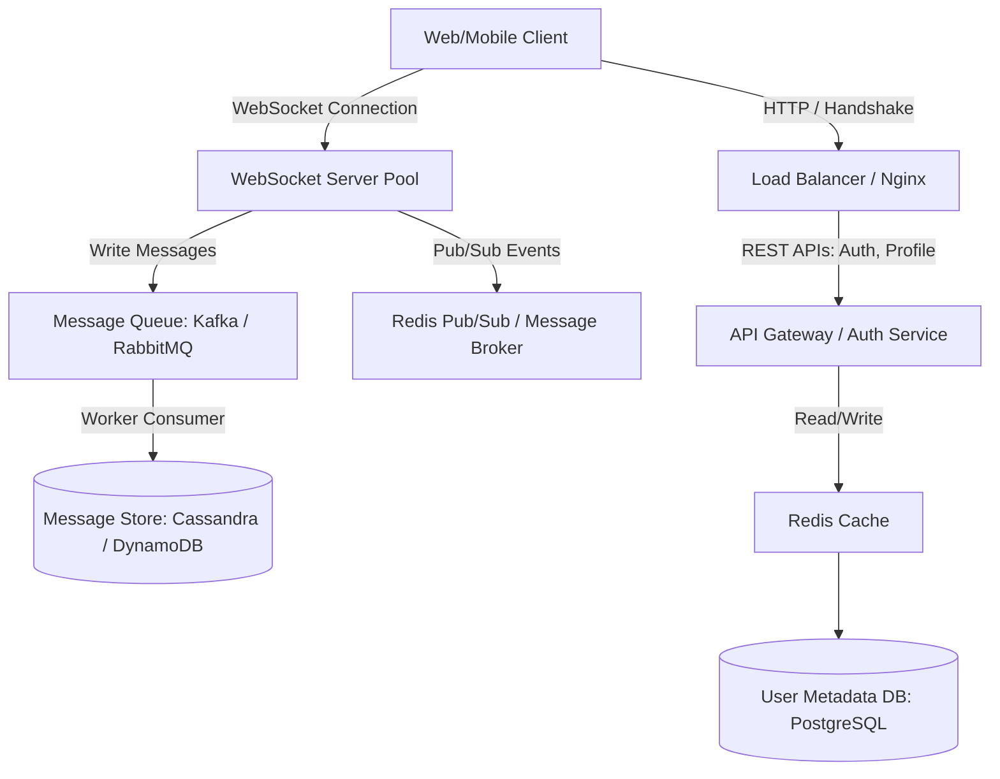

# Chat Application Architecture Blueprint (High-Scale)

Derived from awesome system design resources.

## 1. High-Level Design

## 2. Key Architecture Components

- **WebSocket Server Pool:** Stateless connection managers handling active client WebSocket connections.
- **Redis Pub/Sub:** Handles real-time message routing and presence indicators between WebSocket instances.
- **Message Broker & Queue (Kafka/RabbitMQ):** Decouples writing messages from WebSocket servers to guarantee persistence and handle traffic spikes.
- **Cassandra / DynamoDB:** Wide-column NoSQL stores optimized for highly concurrent, sequential writes and reads by conversation ID.
- **Read-Aside Caching:** User sessions and metadata stored in Redis.
