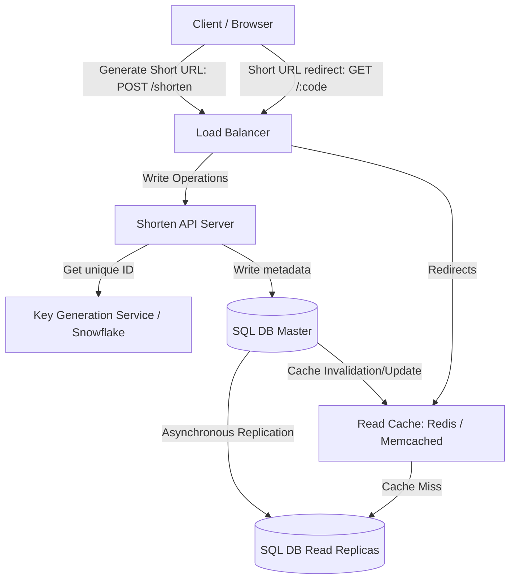

# URL Shortener Architecture Blueprint (High-Scale)

Derived from awesome system design resources.

## 1. High-Level Design

## 2. Key Architecture Components

- **Read Cache (Redis / Memcached):** Stores mappings of `short_code -> long_url` with LRU eviction. Handles >90% of redirection traffic.
- **Key Generation Service (KGS):** Prevents collisions by generating pre-allocated unique IDs (using Snowflake, or a database-backed range allocator) to ensure extremely fast ID distribution.
- **SQL Master-Replica Database:** Relational database (PostgreSQL/MySQL) storing URL mappings. Read replicas scale redirection lookups, while master handles new shortened URLs.
- **Write-Through / Cache-Aside Caching:** Ensures newly generated URLs are immediately cached to optimize subsequent redirects.
